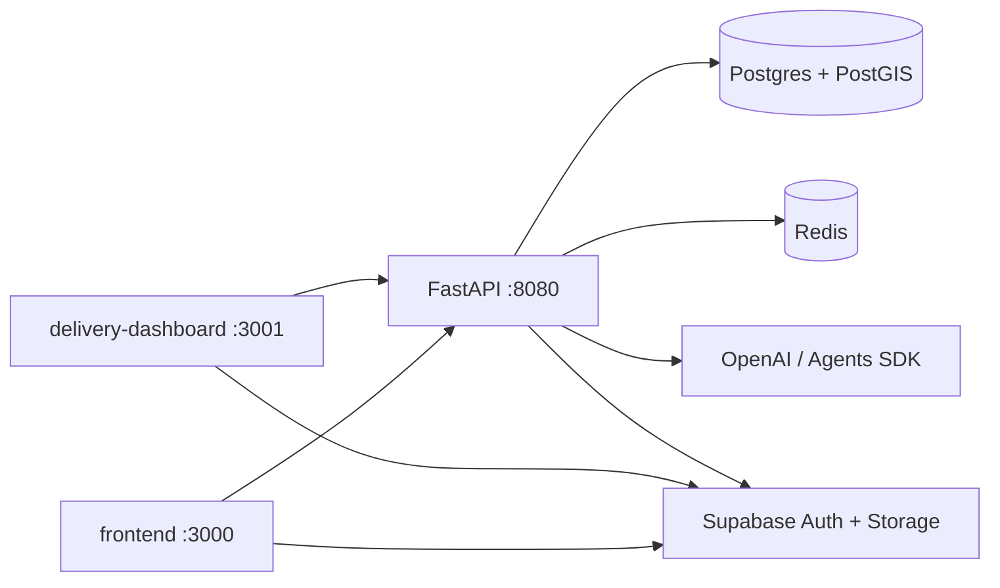
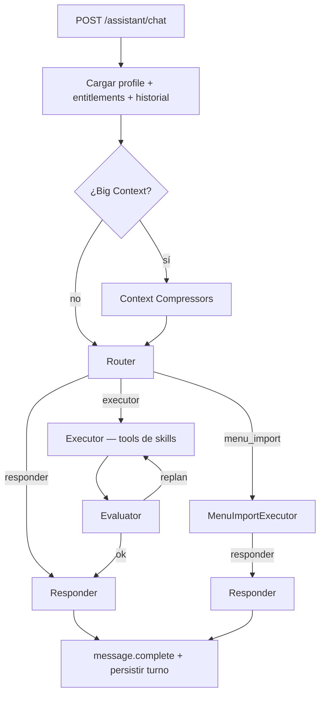
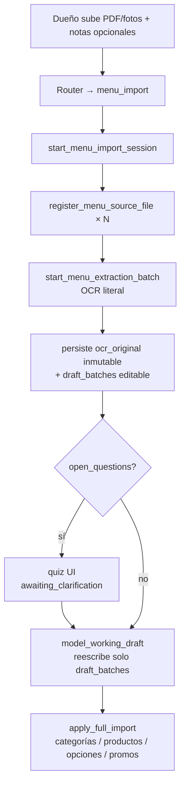
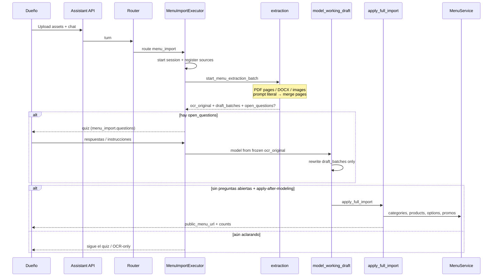

# Vendelo AI

Plataforma para que restaurantes **creen, optimicen y publiquen un menú digital con QR**, reciban **pedidos en línea** (checkout hacia WhatsApp) y operen **delivery** con partners — con el **Copilot de Operaciones para Restaurantes**, que digitaliza menús y opera el panel en lenguaje natural.

---

## Qué hace

| Superficie | App | Puerto | Rol |
|------------|-----|--------|-----|
| Panel restaurante + menú público | `frontend/` | `:3000` | Onboarding, dashboard, menú digital público (`/menu/[subdomain]` o subdominio) |
| Ops de delivery | `delivery-dashboard/` | `:3001` | Geofence, tarifas, partnerships, pedidos, analytics del courier |
| API | `backend/` | `:8080` | FastAPI modular monolith — dominio + Copilot de Operaciones |
| Infra local | `infra/` | `:5434` / `:6379` | Postgres + PostGIS, Redis |


---

## Cómo correrlo

### Requisitos

- Docker Desktop (Compose v2.20+)

### Stack completo (recomendado)

Desde la raíz del repo:

```bash
cp .env.example .env
cp backend/.env.example backend/.env
cp frontend/.env.example frontend/.env.local
cp delivery-dashboard/.env.example delivery-dashboard/.env.local

# Edita los .env copiados con tus propias keys

docker compose up --build
```

| Servicio | URL |
|----------|-----|
| Frontend | http://localhost:3000 |
| Delivery dashboard | http://localhost:3001 |
| API health | http://localhost:8080/api/v1/health |
| Postgres | `localhost:5434` (`vendelo` / `vendelo`) |
| Redis | `localhost:6379` |

El compose raíz **incluye** `infra/docker-compose.yml` y levanta `api`, `frontend` y `delivery-dashboard`. El API usa la red interna (`postgres`, `redis`) y corre migraciones al arrancar si `RUN_MIGRATIONS=true`.

### Sin Docker (híbrido)

```bash
# Infra
cd infra && docker compose up -d

# Backend
cd backend
python3.12 -m venv .venv && source .venv/bin/activate
pip install -r requirements-dev.txt
cp .env.example .env   # DATABASE_URL → localhost:5434
python start.py        # NO corre migraciones solo; usa: alembic upgrade head

# Frontends
cd frontend && pnpm install && pnpm dev
cd delivery-dashboard && pnpm install && pnpm dev
```
---

## Arquitectura del monorepo



| App | Stack |
|-----|--------|
| frontend / delivery-dashboard | Next.js 16 · React 19 · TypeScript · MUI · Supabase SSR |
| backend | Python 3.12 · FastAPI · SQLAlchemy 2 · Alembic · Pydantic v2 · GeoAlchemy2 · Redis · OpenAI Agents SDK |
| infra | PostGIS 16 · Redis 7 |

---

## Copilot de Operaciones para Restaurantes

El Copilot de Operaciones para Restaurantes es el **plano de control en lenguaje natural** del restaurante: el personal chatea en lenguaje natural y el agente lee/actualiza menú, promociones, branding y horarios — **sin deletes** (soft-disable).

Inspiración OpenClaw adaptada a SaaS: tool loop, skills enchufables (`SKILL.md` + `tools.py`), identidad por restaurante, turnos serializados.

### Endpoints

| Método | Path | Uso |
|--------|------|-----|
| `POST` | `/api/v1/restaurants/{id}/assistant/chat` | Chat SSE (turno principal) |
| `POST` | `/api/v1/restaurants/{id}/assistant/import/assets` | Subir PDF/DOCX/imagen al inbox de import |
| `POST` | `/api/v1/restaurants/{id}/assistant/conversations/reset` | Nuevo hilo + cancelar import activo |

Auth: `require_owned_restaurant`. Body: mensaje + `conversation_id` opcional + `attachments[]`.

### Flujo de un turno (SSE)



Eventos SSE típicos: `agent.status` → `agent.phase` → `agent.thought` → `tool.start` / `tool.result` → `agent.evaluation` → `content.delta` → `message.complete` (a veces con `menu_import.questions` para el quiz UI).

### Pipeline de roles

| Rol | Qué hace |
|-----|----------|
| **Context** | Profile, entitlements, registry, historial comprimido, adjuntos, sesión de import activa |
| **Router** | Decide `responder` \| `executor` \| `menu_import` |
| **Executor** | Loop de tools (Agents SDK); skills con entitlement, excepto tools granulares de import |
| **Evaluator** | Puede pedir replan (pocos reintentos) si faltan datos o fallaron tools |
| **Responder** | Markdown de respuesta al dueño|

`menu_import` **no** va por el executor general: tiene agentes dedicados para OCR largo + quiz + apply.

### Skills (Lego)

| Skill | Mutaciones | Propósito |
|-------|------------|-----------|
| `menu_read` | No | Catálogo + promos (search/list/get) |
| `menu_write` | Sí | Categorías, productos, opciones, theme, horarios, asignar fotos |
| `menu_import` | Sí | Digitalización completa (sub-workflow) |
| `menu_media` | Sí | Generar foto de platillo con IA (**prohibido durante import**) |
| `menu_intelligence` | No | Visión: componentes / complementos sugeridos |
| `menu_best_practices` | Guía | Criterios de calidad (sin tools) |
| `promotions` | Sí | Campañas + banners NxM |

Reglas duras:

- **`restaurant_id` viene del JWT**, nunca del LLM.
- **No-delete:** el registry rechaza tools de delete.
- **Entitlements:** `effective = granted ∩ enabled ∩ registered`.
- Prompts de sistema en **inglés**.

### Compresión de contexto

`context/compressor.py` recorta **lo que ve el LLM** (el transcript en Postgres se conserva completo):

1. Si tokens estimados ≥ umbral → mantener últimas K turnos crudos.
2. Resumir el resto con LLM barato (`<conversation_summary>`).
3. Fallback determinístico (`<state_snapshot>`) si falla el summary.

### Decisiones / tradeoffs del Copilot de Operaciones

| Decisión | Por qué | Tradeoff |
|----------|---------|----------|
| Postgres como estado durable | Conversaciones + sesiones de import sobreviven N réplicas | Más latencia en lecturas calientes si no hay cache |
| Redis como capa caliente | Cache de menú público, traducciones, profile del Copilot, rate limit e idempotency de pedidos; locks/caches efímeros compartidos entre réplicas Cloud Run | Sin `REDIS_URL` degrada a adapters nulos; no es fuente de verdad (Postgres sí) |
| Router → Executor → Evaluator → Responder | Roles claros vs un mega-prompt | Más llamadas LLM / latencia |
| Skills descubiertas en disco | Open-Closed: nueva capability = nueva carpeta | Hay que mantener `SKILL.md` + tools alineados |
| Confirm gates (spec) vs mutate inmediato (código) | Spec más seguro; runtime actual prioriza velocidad cuando la intención es clara | “Secretary recap” vive en guías de skill, no siempre como token duro |


Código clave: `backend/app/modules/assistant/` — sobre todo `agent/workflow/orchestrator.py`, `agent/service.py`, `skills/`, `context/compressor.py`.

## Specs

Specs de diseño: [`docs/superpowers/specs/`](docs/superpowers/specs/)

---

## Menu import (profundidad)

Objetivo: del PDF/foto del menú físico → **menú vivo** en la base, con fidelidad literal del OCR y un quiz de aclaración cuando hay ambigüedad (sobre todo complementos).

### Vista mental



### Memoria de sesión (Postgres)

| Campo | Rol |
|-------|-----|
| `ocr_original` | Snapshot **inmutable** del OCR literal |
| `draft_batches` | Copia de trabajo que se modela y se aplica |
| `discovery_answers` / `clarification_answers` | Contexto y respuestas del quiz |
| `open_questions` | Ambigüedades → UI quiz |
| `live_menu_snapshot` | Menú vivo cacheado para reconcile |

Una sesión activa por restaurante; un nuevo `menu_source` puede cancelar/reemplazar una incompleta.

### Secuencia end-to-end



### Flags de apply (estado actual del código)

| Flag | Valor típico | Efecto |
|------|--------------|--------|
| `MENU_IMPORT_APPLY_ENABLED` | `False` | No aplicar directo desde OCR crudo |
| `MENU_IMPORT_APPLY_AFTER_MODELING_ENABLED` | `True` | Publicar cuando el draft modelado no tiene preguntas abiertas |

Así se evita “blast radius” de un OCR malo: primero literal → aclarar → modelar → publicar.

### Después del import

- **Fotos de platillos:** no en el loop de import. Luego, chat normal + `menu_write` (`assign_product_image` / bulk) o `menu_media` para generar.
- **Banners NxM / promos:** skill `promotions` post-publish.
- **Cierre:** `update_menu_knowledge` + sesión `completed`.

Código clave: `backend/app/modules/assistant/skills/menu_import/` — `tools.py`, `extraction.py`, `extraction_prompt.py`, `draft_modeling.py`, `apply_batch.py`, `SKILL.md`.

Specs:  
[`menu-import-concierge`](docs/superpowers/specs/2026-07-06-menu-import-concierge-redesign.es.md) ·  
[`onboarding-agent`](docs/superpowers/specs/2026-07-07-menu-import-onboarding-agent-design.md)

---

## Decisiones transversales del monorepo

| Tema | Decisión | Tradeoff |
|------|----------|----------|
| Forma del backend | Modular monolith (SOLID, listo a extraer módulos) | Menos ops que microservicios; disciplina de boundaries |
| Compose raíz | `include` de `infra/` + api/frontends | Un comando; frontends en `next dev` con volúmenes (no imagen prod) |
| Migraciones locales Docker | `RUN_MIGRATIONS=true` en entrypoint | Conveniente en local; en Cloud Run debe ir `false` + migrar en CI |
| Migraciones en prod | Diseño: CI / release job, no boot del contenedor | Evita races entre réplicas|
| Dinero | Centavos en DB / API interna | UI y drafts de import hablan MXN |
| Soft deletes | Default en dominio | Menú “borra” = inactive |
| Redis | Cache, rate limit, conversaciones assistant | App degrada a Postgres si Redis no está |
| Frontends en Docker | Dev mode + bind mount | Hot reload; builds más pesados (pnpm 11 necesita `allowBuilds` en `pnpm-workspace.yaml`) |

---

## Documentación relacionada

| Doc | Contenido |
|-----|-----------|
| [`docs/PROJECT_CONTEXT.es.md`](docs/PROJECT_CONTEXT.es.md) | Producto: para quién, flujos, promesas de IA |
| [`docs/TECH_ARCHITECTURE.es.md`](docs/TECH_ARCHITECTURE.es.md) | Stack, Redis, WS, puertos de IA |
| [`docs/PROJECT_PLANNING.es.md`](docs/PROJECT_PLANNING.es.md) | Fases de construcción |
| [`backend/README.md`](backend/README.md) | Setup API, Docker parcial, Cloud Run |
| [`delivery-dashboard/README.md`](delivery-dashboard/README.md) | Panel courier + setup Supabase Google |
| [`docs/superpowers/specs/`](docs/superpowers/specs/) | Specs de diseño (assistant, import, compose, etc.) |

