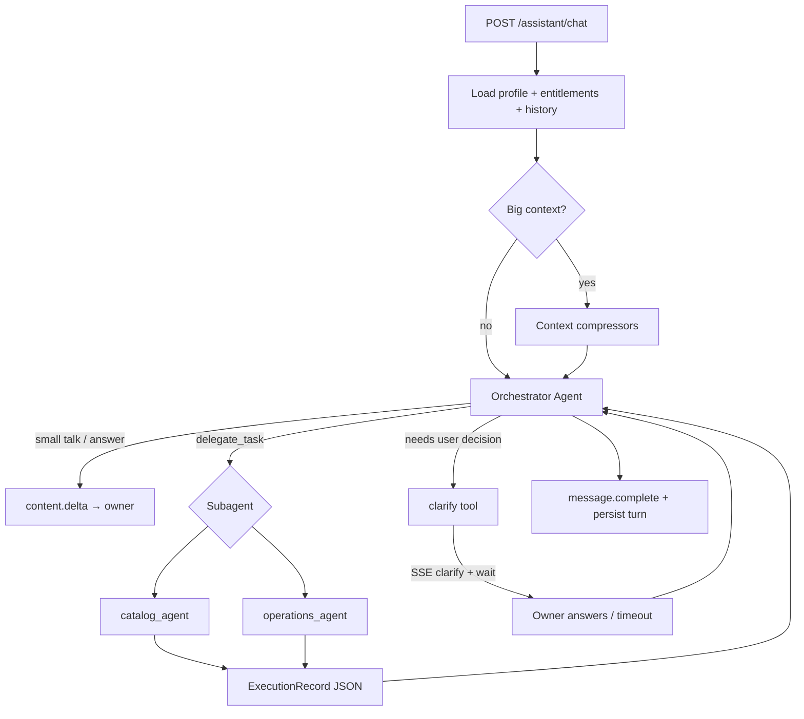
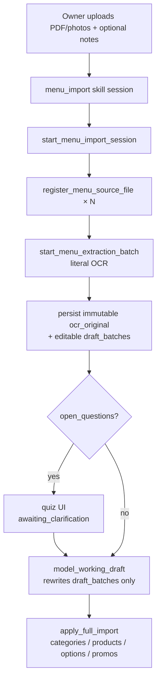
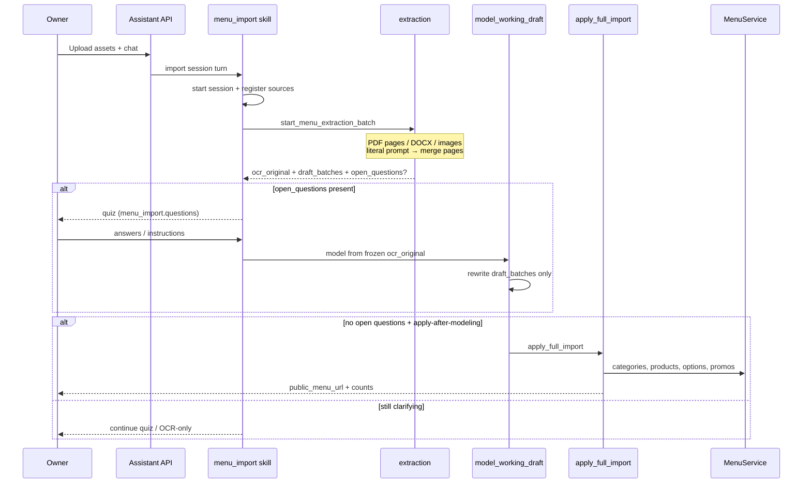

# Venddelo AI

**An AI-native restaurant operations platform.** Upload a menu. Chat in natural language. Ship a live QR digital menu, WhatsApp checkout, and delivery ops — while **The Agent** digs into the catalog, mutates it with real tools, and asks only when a decision actually matters.

This repo is built around a **subagent-driven assistant**: an Orchestrator that thinks and replies to the owner, then delegates hard work to specialized child agents with skill toolkits. Not a chatbot wrapper. A control plane for the restaurant.

---

## What it does

| Surface | App | Port | Role |
|---------|-----|------|------|
| Restaurant panel + public menu | `frontend/` | `:3000` | Onboarding, dashboard, public digital menu (`/menu/[subdomain]` or subdomain) |
| Delivery ops | `delivery-dashboard/` | `:3001` | Geofence, fees, partnerships, orders, courier analytics |
| API | `backend/` | `:8080` | FastAPI modular monolith — domain + Mexy Agent |
| Local infra | `infra/` | `:5434` / `:6379` | Postgres + PostGIS, Redis |

---

## Project scaffolding

```
venddelo-ai/
├── docker-compose.yml          # Full stack (infra + api + frontends)
├── .env.example                # Shared Compose variables
│
├── frontend/                   # Restaurant panel + public menu (Next.js)
│   └── src/
│       ├── app/                # App Router routes
│       ├── components/         # Dashboard UI + digital menu (+ assistant chat)
│       └── lib/                # API client, utilities
│
├── delivery-dashboard/         # Delivery ops (Next.js)
│   └── src/
│       ├── app/                # App Router routes
│       ├── components/         # Courier panel UI (maps, fees, orders)
│       └── lib/                # API client, utilities
│
├── backend/                    # FastAPI API (modular monolith)
│   ├── app/
│   │   ├── api/                # Aggregated routers
│   │   ├── core/               # Config, auth, LLM ports
│   │   ├── db/                 # SQLAlchemy models
│   │   ├── infra/              # Redis, storage, shared repos
│   │   ├── middleware/         # Rate limit, etc.
│   │   └── modules/            # Domain by module
│   │       ├── assistant/      # Mexy Agent (AI control plane)
│   │       │   ├── agent/
│   │       │   │   └── workflow/   # Orchestrator → subagents (delegate + clarify)
│   │       │   ├── skills/     # Plug-in capabilities (SKILL.md + tools)
│   │       │   ├── context/    # History compression for the LLM
│   │       │   └── entitlements/
│   │       ├── menu/
│   │       ├── orders/
│   │       ├── promotions/
│   │       ├── restaurants/
│   │       ├── delivery_providers/
│   │       ├── public/         # Public menu + guest orders
│   │       └── …
│   ├── migrations/             # Alembic
│   ├── tests/
│   └── scripts/                # entrypoint.sh, utilities
│
├── infra/                      # Postgres + PostGIS + Redis (local)
│   ├── docker-compose.yml
│   └── postgres-init/
│
└── docs/                       # Product, architecture, AI specs
    ├── PROJECT_CONTEXT.es.md
    ├── TECH_ARCHITECTURE.es.md
    └── superpowers/
        ├── specs/              # Approved designs (agent, clarify, import, …)
        └── plans/              # Implementation plans
```

---

## How to run it

### Requirements

- Docker Desktop (Compose v2.20+)

### Full stack (recommended)

From the repo root:

```bash
cp .env.example .env
cp backend/.env.example backend/.env
cp frontend/.env.example frontend/.env.local
cp delivery-dashboard/.env.example delivery-dashboard/.env.local

# Edit the copied .env files with your own keys (especially OPENAI_API_KEY)

docker compose up --build
```

| Service | URL |
|---------|-----|
| Frontend | http://localhost:3000 |
| Delivery dashboard | http://localhost:3001 |
| API health | http://localhost:8080/api/v1/health |
| Postgres | `localhost:5434` (`vendelo` / `vendelo`) |
| Redis | `localhost:6379` |

Root Compose **includes** `infra/docker-compose.yml` and starts `api`, `frontend`, and `delivery-dashboard`. The API uses the internal network (`postgres`, `redis`) and runs migrations on boot when `RUN_MIGRATIONS=true`.

### Without Docker (hybrid)

```bash
# Infra
cd infra && docker compose up -d

# Backend
cd backend
python3.12 -m venv .venv && source .venv/bin/activate
pip install -r requirements-dev.txt
cp .env.example .env   # DATABASE_URL → localhost:5434
python start.py        # does NOT run migrations alone; use: alembic upgrade head

# Frontends
cd frontend && pnpm install && pnpm dev
cd delivery-dashboard && pnpm install && pnpm dev
```

---

## Stack

| App | Stack |
|-----|--------|
| frontend / delivery-dashboard | Next.js 16 · React 19 · TypeScript · MUI · Supabase SSR |
| backend | Python 3.12 · FastAPI · SQLAlchemy 2 · Alembic · Pydantic v2 · GeoAlchemy2 · Redis · **OpenAI Agents SDK** |
| infra | PostGIS 16 · Redis 7 |

---

## Mexy Agent — Restaurant Operations Copilot

Mexy is the **natural-language control plane** for the restaurant. Staff chat in Spanish; the agent reads and updates menu, promotions, branding, and hours with real skill tools — grounded in tool output, not vibes.

Architecture is **subagent-driven** (OpenAI Agents SDK):

| Role | Responsibility |
|------|----------------|
| **Orchestrator** | Only agent that talks to the owner. Plans, replies in Markdown ES, and calls tools. |
| **`delegate_task`** | Spawns a focused child agent for a concrete goal. |
| **`catalog_agent`** | Live catalog: products, categories, complements, promos, themes, product photos. |
| **`operations_agent`** | Business profile: name, location, hours, payments, logo/cover, public menu URL / QR. |
| **`clarify`** | Mid-turn structured question to the owner (choices / multi-select); blocks until answer or timeout. |

Subagents return a structured **`ExecutionRecord`** (JSON). The Orchestrator never invents mutations — it reports what tools actually did. If a subagent needs a user decision, it emits `needs_user_input:…` in `notes`; only the Orchestrator may call `clarify`.

Inspiration: OpenClaw-style tool loops, adapted for multi-tenant SaaS — pluggable skills (`SKILL.md` + `tools.py`), restaurant identity from JWT, serialized turns.

### Endpoints

| Method | Path | Use |
|--------|------|-----|
| `POST` | `/api/v1/restaurants/{id}/assistant/chat` | Main chat SSE turn |
| `POST` | `/api/v1/restaurants/{id}/assistant/clarify/answer` | Answer a mid-turn `clarify` prompt (`clarify_id` + response in body) |
| `POST` | `/api/v1/restaurants/{id}/assistant/import/assets` | Upload PDF/DOCX/image into the import inbox |
| `POST` | `/api/v1/restaurants/{id}/assistant/conversations/reset` | New thread (+ cancel active import) |

Auth: `require_owned_restaurant`. Body: message + optional `conversation_id` + `attachments[]`.

### Turn flow (SSE)


```mermaid
flowchart TD
  A[POST /assistant/chat] --> B[Load profile + entitlements + history]
  B --> C{Big context?}
  C -->|yes| D[Context compressors]
  C -->|no| E[Orchestrator Agent]
  D --> E
  E -->|small talk / answer| F[content.delta → owner]
  E -->|delegate_task| G{Subagent}
  G --> H[catalog_agent]
  G --> I[operations_agent]
  H --> J[ExecutionRecord JSON]
  I --> J
  J --> E
  E -->|needs user decision| K[clarify tool]
  K -->|SSE clarify + wait| L[Owner answers / timeout]
  L --> E
  E --> M[message.complete + persist turn]
```

Typical SSE events: `agent.status` → `agent.phase` → `agent.thought` → `tool.start` / `tool.result` → `clarify` / `clarify.closed` → `content.delta` → `message.complete`.

### Why subagents

| Before | Now |
|--------|-----|
| Router → Executor → Evaluator → Responder | **Orchestrator** + `delegate_task` + `clarify` |
| One mega tool loop for everything | Specialized children with narrower tool surfaces |
| Python evaluator retries | Orchestrator re-delegates when the record is incomplete |
| Separate responder LLM | Orchestrator writes the owner-facing reply |

Hard rules:

- **`restaurant_id` comes from the JWT**, never from the LLM.
- **Entitlements:** `effective = granted ∩ enabled ∩ registered`.
- **System prompts in English**; owner-facing replies in Spanish.
- Prefer **bulk tools** for multi-item reads/writes (`bulk_search_products`, `bulk_create_products`, …) — including single-item arrays.
- Act on obvious defaults; use **`clarify`** only when the ambiguity changes the tool call.

### Skills (Lego)

| Skill | Mutations | Purpose |
|-------|-----------|---------|
| `menu_read` | No | Catalog + promos (`bulk_search_products`, list/get, bulk get) |
| `menu_write` | Yes | Categories, products, options, theme, hours, assign photos |
| `menu_import` | Yes | Full digitization pipeline (OCR → clarify → model → apply) |
| `menu_media` | Yes | AI dish photo generation (**forbidden during import**) |
| `menu_intelligence` | No | Vision: suggested components / complements |
| `menu_best_practices` | Guide | Quality criteria (no tools) |
| `promotions` | Yes | Campaigns + NxM banners |

Skills are discovered from disk: new capability ≈ new folder with `SKILL.md` + `tools.py`.

### Context compression

`context/compressor.py` trims **what the LLM sees** (Postgres keeps the full transcript):

1. If estimated tokens ≥ threshold → keep the last K raw turns.
2. Summarize the rest with a cheap LLM (`<conversation_summary>`).
3. Deterministic fallback (`<state_snapshot>`) if summary fails.

### Agent decisions / tradeoffs

| Decision | Why | Tradeoff |
|----------|-----|----------|
| Subagent-driven Orchestrator | Clear ownership: one voice to the owner, specialists for work | Extra LLM calls / latency vs a single mega-agent |
| `delegate_task` + `ExecutionRecord` | Ground replies in real tool output | Orchestrator must re-delegate when the record is thin |
| Mid-turn `clarify` | Human-in-the-loop without ending the SSE turn | In-process waiters (MVP); multi-worker needs shared wait storage |
| Postgres as durable state | Conversations + import sessions survive N replicas | Hot-path latency without cache |
| Redis as hot layer | Public menu cache, translations, profile, rate limit, order idempotency | Without `REDIS_URL` degrades to null adapters; Postgres stays source of truth |
| Disk-discovered skills | Open-Closed: ship capability as a folder | Keep `SKILL.md` and tools aligned |

Key code: `backend/app/modules/assistant/` — especially `agent/workflow/orchestrator.py`, `delegate.py`, `clarify_tool.py`, `skills/`, `context/compressor.py`.

## Specs

Design specs: [`docs/superpowers/specs/`](docs/superpowers/specs/)

AI-heavy ones worth reading first:

- [Assistant orchestrator](docs/superpowers/specs/2026-07-29-assistant-orchestrator-design.es.md)
- [Clarify tool](docs/superpowers/specs/2026-07-30-assistant-clarify-tool-design.es.md)
- [Parallel delegate](docs/superpowers/specs/2026-07-29-assistant-parallel-delegate-design.es.md)
- [Agentic assistant](docs/superpowers/specs/2026-06-27-agentic-assistant-design.en.md)

---

## Menu import (depth)

Goal: physical menu PDF/photo → **live menu** in the database, with literal OCR fidelity and a clarification quiz when complements (or other fields) are ambiguous.

### Mental model


```mermaid
flowchart TD
  A[Owner uploads PDF/photos + optional notes] --> B[menu_import skill session]
  B --> C[start_menu_import_session]
  C --> D[register_menu_source_file × N]
  D --> E[start_menu_extraction_batch<br/>literal OCR]
  E --> F[persist immutable ocr_original<br/>+ editable draft_batches]
  F --> G{open_questions?}
  G -->|yes| H[quiz UI<br/>awaiting_clarification]
  H --> I[model_working_draft<br/>rewrites draft_batches only]
  G -->|no| I
  I --> J[apply_full_import<br/>categories / products / options / promos]
```

### Session memory (Postgres)

| Field | Role |
|-------|------|
| `ocr_original` | **Immutable** snapshot of literal OCR |
| `draft_batches` | Working copy that gets modeled and applied |
| `discovery_answers` / `clarification_answers` | Context + quiz answers |
| `open_questions` | Ambiguities → quiz UI |
| `live_menu_snapshot` | Cached live menu for reconcile |

One active session per restaurant; a new `menu_source` can cancel/replace an incomplete one.

### End-to-end sequence


```mermaid
sequenceDiagram
  participant Owner as Owner
  participant API as Assistant API
  participant Imp as menu_import skill
  participant OCR as extraction
  participant Model as model_working_draft
  participant Apply as apply_full_import
  participant Live as MenuService

  Owner->>API: Upload assets + chat
  API->>Imp: import session turn
  Imp->>Imp: start session + register sources
  Imp->>OCR: start_menu_extraction_batch
  Note over OCR: PDF pages / DOCX / images<br/>literal prompt → merge pages
  OCR-->>Imp: ocr_original + draft_batches + open_questions?
  alt open_questions present
    Imp-->>Owner: quiz (menu_import.questions)
    Owner->>Imp: answers / instructions
    Imp->>Model: model from frozen ocr_original
    Model->>Model: rewrite draft_batches only
  end
  alt no open questions + apply-after-modeling
    Model->>Apply: apply_full_import
    Apply->>Live: categories, products, options, promos
    Apply-->>Owner: public_menu_url + counts
  else still clarifying
    Imp-->>Owner: continue quiz / OCR-only
  end
```

### Apply flags (current code)

| Flag | Typical value | Effect |
|------|---------------|--------|
| `MENU_IMPORT_APPLY_ENABLED` | `False` | Do not apply straight from raw OCR |
| `MENU_IMPORT_APPLY_AFTER_MODELING_ENABLED` | `True` | Publish when the modeled draft has no open questions |

That avoids blast radius from bad OCR: literal → clarify → model → publish.

### After import

- **Dish photos:** not inside the import loop. Later, normal chat + `menu_write` (`assign_product_image` / bulk) or `menu_media` to generate.
- **NxM banners / promos:** `promotions` skill post-publish.
- **Close-out:** `update_menu_knowledge` + session `completed`.

Key code: `backend/app/modules/assistant/skills/menu_import/` — `tools.py`, `extraction.py`, `extraction_prompt.py`, `draft_modeling.py`, `apply_batch.py`, `SKILL.md`.

Specs:  
[`menu-import-concierge`](docs/superpowers/specs/2026-07-06-menu-import-concierge-redesign.es.md) ·  
[`onboarding-agent`](docs/superpowers/specs/2026-07-07-menu-import-onboarding-agent-design.md)

---

## Cross-cutting monorepo decisions

| Topic | Decision | Tradeoff |
|-------|----------|----------|
| Backend shape | Modular monolith (SOLID, extractable modules) | Less ops than microservices; boundary discipline required |
| Root Compose | `include` of `infra/` + api/frontends | One command; frontends run `next dev` with volumes (not prod images) |
| Local Docker migrations | `RUN_MIGRATIONS=true` in entrypoint | Convenient locally; Cloud Run should use `false` + migrate in CI |
| Prod migrations | Design: CI / release job, not container boot | Avoids races across replicas |
| Money | Cents in DB / internal API | UI and import drafts speak MXN |
| Soft deletes | Default in domain | Menu “delete” = inactive |
| Redis | Cache, rate limit, assistant hot paths | App degrades to Postgres if Redis is down |
| Frontends in Docker | Dev mode + bind mount | Hot reload; heavier builds (pnpm 11 needs `allowBuilds` in `pnpm-workspace.yaml`) |

---

## Related documentation

| Doc | Contents |
|-----|----------|
| [`docs/PROJECT_CONTEXT.es.md`](docs/PROJECT_CONTEXT.es.md) | Product: who it's for, flows, AI promises |
| [`docs/TECH_ARCHITECTURE.es.md`](docs/TECH_ARCHITECTURE.es.md) | Stack, Redis, WS, AI ports |
| [`docs/PROJECT_PLANNING.es.md`](docs/PROJECT_PLANNING.es.md) | Build phases |
| [`backend/README.md`](backend/README.md) | API setup, partial Docker, Cloud Run |
| [`delivery-dashboard/README.md`](delivery-dashboard/README.md) | Courier panel + Supabase Google setup |
| [`docs/superpowers/specs/`](docs/superpowers/specs/) | Design specs (assistant, clarify, import, compose, …) |
