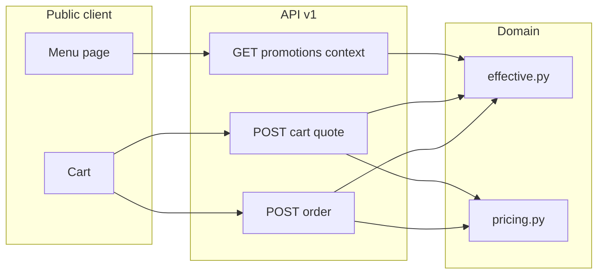

# Promotions Engine — Full Stack Design

> **Status:** draft — pending user review before implementation plan.  
> **Scope:** Backend persistence + effectiveness + pricing + cart/order integration + public/admin UI.  
> **Explicitly out of scope:** Cron jobs / scheduled deactivation, discount codes, combo bundle pricing, promotion stacking beyond rules below.

Builds on `docs/PROMOTIONS_ENHANCEMENT_PLAN.en.md` and the frontend draft UI (`PromotionForm`, `promotionDraft.ts`).

---

## 1. Goal

Deliver end-to-end promotions that:

1. Persist the advanced Marketing form (NxM, weekdays, daily time window, campaign dates, complement option items).
2. Evaluate **when** a promotion applies using the **server clock** and the restaurant **IANA timezone** (default `America/Mexico_City`).
3. Calculate **how much** to discount (product/category percent & amount, N×M bundles, order-level discounts).
4. Show discounts on the **public menu**, **cart**, and **order creation** consistently.
5. **Do not use background jobs** — effectiveness is computed at read time and at checkout.

### Reference scenario (acceptance)

> **“Miércoles pizza 2×1”** — category Pizzas, offer 2×1, Wednesdays only, optional 12:00–22:00, selected complements included in pricing rules.

---

## 2. Confirmed decisions

| Decision | Choice |
|----------|--------|
| Time source | **Server UTC** converted to restaurant `timezone` |
| Default timezone | `America/Mexico_City` |
| Cron / jobs | **None** — no automatic `is_active` flips on expiry |
| Frontend schedule checks | Uses **`server_now`** returned by API, not device clock |
| Cart / order prices | **Backend pricing engine** is authoritative; frontend mirrors for UX via quote API |
| Weekday convention | `0 = Monday … 6 = Sunday` (same as `restaurant_schedules.day_of_week` and `WEEKDAY_LABELS`) |
| Stacking (v1) | **Best single line discount** per cart line; **one order-level** promotion max |
| Combo type | Stored + badge only; **no combo pricing** in v1 |
| Catalog auto-promos | `__product_discount__*` promotions follow same effectiveness rules |
| Draft storage | **Replace** `localStorage` drafts with API persistence after backend ships |

---

## 3. Architecture

```
api (thin)
  → PromotionService / OrderService
      → PromotionEffectiveService   # when does it apply?
      → PromotionPricingService     # how much off?
      → repository ports (Phase 3)
```

- **PromotionEffectiveService** — pure functions + timezone; no DB imports in domain tests.
- **PromotionPricingService** — takes cart lines + effective promotions + catalog prices; returns priced lines + order discount.
- **OrderService.create_public** — always runs pricing engine; never trusts client totals.
- **Public cart quote** — same pricing engine as orders (read-only).



---

## 4. Database changes (Alembic `0013_promotions_engine`)

### 4.1 `restaurants`

| Column | Type | Default | Notes |
|--------|------|---------|-------|
| `timezone` | `VARCHAR(64)` NOT NULL | `'America/Mexico_City'` | IANA name; validate on write |

### 4.2 `promotions`

| Column | Type | Notes |
|--------|------|-------|
| `bundle_get_quantity` | `INTEGER` NULL | N in N×M (e.g. 2 in 2×1); required when `type = 'two_for_one'` |
| `bundle_pay_quantity` | `INTEGER` NULL | M in N×M (e.g. 1 in 2×1) |
| `recurrence_weekdays` | `SMALLINT[]` NULL | NULL or `{}` = all days; else subset of 0–6 |
| `recurrence_start_time` | `TIME` NULL | Local restaurant time; NULL = start of day |
| `recurrence_end_time` | `TIME` NULL | Local restaurant time; NULL = end of day |

**Constraints (new migration replaces CHECK on `type`):**

- `type IN ('percent','amount','combo','two_for_one')` — unchanged storage values.
- When `type = 'two_for_one'`: `bundle_get_quantity >= 2`, `bundle_pay_quantity >= 1`, `bundle_pay_quantity < bundle_get_quantity`.
- `recurrence_weekdays` elements BETWEEN 0 AND 6 (Postgres array check via trigger or app validation).

**API wire format:** expose bundle promos as `type: "bundle"` with `bundle: { get_quantity, pay_quantity }`; map to/from `two_for_one` + columns in Pydantic (see §5).

### 4.3 `promotion_option_items` (new join table)

| Column | Type |
|--------|------|
| `promotion_id` | UUID FK → promotions ON DELETE CASCADE |
| `option_item_id` | UUID FK → option_items ON DELETE CASCADE |
| PK | `(promotion_id, option_item_id)` |

Complements that participate in the promotion (from Marketing UI).

### 4.4 `orders`

| Column | Type | Default |
|--------|------|---------|
| `discount_cents` | `INTEGER` NOT NULL | `0` |
| `subtotal_before_discount_cents` | `INTEGER` NOT NULL | mirrors sum of line totals before order-level discount |

Optional: `applied_order_promotion_id` UUID FK NULL.

### 4.5 `order_items`

| Column | Type | Default |
|--------|------|---------|
| `discount_cents` | `INTEGER` NOT NULL | `0` |
| `line_subtotal_cents` | `INTEGER` NOT NULL | before line discount (qty × (unit + options)) |
| `applied_promotion_id` | UUID NULL | FK SET NULL |

Snapshot fields preserve history if promotion is deleted later.

---

## 5. Type mapping (`2x1` / `bundle` / `two_for_one`)

**Storage (Postgres):** `type = 'two_for_one'`, `bundle_get_quantity`, `bundle_pay_quantity`.

**API JSON (wire):**

```json
{
  "type": "bundle",
  "bundle": { "get_quantity": 2, "pay_quantity": 1 }
}
```

**Pydantic (`app/modules/promotions/types.py`):**

- `normalize_promotion_type("bundle" | "2x1") → "two_for_one"`
- `serialize_promotion_type("two_for_one") → "bundle"`
- Accept legacy `"2x1"` on input for backward compatibility.

**Frontend `Promotion` type:** add `'bundle'`; map `two_for_one` from API to `bundle` in client mapper if serializer not yet deployed.

---

## 6. Effectiveness engine (`effective.py`)

### 6.1 Inputs

- `promotion: PromotionDTO`
- `now_utc: datetime` (aware, UTC)
- `restaurant_tz: ZoneInfo`

### 6.2 Algorithm

```python
def is_promotion_effective(promo, now_utc, tz) -> bool:
    if not promo.is_active:
        return False
    local = now_utc.astimezone(tz)

    # Campaign window (timestamptz, absolute)
    if promo.starts_at and local < promo.starts_at.astimezone(tz):
        return False
    if promo.ends_at and local >= promo.ends_at.astimezone(tz):
        return False

    # Weekdays (restaurant local)
    if promo.recurrence_weekdays:  # non-empty list
        if local.weekday() not in promo.recurrence_weekdays:  # Mon=0
            return False

    # Daily time window (restaurant local time)
    if promo.recurrence_start_time or promo.recurrence_end_time:
        start = promo.recurrence_start_time or time(0, 0)
        end = promo.recurrence_end_time or time(23, 59, 59)
        t = local.timetz().replace(tzinfo=None)  # compare naive local time
        if not (start <= t < end):  # v1: no overnight window
            return False

    return True
```

### 6.3 `effective_status` (admin DTO, computed)

| Status | Rule |
|--------|------|
| `inactive` | `is_active = false` |
| `scheduled` | campaign `starts_at` in future |
| `expired` | campaign `ends_at` passed and no recurring weekdays saving it* |
| `active` | `is_promotion_effective` true |
| `outside_schedule` | active in DB but not effective now (wrong day/time) |

\*For recurring promos without `ends_at`, never `expired` from dates alone.

### 6.4 No cron

Expired promos remain `is_active = true` in DB; public API and admin `effective_status` reflect reality at query time.

---

## 7. Pricing engine (`pricing.py`)

### 7.1 Line eligibility

A promotion applies to a cart line if:

- `is_promotion_effective(promo, now, tz)`
- Scope match:
  - `product` → `line.product_id in promo.product_ids`
  - `category` → product has ∩ `promo.category_ids`
  - `order` → not line-level (handled separately)
- Type is `percent`, `amount`, or `two_for_one` (bundle)

### 7.2 Line base price

```
unit_base_cents = product.price_cents
options_cents = sum(selected option item price_delta_cents)
```

**Complements:** If promotion has `option_item_ids` and line selections include only those option items (or: option deltas for **included** complements are waived — see rule below):

**v1 complement rule:** For an effective bundle/percent/amount promo on a line, **waive `price_delta_cents`** for selected option items whose IDs are in `promotion_option_items`. Non-listed complements charge full delta.

### 7.3 Discount by type

**Percent / amount (line):**

- `percent`: `discount = round(line_subtotal * percent / 100)`
- `amount`: `discount = min(amount_cents, line_subtotal)` per line application

**Bundle N×M (`two_for_one` + quantities):**

```
paid_units = ceil(quantity / get_quantity) * pay_quantity
         + (quantity % get_quantity)  # remainder at full unit price — see note
```

**v1 simplified rule (documented):**

```
free_units = (quantity // get_quantity) * (get_quantity - pay_quantity)
line_total = (quantity - free_units) * unit_effective_cents
```

Where `unit_effective_cents = unit_base_cents + eligible_options_cents` (after complement waiver).

Examples (2×1, unit $100):

| Qty | Pay |
|-----|-----|
| 1 | $100 |
| 2 | $100 |
| 3 | $200 |
| 4 | $200 |

### 7.4 Stacking

For each line, compute discount from each eligible promo; **apply the maximum discount only** (one promo per line).

### 7.5 Order scope

After line totals:

- Filter effective promos with `scope = order` and types `percent` / `amount`.
- Require `sum(line_totals) >= min_order_cents` when set.
- Pick **best** order discount (max savings).
- `order.discount_cents` = that value; `total = subtotal - discount`.

### 7.6 Combo

No price change in v1; excluded from pricing engine.

---

## 8. API surface

### 8.1 Admin — extend existing promotion routes

**`PromotionCreate` / `PromotionUpdate` / `PromotionDTO`** additions:

```yaml
bundle:
  get_quantity: int
  pay_quantity: int
schedule:
  weekdays: int[]          # empty = all days
  use_time_window: bool
  daily_start_time: "HH:MM" | null
  daily_end_time: "HH:MM" | null
option_item_ids: uuid[]
effective_status: string   # read-only on DTO
```

**`GET /restaurants/{rid}/promotions`**

- Returns all non-deleted promos with `effective_status` computed using server now + restaurant timezone.
- Does **not** filter out `outside_schedule` rows (admin sees full list).

**`POST/PATCH`** — map frontend draft shape; invalidate menu cache (existing).

### 8.2 Public — promotions context

Replace bare list with envelope:

```
GET /api/v1/public/restaurants/{subdomain}/promotions
```

```json
{
  "server_now": "2026-06-21T01:12:00.000Z",
  "timezone": "America/Mexico_City",
  "local_now": "2026-06-20T19:12:00-06:00",
  "items": [ /* PromotionDTO effective NOW only */ ]
}
```

Also add `server_now` + `timezone` to:

```
GET /api/v1/public/restaurants/{subdomain}
```

so menu can refresh clock without extra round-trip.

### 8.3 Public — cart quote

```
POST /api/v1/public/restaurants/{subdomain}/cart/quote
```

**Request:**

```json
{
  "items": [
    {
      "product_id": "uuid",
      "quantity": 2,
      "selected_options": { "group_id": ["item_id"] }
    }
  ]
}
```

**Response:**

```json
{
  "server_now": "...",
  "timezone": "America/Mexico_City",
  "lines": [
    {
      "product_id": "uuid",
      "quantity": 2,
      "unit_base_cents": 15000,
      "options_cents": 2000,
      "discount_cents": 15000,
      "line_total_cents": 17000,
      "badge": "2×1",
      "applied_promotion_id": "uuid"
    }
  ],
  "subtotal_before_discount_cents": 34000,
  "order_discount_cents": 0,
  "total_cents": 17000
}
```

- Debounce on frontend (~300ms) when cart changes.
- Fallback: if quote fails, show subtotal without promo (with warning banner).

### 8.4 Public — order create (modify existing)

`OrderService.create_public`:

1. Load restaurant + timezone.
2. Build lines from products (existing validation).
3. Run **same** `PromotionPricingService` as quote.
4. Persist `discount_cents`, `subtotal_before_discount_cents`, per-line snapshots.
5. Reject with `400 validation_error` if client sent totals (future) — today no client totals, only recompute.

---

## 9. Frontend design

> UI follows existing panel tokens (`--color-primary`, flat cards, 12px radius). ui-ux-pro-max: flat SaaS, clear hover/focus, no emoji icons, MUI icons only, contrast ≥ 4.5:1.

### 9.1 Marketing panel

| Change | Detail |
|--------|--------|
| Submit | `POST /promotions` instead of `localStorage` |
| Remove | Draft-only banner; keep preview card |
| List | Single table; `effective_status` pill (Activa / Programada / Fuera de horario / Expirada) |
| Migrate | One-time: offer to import local drafts on first load (optional helper) |

Map `PromotionForm` payload → `PromotionCreate` JSON (including `schedule`, `bundle`, `option_item_ids`).

### 9.2 Public menu

| Element | Behavior |
|---------|----------|
| Data | Fetch promotions context envelope; store `serverNow` + `timezone` in React context |
| Badges | `2×1`, `3×1`, `-20%` from effective promos only (API pre-filters + re-check with `serverNow` on interval every 60s using offset, not `Date.now()` drift) |
| Price | Show sale price from `resolveMenuProductDiscount` updated to use `bundle` type + `serverNow` |
| Stale promo | If local re-check fails, remove badge without reload |

**Server clock sync pattern:**

```typescript
const serverOffsetMs = Date.parse(server_now) - Date.now();
function serverNow(): Date {
  return new Date(Date.now() + serverOffsetMs);
}
```

Use `serverNow()` in all `isPromotionEffective` client checks.

### 9.3 Cart (`PublicMenuCart`, `usePublicMenuCart`, `cartMath`)

| Change | Detail |
|--------|--------|
| Quote hook | `useCartQuote(subdomain, lines)` → POST quote, returns priced lines + totals |
| Line display | Strikethrough original, sale total, promo badge per line |
| Summary | Rows: Subtotal, Descuentos (if > 0), Total |
| `addItem` | Store catalog unit price; let quote recalculate discounts |
| Quantity change | Re-quote |

Extend `PublicMenuCartLine` optionally with `discountCents`, `badge` from quote response (display only).

### 9.4 Settings (timezone)

Add **Timezone** select on Settings (or onboarding): IANA list with default `America/Mexico_City`; `PATCH /restaurants/{id}`.

v1: dropdown with common MX zones + `America/Mexico_City` default if unset.

### 9.5 Digital menu preview (panel)

`DigitalMenuPage` — same promotion context + discount map as public menu.

---

## 10. File structure (backend)

```
backend/app/modules/promotions/
  types.py              # normalize/serialize promotion types
  effective.py          # is_promotion_effective, effective_status
  pricing.py            # PromotionPricingService
  schemas.py            # extend DTOs
  service.py            # wire effective + validation
  adapters.py           # new columns + option_items join
  api.py                # unchanged routes, extended bodies

backend/app/modules/public/
  api.py                # promotions envelope, cart quote route
  schemas.py            # PublicPromotionsContextDTO, CartQuoteInput/Output

backend/app/modules/orders/
  service.py            # integrate pricing on create_public
  schemas.py            # discount fields on DTOs

backend/migrations/versions/
  0013_promotions_engine.py

backend/tests/modules/
  test_promotion_effective.py
  test_promotion_pricing.py
  test_cart_quote_api.py
  test_order_with_promotions.py
```

## 11. File structure (frontend)

```
frontend/src/lib/promotions/
  effective.ts          # client mirror of effective rules using serverNow
  pricing.ts            # optional thin wrapper; quote API preferred
  promotionDraft.ts     # trim localStorage; keep types shared with API mappers
  mapPromotionForm.ts   # form → CreatePromotionInput

frontend/src/lib/api/
  promotions.ts         # extended types
  public.ts             # promotions context + quoteCart()

frontend/src/hooks/
  useServerClock.ts     # offset from server_now
  useCartQuote.ts       # debounced quote

frontend/src/components/marketing/PromotionForm.tsx  # wire to API
frontend/src/components/pages/MarketingPage.tsx
frontend/src/components/digital-menu/PublicMenuCart.tsx
frontend/src/lib/promotions/menuProductDiscount.ts
frontend/src/lib/digital-menu/cart/*
```

---

## 12. Testing requirements

### Backend unit

- [ ] Effective: Wednesday promo active only Wed (CDMX TZ); UTC boundary near midnight
- [ ] Effective: time window 17:00–20:00 local
- [ ] Effective: campaign `starts_at` / `ends_at`
- [ ] Pricing: 2×1 qty 1/2/3/4
- [ ] Pricing: percent vs amount best-of on same line
- [ ] Pricing: order 10% with `min_order_cents`
- [ ] Pricing: complement waiver for listed option items only
- [ ] Type mapping: API `bundle` round-trip

### Backend integration

- [ ] `GET public promotions` returns only effective items + `server_now`
- [ ] `POST cart/quote` matches order create totals for same payload
- [ ] Order rejects nothing extra (client doesn't send prices today)

### Frontend (manual / e2e later)

- [ ] Badge appears Wed not Tue (with mocked server_now in devtools intercept)
- [ ] Cart total updates on qty change via quote
- [ ] Marketing save persists and reloads schedule + complements

---

## 13. Out of scope (v1)

- Cron-based deactivation
- Discount codes (`PRIMERA-COMPRA`)
- Combo fixed-bundle pricing
- Overnight recurrence windows (22:00–02:00)
- Multiple stacked promos per line
- `every N days` recurrence
- WebSocket live promo updates

---

## 14. Migration & rollout

1. Deploy migration `0013` + backend (backward compatible: new columns nullable).
2. Deploy frontend Marketing → API (drafts import optional).
3. Deploy public menu + cart quote.
4. Enable order discounts on `create_public`.

Existing promotions without schedule fields behave as **always-on** within campaign dates.

---

## 15. Risks & mitigations

| Risk | Mitigation |
|------|------------|
| Client clock bypass | `server_now` offset; quote + order on server |
| `two_for_one` vs `bundle` break | Pydantic normalize + tests |
| Quote latency | Debounce 300ms; loading skeleton on cart total |
| TZ wrong for restaurant | Settings timezone field; default CDMX |
| Cart offline | Show last quote + retry banner |

---

## 16. Self-review (pre-implementation)

- [x] No TBD sections
- [x] Aligns with Phase 4 modular monolith
- [x] No cron — effectiveness at read/checkout only
- [x] Frontend uses server clock, not device
- [x] Cart + order share pricing engine
- [x] Matches `PromotionForm` / `promotionDraft` shape
- [x] Combo explicitly deferred

---

## 17. Next step

After user approves this spec → invoke **writing-plans** skill → `docs/superpowers/plans/2026-06-21-promotions-engine.md` with TDD task breakdown.
