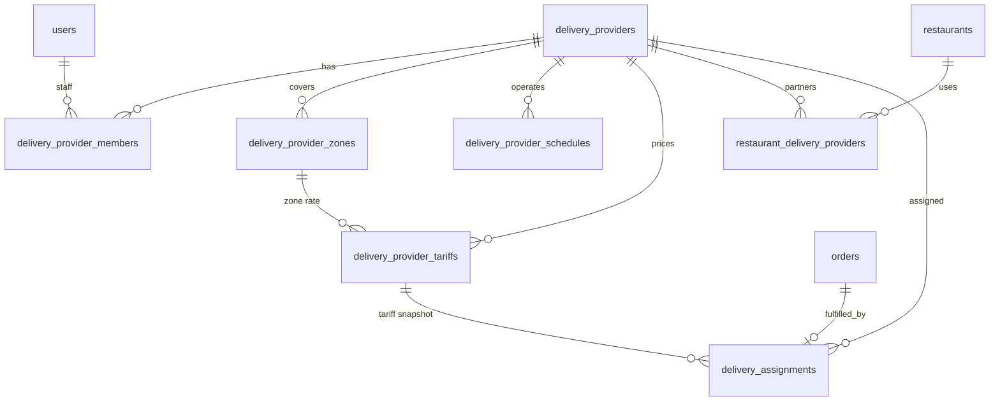

# Delivery Providers — Database & Domain Design

> **Status:** draft — pending user review before implementation plan.  
> **Scope:** PostgreSQL schema for third-party delivery companies (providers), their tariffs, geographic coverage, schedules, and restaurant partnerships. UI target: `delivery-dashboard/`.  
> **Explicitly out of scope (v1):** Driver GPS tracking, automatic dispatch/routing, payouts/settlements, multi-stop batching, customer-facing provider selection UI.

---

## 1. Goal

Venddelo restaurants can outsource deliveries to **one or more independent delivery providers**. Each provider:

- Manages its own **tariffs** (rate cards, versioned over time).
- Defines **geographic service areas** (coverage polygons / radius zones).
- Defines **operating schedules** (when deliveries are offered).
- Links to **restaurants** through an explicit partnership (not implicit).

The `delivery-dashboard` app is the provider-facing admin UI. The existing restaurant dashboard (`frontend/`) remains unchanged in scope for v1 except for future order/quote integration.

---

## 2. Context (existing schema)

Relevant tables today:

| Table | Relevance |
|-------|-----------|
| `users` | Supabase-auth mirror; roles: `owner`, `admin`, `staff` |
| `restaurants` | Tenant; has `latitude`, `longitude`, `timezone`, `delivery_enabled` |
| `restaurant_schedules` | Per-restaurant takeout/delivery hours (not provider hours) |
| `orders` | `type = delivery`; `delivery_address` text only; no provider, no fee breakdown, no coordinates |

**No delivery-provider domain exists yet.**

---

## 3. Approaches considered

### A — Satellite schema (recommended)

Add a self-contained `delivery_*` table group. Foreign keys **into** existing tables (`restaurants`, `orders`, `users`) but **no structural changes** to restaurant/menu/promotion tables. Optional nullable columns on `orders` only when an assignment is created.

| Pros | Cons |
|------|------|
| Isolated migration; easy to reason about | Point-in-polygon queries need geo strategy (see §5) |
| Multiple providers per restaurant | Slight duplication of schedule pattern vs `restaurant_schedules` |
| Provider staff auth via membership table | |

### B — Extend `restaurants` with embedded delivery config

Store zones/tariffs as JSONB on `restaurants` or a single `restaurant_delivery_config` row.

| Pros | Cons |
|------|------|
| Fewer tables | Wrong model: providers are **cross-restaurant** companies |
| | Hard to version tariffs, audit changes, multi-tenant provider dashboard |

### C — Separate database for logistics

| Pros | Cons |
|------|------|
| Hard isolation | Operational overhead; cross-DB joins for order quotes |

**Recommendation:** **A — Satellite schema** with PostGIS for zones (Supabase supports `postgis` extension).

---

## 4. Architecture



### Data flow (quote at checkout — future slice)

1. Restaurant has ≥1 **active** link in `restaurant_delivery_providers`.
2. Customer delivery address is geocoded → `(lat, lng)`.
3. For each linked provider: check **schedule** (provider timezone) and **zone** (point-in-polygon).
4. Pick applicable **tariff** (zone-specific overrides default).
5. Compute `delivery_fee_cents`; restaurant or system picks default provider (v1: restaurant-configured default).
6. On order create: insert `delivery_assignments` row; set nullable FKs on `orders`.

---

## 5. Geographic coverage (zones)

### Storage options

| Option | Recommendation |
|--------|----------------|
| **PostGIS `geography(Polygon)`** | **Preferred** — `ST_Contains`, index-friendly on Supabase |
| GeoJSON in `JSONB` | Fallback if extension blocked; app-side validation |
| Center + radius only | Good for MVP circles; insufficient alone for irregular cercos |

### Zone model

- A provider has **1..N zones** (named cercos).
- Zones may overlap; **`priority`** (integer, higher wins) resolves conflicts.
- `zone_kind`:
  - `polygon` — `boundary` geography column (SRID 4326)
  - `radius` — `center_lat`, `center_lng`, `radius_meters` (stored as geography circle or computed polygon approximation)

**v1 UI:** map editor outputs GeoJSON → API persists as PostGIS geography.

---

## 6. Tariff model

### Pricing models (`pricing_model`)

| Value | Formula (cents) |
|-------|-----------------|
| `flat` | `base_fee_cents` |
| `distance` | `base_fee_cents + per_km_cents * ceil(distance_m / 1000)` after `free_distance_meters` |
| `zone_flat` | Flat fee scoped to `zone_id` |
| `zone_distance` | Distance formula scoped to `zone_id` |

### Versioning

- Tariffs are **never hard-deleted**; use `is_active`, `effective_from`, `effective_until`.
- At assignment time, store `tariff_id` + `quoted_fee_cents` on `delivery_assignments` (price snapshot).
- Provider dashboard can **schedule future rates** (`effective_from` > now).

### Constraints

- `base_fee_cents >= 0`, `per_km_cents >= 0` when applicable.
- `free_distance_meters >= 0`, `max_distance_meters` nullable cap.
- `currency` `VARCHAR(3)` default `MXN` (aligns with migration `0007_currency_mxn`).
- `zone_id` NULL = provider-wide default tariff.

---

## 7. Schedules

Mirror `restaurant_schedules` pattern but **provider-scoped**:

- `day_of_week` `0 = Monday … 6 = Sunday` (project convention).
- One row per time range; closed day = no rows.
- Times interpreted in **`delivery_providers.timezone`** (IANA, default `America/Mexico_City`).
- v1: provider-wide hours only (no per-zone schedules).

---

## 8. Restaurant ↔ provider partnership

`restaurant_delivery_providers` is the **only** link between tenants and providers.

| Field | Purpose |
|-------|---------|
| `status` | `pending` → `active` → `suspended` |
| `is_default` | At most one `is_default = true` per `restaurant_id` among active links |
| `activated_at` | Audit |

Restaurants **do not** own provider zones/tariffs; they only **select** which providers may fulfill their deliveries.

---

## 9. Auth & roles

**Do not alter `users.role` CHECK in v1.**

Provider access via `delivery_provider_members`:

| `member_role` | Capabilities |
|---------------|--------------|
| `owner` | Full provider config + members |
| `admin` | Tariffs, zones, schedules, view assignments |
| `dispatcher` | Assignments, status updates |
| `driver` | Own assignment status (future mobile) |

`delivery-dashboard` middleware: user must have ≥1 active membership.

---

## 10. Database changes (Alembic `0017_delivery_providers`)

### 10.1 Extension

```sql
CREATE EXTENSION IF NOT EXISTS postgis;
```

### 10.2 New tables

#### `delivery_providers`

| Column | Type | Notes |
|--------|------|-------|
| `id` | UUID PK | `gen_random_uuid()` |
| `name` | TEXT NOT NULL | Display name |
| `legal_name` | TEXT NULL | |
| `slug` | VARCHAR(63) NOT NULL UNIQUE | URL-safe identifier |
| `contact_email` | TEXT NULL | |
| `contact_phone` | VARCHAR(20) NULL | E.164 preferred |
| `logo_path` | TEXT NULL | Storage path |
| `timezone` | VARCHAR(64) NOT NULL DEFAULT `America/Mexico_City` | |
| `status` | VARCHAR NOT NULL DEFAULT `draft` | `draft`, `active`, `suspended` |
| `created_at`, `updated_at` | TIMESTAMPTZ | Standard mixins |

Indexes: `ix_delivery_providers_status`, unique `slug`.

#### `delivery_provider_members`

| Column | Type | Notes |
|--------|------|-------|
| `id` | UUID PK | |
| `delivery_provider_id` | UUID FK → `delivery_providers` ON DELETE CASCADE | |
| `user_id` | UUID FK → `users` ON DELETE CASCADE | |
| `member_role` | VARCHAR NOT NULL | `owner`, `admin`, `dispatcher`, `driver` |
| `is_active` | BOOLEAN DEFAULT true | |
| `created_at`, `updated_at` | TIMESTAMPTZ | |

Unique: `(delivery_provider_id, user_id)`.

#### `delivery_provider_zones`

| Column | Type | Notes |
|--------|------|-------|
| `id` | UUID PK | |
| `delivery_provider_id` | UUID FK CASCADE | |
| `name` | TEXT NOT NULL | e.g. "Centro", "Zona Norte" |
| `zone_kind` | VARCHAR NOT NULL | `polygon`, `radius` |
| `boundary` | GEOGRAPHY(Polygon, 4326) NULL | Required when `polygon` |
| `center_lat`, `center_lng` | FLOAT NULL | Required when `radius` |
| `radius_meters` | INTEGER NULL | Required when `radius` |
| `priority` | SMALLINT NOT NULL DEFAULT 0 | Overlap resolution |
| `is_active` | BOOLEAN DEFAULT true | |
| `created_at`, `updated_at` | TIMESTAMPTZ | |

Index: GiST on `boundary` where not null.  
Index: `(delivery_provider_id, is_active)`.

#### `delivery_provider_schedules`

| Column | Type | Notes |
|--------|------|-------|
| `id` | UUID PK | |
| `delivery_provider_id` | UUID FK CASCADE | |
| `day_of_week` | SMALLINT NOT NULL | 0–6 |
| `opens_at` | TIME NOT NULL | |
| `closes_at` | TIME NOT NULL | |
| `created_at`, `updated_at` | TIMESTAMPTZ | |

Index: `(delivery_provider_id, day_of_week)`.

#### `delivery_provider_tariffs`

| Column | Type | Notes |
|--------|------|-------|
| `id` | UUID PK | |
| `delivery_provider_id` | UUID FK CASCADE | |
| `zone_id` | UUID FK → `delivery_provider_zones` ON DELETE SET NULL | NULL = default |
| `name` | TEXT NOT NULL | e.g. "Tarifa estándar 2026" |
| `pricing_model` | VARCHAR NOT NULL | `flat`, `distance`, `zone_flat`, `zone_distance` |
| `base_fee_cents` | INTEGER NOT NULL DEFAULT 0 | |
| `per_km_cents` | INTEGER NULL | Required for distance models |
| `free_distance_meters` | INTEGER NOT NULL DEFAULT 0 | |
| `max_distance_meters` | INTEGER NULL | |
| `min_order_subtotal_cents` | INTEGER NULL | Optional minimum cart |
| `currency` | VARCHAR(3) NOT NULL DEFAULT `MXN` | |
| `effective_from` | TIMESTAMPTZ NOT NULL DEFAULT now() | |
| `effective_until` | TIMESTAMPTZ NULL | NULL = open-ended |
| `is_active` | BOOLEAN DEFAULT true | |
| `created_at`, `updated_at` | TIMESTAMPTZ | |

Index: `(delivery_provider_id, is_active, effective_from)`.

#### `restaurant_delivery_providers`

| Column | Type | Notes |
|--------|------|-------|
| `id` | UUID PK | |
| `restaurant_id` | UUID FK → `restaurants` ON DELETE CASCADE | |
| `delivery_provider_id` | UUID FK → `delivery_providers` ON DELETE CASCADE | |
| `status` | VARCHAR NOT NULL DEFAULT `pending` | `pending`, `active`, `suspended` |
| `is_default` | BOOLEAN NOT NULL DEFAULT false | |
| `activated_at` | TIMESTAMPTZ NULL | |
| `created_at`, `updated_at` | TIMESTAMPTZ | |

Unique: `(restaurant_id, delivery_provider_id)`.  
Partial unique index: one `is_default` per restaurant where `status = 'active'`.

#### `delivery_assignments`

| Column | Type | Notes |
|--------|------|-------|
| `id` | UUID PK | |
| `order_id` | UUID FK → `orders` ON DELETE CASCADE UNIQUE | One assignment per order in v1 |
| `delivery_provider_id` | UUID FK RESTRICT | |
| `tariff_id` | UUID FK → `delivery_provider_tariffs` ON DELETE SET NULL | Snapshot reference |
| `zone_id` | UUID FK → `delivery_provider_zones` ON DELETE SET NULL | Matched zone |
| `status` | VARCHAR NOT NULL DEFAULT `quoted` | See §11 |
| `quoted_fee_cents` | INTEGER NOT NULL | Fee at quote/assign time |
| `distance_meters` | INTEGER NULL | Computed route or haversine |
| `delivery_lat`, `delivery_lng` | FLOAT NULL | Customer drop-off |
| `pickup_lat`, `pickup_lng` | FLOAT NULL | Restaurant at assignment time |
| `assigned_driver_user_id` | UUID FK → `users` ON DELETE SET NULL | Optional |
| `assigned_at`, `picked_up_at`, `delivered_at` | TIMESTAMPTZ NULL | Lifecycle |
| `created_at`, `updated_at` | TIMESTAMPTZ | |

Index: `(delivery_provider_id, status, created_at)`.

### 10.3 Alterations to existing tables

#### `orders` (nullable columns only — backward compatible)

| Column | Type | Notes |
|--------|------|-------|
| `delivery_fee_cents` | INTEGER NOT NULL DEFAULT 0 | Shown in cart/checkout total |
| `delivery_provider_id` | UUID FK → `delivery_providers` ON DELETE SET NULL | Denormalized for listing; canonical link via `delivery_assignments` |

> **Why two references?** `delivery_assignments` holds lifecycle + snapshot; `orders.delivery_provider_id` avoids JOIN on hot restaurant order lists. App keeps both in sync on assign.

#### Tables **not** altered in v1

- `restaurants` — partnership via join table only.
- `users` — provider roles via `delivery_provider_members`.
- `restaurant_schedules` — restaurant hours remain independent from provider hours.

---

## 11. Enumerations

### `delivery_provider.status`
`draft` | `active` | `suspended`

### `delivery_provider_members.member_role`
`owner` | `admin` | `dispatcher` | `driver`

### `delivery_provider_zones.zone_kind`
`polygon` | `radius`

### `delivery_provider_tariffs.pricing_model`
`flat` | `distance` | `zone_flat` | `zone_distance`

### `restaurant_delivery_providers.status`
`pending` | `active` | `suspended`

### `delivery_assignments.status`
`quoted` | `assigned` | `picked_up` | `in_transit` | `delivered` | `failed` | `cancelled`

---

## 12. SQLAlchemy placement

```
backend/app/db/models/delivery.py   # all delivery_* models
```

Register in `app/db/models/__init__.py`.

---

## 13. API surface (future — not this migration)

| Audience | Endpoints (sketch) |
|----------|-------------------|
| Provider dashboard | `CRUD /delivery-providers/{id}`, zones, tariffs, schedules, members |
| Restaurant dashboard | `GET/POST /restaurants/{id}/delivery-providers` (link management) |
| Public menu | `POST /public/.../delivery-quote` (address → fee + provider) |
| Orders | Extend `OrderCreate` / `OrderDTO` with `delivery_fee_cents`, assignment status |

---

## 14. `delivery-dashboard` UI mapping

| Page (existing shell) | Data |
|-----------------------|------|
| Dashboard | Active assignments, today's deliveries |
| Settings | Provider profile, timezone, contact |
| *(new)* Zones | Map editor → `delivery_provider_zones` |
| *(new)* Tariffs | Rate cards → `delivery_provider_tariffs` |
| *(new)* Schedules | Weekly hours → `delivery_provider_schedules` |
| Orders | `delivery_assignments` for this provider |

---

## 15. Testing notes

- Unit: tariff calculator (flat, distance, free distance, max distance).
- Integration: point inside polygon / outside; schedule boundary (timezone).
- Integration: unique `is_default` per restaurant enforced.
- Seed: one provider, two zones, two tariffs, one restaurant link.

---

## 16. Open questions (deferred)

1. **Restaurant-initiated vs provider-initiated** partnership — v1 assumes restaurant requests, provider approves (`pending` → `active`).
2. **Who sets default provider** — restaurant `is_default` flag on link table.
3. **Distance source** — haversine v1; routing API later.
4. **Overlapping providers** — customer sees one fee (restaurant default); marketplace comparison is out of scope.

---

## 17. Summary

| Action | Count |
|--------|-------|
| New tables | 7 |
| PostGIS extension | 1 |
| Altered tables | 1 (`orders`, 2 nullable columns) |
| Unchanged core tables | `restaurants`, `users`, `restaurant_schedules`, menu, promotions |
