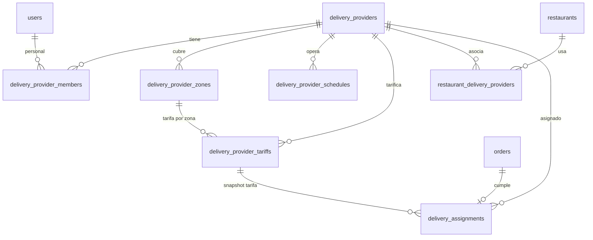

# Proveedores de delivery — Diseño de base de datos y dominio

> **Estado:** borrador — pendiente de revisión del usuario antes del plan de implementación.  
> **Alcance:** Esquema PostgreSQL para empresas de reparto independientes (proveedores), sus tarifas, cobertura geográfica, horarios y vínculos con restaurantes. UI objetivo: `delivery-dashboard/`.  
> **Fuera de alcance (v1):** Rastreo GPS de repartidores, despacho automático/ruteo, liquidaciones/pagos, entregas multi-parada, selector de proveedor en el menú público.

---

## 1. Objetivo

Los restaurantes en Venddelo pueden externalizar entregas a **uno o varios proveedores de reparto independientes**. Cada proveedor:

- Administra sus propias **tarifas** (tablas de precios versionadas en el tiempo).
- Define **cercos geográficos** (polígonos o zonas por radio).
- Define **horarios de operación** (cuándo ofrece reparto).
- Se vincula a **restaurantes** mediante una relación explícita (no implícita).

La app `delivery-dashboard` es el panel administrativo del proveedor. El dashboard del restaurante (`frontend/`) no cambia de alcance en v1, salvo la futura integración de cotización/pedidos.

---

## 2. Contexto (esquema actual)

Tablas relevantes hoy:

| Tabla | Relevancia |
|-------|------------|
| `users` | Espejo de Supabase Auth; roles: `owner`, `admin`, `staff` |
| `restaurants` | Tenant; tiene `latitude`, `longitude`, `timezone`, `delivery_enabled` |
| `restaurant_schedules` | Horarios takeout/delivery del restaurante (no del proveedor) |
| `orders` | `type = delivery`; solo `delivery_address` en texto; sin proveedor, sin desglose de tarifa, sin coordenadas |

**Aún no existe dominio de proveedores de delivery.**

---

## 3. Enfoques considerados

### A — Esquema satélite (recomendado)

Grupo de tablas `delivery_*` autocontenido. Claves foráneas **hacia** tablas existentes (`restaurants`, `orders`, `users`) pero **sin cambios estructurales** en restaurante/menú/promociones. Solo columnas opcionales en `orders` al crear una asignación.

| Pros | Contras |
|------|---------|
| Migración aislada; fácil de razonar | Consultas geo requieren estrategia (ver §5) |
| Varios proveedores por restaurante | Patrón de horarios similar a `restaurant_schedules` |
| Auth de personal vía tabla de membresía | |

### B — Extender `restaurants` con config embebida

Zonas/tarifas en JSONB en `restaurants` o una sola fila `restaurant_delivery_config`.

| Pros | Contras |
|------|------|
| Menos tablas | Modelo incorrecto: los proveedores son empresas **entre restaurantes** |
| | Difícil versionar tarifas, auditar y operar multi-tenant |

### C — Base de datos separada para logística

| Pros | Contras |
|------|------|
| Aislamiento fuerte | Overhead operativo; joins entre DBs para cotizaciones |

**Recomendación:** **A — Esquema satélite** con PostGIS para zonas (Supabase soporta la extensión `postgis`).

---

## 4. Arquitectura



### Flujo de datos (cotización en checkout — slice futuro)

1. El restaurante tiene ≥1 vínculo **activo** en `restaurant_delivery_providers`.
2. La dirección del cliente se geocodifica → `(lat, lng)`.
3. Por cada proveedor vinculado: validar **horario** (timezone del proveedor) y **zona** (punto dentro del polígono).
4. Elegir **tarifa** aplicable (la de zona sobreescribe la predeterminada).
5. Calcular `delivery_fee_cents`; el restaurante o el sistema elige proveedor por defecto (v1: flag `is_default` en el vínculo).
6. Al crear pedido: insertar fila en `delivery_assignments`; rellenar FKs opcionales en `orders`.

---

## 5. Cobertura geográfica (zonas / cercos)

### Opciones de almacenamiento

| Opción | Recomendación |
|--------|---------------|
| **PostGIS `geography(Polygon)`** | **Preferida** — `ST_Contains`, índices en Supabase |
| GeoJSON en `JSONB` | Respaldo si no hay extensión; validación en app |
| Solo centro + radio | Útil para círculos MVP; insuficiente para cercos irregulares |

### Modelo de zona

- Un proveedor tiene **1..N zonas** (cercos con nombre).
- Las zonas pueden solaparse; **`priority`** (entero, mayor gana) resuelve conflictos.
- `zone_kind`:
  - `polygon` — columna `boundary` geography (SRID 4326)
  - `radius` — `center_lat`, `center_lng`, `radius_meters`

**UI v1:** editor de mapa exporta GeoJSON → API persiste como geography PostGIS.

---

## 6. Modelo de tarifas

### Modelos de precio (`pricing_model`)

| Valor | Fórmula (centavos) |
|-------|-------------------|
| `flat` | `base_fee_cents` |
| `distance` | `base_fee_cents + per_km_cents * ceil(distance_m / 1000)` después de `free_distance_meters` |
| `zone_flat` | Tarifa fija asociada a `zone_id` |
| `zone_distance` | Fórmula por distancia asociada a `zone_id` |

### Versionado

- Las tarifas **no se borran**; usar `is_active`, `effective_from`, `effective_until`.
- Al asignar: guardar `tariff_id` + `quoted_fee_cents` en `delivery_assignments` (snapshot).
- El panel del proveedor puede **programar tarifas futuras** (`effective_from` > now).

### Restricciones

- `base_fee_cents >= 0`, `per_km_cents >= 0` cuando aplique.
- `free_distance_meters >= 0`, `max_distance_meters` como tope opcional.
- `currency` `VARCHAR(3)` default `MXN` (alineado con migración `0007_currency_mxn`).
- `zone_id` NULL = tarifa predeterminada del proveedor (todas las zonas).

---

## 7. Horarios

Mismo patrón que `restaurant_schedules` pero **por proveedor**:

- `day_of_week` `0 = lunes … 6 = domingo` (convención del proyecto).
- Una fila por rango horario; día cerrado = sin filas.
- Horas en **`delivery_providers.timezone`** (IANA, default `America/Mexico_City`).
- v1: horarios globales del proveedor (sin horarios por zona).

---

## 8. Vínculo restaurante ↔ proveedor

`restaurant_delivery_providers` es el **único** enlace entre tenants y proveedores.

| Campo | Propósito |
|-------|-----------|
| `status` | `pending` → `active` → `suspended` |
| `is_default` | Como máximo uno `is_default = true` por `restaurant_id` entre vínculos activos |
| `activated_at` | Auditoría |

Los restaurantes **no** poseen zonas/tarifas del proveedor; solo **eligen** qué proveedores pueden cumplir sus entregas.

---

## 9. Auth y roles

**No alterar el CHECK de `users.role` en v1.**

Acceso del proveedor vía `delivery_provider_members`:

| `member_role` | Capacidades |
|---------------|-------------|
| `owner` | Config completa + miembros |
| `admin` | Tarifas, zonas, horarios, ver asignaciones |
| `dispatcher` | Asignaciones, cambios de estado |
| `driver` | Estado de sus entregas (app móvil futura) |

Middleware de `delivery-dashboard`: el usuario debe tener ≥1 membresía activa.

---

## 10. Cambios en base de datos (Alembic `0017_delivery_providers`)

### 10.1 Extensión

```sql
CREATE EXTENSION IF NOT EXISTS postgis;
```

### 10.2 Tablas nuevas

#### `delivery_providers`

| Columna | Tipo | Notas |
|---------|------|-------|
| `id` | UUID PK | `gen_random_uuid()` |
| `name` | TEXT NOT NULL | Nombre comercial |
| `legal_name` | TEXT NULL | Razón social |
| `slug` | VARCHAR(63) NOT NULL UNIQUE | Identificador URL |
| `contact_email` | TEXT NULL | |
| `contact_phone` | VARCHAR(20) NULL | E.164 preferido |
| `logo_path` | TEXT NULL | Ruta en storage |
| `timezone` | VARCHAR(64) NOT NULL DEFAULT `America/Mexico_City` | |
| `status` | VARCHAR NOT NULL DEFAULT `draft` | `draft`, `active`, `suspended` |
| `created_at`, `updated_at` | TIMESTAMPTZ | Mixins estándar |

Índices: `ix_delivery_providers_status`, unique `slug`.

#### `delivery_provider_members`

| Columna | Tipo | Notas |
|---------|------|-------|
| `id` | UUID PK | |
| `delivery_provider_id` | UUID FK → `delivery_providers` ON DELETE CASCADE | |
| `user_id` | UUID FK → `users` ON DELETE CASCADE | |
| `member_role` | VARCHAR NOT NULL | `owner`, `admin`, `dispatcher`, `driver` |
| `is_active` | BOOLEAN DEFAULT true | |
| `created_at`, `updated_at` | TIMESTAMPTZ | |

Unique: `(delivery_provider_id, user_id)`.

#### `delivery_provider_zones`

| Columna | Tipo | Notas |
|---------|------|-------|
| `id` | UUID PK | |
| `delivery_provider_id` | UUID FK CASCADE | |
| `name` | TEXT NOT NULL | ej. "Centro", "Zona Norte" |
| `zone_kind` | VARCHAR NOT NULL | `polygon`, `radius` |
| `boundary` | GEOGRAPHY(Polygon, 4326) NULL | Obligatorio si `polygon` |
| `center_lat`, `center_lng` | FLOAT NULL | Obligatorio si `radius` |
| `radius_meters` | INTEGER NULL | Obligatorio si `radius` |
| `priority` | SMALLINT NOT NULL DEFAULT 0 | Resolución de solapes |
| `is_active` | BOOLEAN DEFAULT true | |
| `created_at`, `updated_at` | TIMESTAMPTZ | |

Índice: GiST en `boundary` donde no sea null.  
Índice: `(delivery_provider_id, is_active)`.

#### `delivery_provider_schedules`

| Columna | Tipo | Notas |
|---------|------|-------|
| `id` | UUID PK | |
| `delivery_provider_id` | UUID FK CASCADE | |
| `day_of_week` | SMALLINT NOT NULL | 0–6 |
| `opens_at` | TIME NOT NULL | |
| `closes_at` | TIME NOT NULL | |
| `created_at`, `updated_at` | TIMESTAMPTZ | |

Índice: `(delivery_provider_id, day_of_week)`.

#### `delivery_provider_tariffs`

| Columna | Tipo | Notas |
|---------|------|-------|
| `id` | UUID PK | |
| `delivery_provider_id` | UUID FK CASCADE | |
| `zone_id` | UUID FK → `delivery_provider_zones` ON DELETE SET NULL | NULL = default |
| `name` | TEXT NOT NULL | ej. "Tarifa estándar 2026" |
| `pricing_model` | VARCHAR NOT NULL | `flat`, `distance`, `zone_flat`, `zone_distance` |
| `base_fee_cents` | INTEGER NOT NULL DEFAULT 0 | |
| `per_km_cents` | INTEGER NULL | Obligatorio en modelos por distancia |
| `free_distance_meters` | INTEGER NOT NULL DEFAULT 0 | |
| `max_distance_meters` | INTEGER NULL | |
| `min_order_subtotal_cents` | INTEGER NULL | Mínimo de carrito opcional |
| `currency` | VARCHAR(3) NOT NULL DEFAULT `MXN` | |
| `effective_from` | TIMESTAMPTZ NOT NULL DEFAULT now() | |
| `effective_until` | TIMESTAMPTZ NULL | NULL = sin fin |
| `is_active` | BOOLEAN DEFAULT true | |
| `created_at`, `updated_at` | TIMESTAMPTZ | |

Índice: `(delivery_provider_id, is_active, effective_from)`.

#### `restaurant_delivery_providers`

| Columna | Tipo | Notas |
|---------|------|-------|
| `id` | UUID PK | |
| `restaurant_id` | UUID FK → `restaurants` ON DELETE CASCADE | |
| `delivery_provider_id` | UUID FK → `delivery_providers` ON DELETE CASCADE | |
| `status` | VARCHAR NOT NULL DEFAULT `pending` | `pending`, `active`, `suspended` |
| `is_default` | BOOLEAN NOT NULL DEFAULT false | |
| `activated_at` | TIMESTAMPTZ NULL | |
| `created_at`, `updated_at` | TIMESTAMPTZ | |

Unique: `(restaurant_id, delivery_provider_id)`.  
Índice único parcial: un solo `is_default` por restaurante con `status = 'active'`.

#### `delivery_assignments`

| Columna | Tipo | Notas |
|---------|------|-------|
| `id` | UUID PK | |
| `order_id` | UUID FK → `orders` ON DELETE CASCADE UNIQUE | Una asignación por pedido en v1 |
| `delivery_provider_id` | UUID FK RESTRICT | |
| `tariff_id` | UUID FK → `delivery_provider_tariffs` ON DELETE SET NULL | Referencia snapshot |
| `zone_id` | UUID FK → `delivery_provider_zones` ON DELETE SET NULL | Zona aplicada |
| `status` | VARCHAR NOT NULL DEFAULT `quoted` | Ver §11 |
| `quoted_fee_cents` | INTEGER NOT NULL | Tarifa al cotizar/asignar |
| `distance_meters` | INTEGER NULL | Ruta o haversine |
| `delivery_lat`, `delivery_lng` | FLOAT NULL | Destino cliente |
| `pickup_lat`, `pickup_lng` | FLOAT NULL | Restaurante al asignar |
| `assigned_driver_user_id` | UUID FK → `users` ON DELETE SET NULL | Opcional |
| `assigned_at`, `picked_up_at`, `delivered_at` | TIMESTAMPTZ NULL | Ciclo de vida |
| `created_at`, `updated_at` | TIMESTAMPTZ | |

Índice: `(delivery_provider_id, status, created_at)`.

### 10.3 Alteraciones a tablas existentes

#### `orders` (solo columnas opcionales — retrocompatible)

| Columna | Tipo | Notas |
|---------|------|-------|
| `delivery_fee_cents` | INTEGER NOT NULL DEFAULT 0 | Total en carrito/checkout |
| `delivery_provider_id` | UUID FK → `delivery_providers` ON DELETE SET NULL | Desnormalizado para listados; vínculo canónico en `delivery_assignments` |

> **¿Por qué dos referencias?** `delivery_assignments` guarda ciclo de vida + snapshot; `orders.delivery_provider_id` evita JOIN en listados calientes del restaurante. La app mantiene ambos sincronizados al asignar.

#### Tablas **sin** cambios en v1

- `restaurants` — vínculo solo vía tabla de unión.
- `users` — roles del proveedor vía `delivery_provider_members`.
- `restaurant_schedules` — horarios del restaurante independientes de los del proveedor.

---

## 11. Enumeraciones

### `delivery_provider.status`
`draft` | `active` | `suspended`

### `delivery_provider_members.member_role`
`owner` | `admin` | `dispatcher` | `driver`

### `delivery_provider_zones.zone_kind`
`polygon` | `radius`

### `delivery_provider_tariffs.pricing_model`
`flat` | `distance` | `zone_flat` | `zone_distance`

### `restaurant_delivery_providers.status`
`pending` | `active` | `suspended`

### `delivery_assignments.status`
`quoted` | `assigned` | `picked_up` | `in_transit` | `delivered` | `failed` | `cancelled`

---

## 12. Ubicación en SQLAlchemy

```
backend/app/db/models/delivery.py   # todos los modelos delivery_*
```

Registrar en `app/db/models/__init__.py`.

---

## 13. API (futuro — no incluida en esta migración)

| Audiencia | Endpoints (borrador) |
|-----------|---------------------|
| Panel proveedor | `CRUD /delivery-providers/{id}`, zonas, tarifas, horarios, miembros |
| Panel restaurante | `GET/POST /restaurants/{id}/delivery-providers` |
| Menú público | `POST /public/.../delivery-quote` (dirección → tarifa + proveedor) |
| Pedidos | Extender `OrderCreate` / `OrderDTO` con `delivery_fee_cents`, estado de asignación |

---

## 14. Mapeo UI `delivery-dashboard`

| Página (shell existente) | Datos |
|--------------------------|-------|
| Dashboard | Asignaciones activas, entregas del día |
| Settings | Perfil del proveedor, timezone, contacto |
| *(nueva)* Zonas | Editor de mapa → `delivery_provider_zones` |
| *(nueva)* Tarifas | Tablas de precio → `delivery_provider_tariffs` |
| *(nueva)* Horarios | Semana operativa → `delivery_provider_schedules` |
| Orders | `delivery_assignments` del proveedor |

---

## 15. Pruebas

- Unitarias: calculadora de tarifas (fija, distancia, distancia gratis, tope).
- Integración: punto dentro/fuera de polígono; límite de horario (timezone).
- Integración: unique `is_default` por restaurante.
- Seed: un proveedor, dos zonas, dos tarifas, un vínculo con restaurante.

---

## 16. Preguntas abiertas (diferidas)

1. **Vínculo iniciado por restaurante vs proveedor** — v1 asume solicitud del restaurante y aprobación del proveedor (`pending` → `active`).
2. **Quién define el proveedor por defecto** — flag `is_default` en la tabla de vínculo.
3. **Fuente de distancia** — haversine en v1; API de ruteo después.
4. **Proveedores solapados** — el cliente ve una tarifa (default del restaurante); comparador marketplace fuera de alcance.

---

## 17. Resumen

| Acción | Cantidad |
|--------|----------|
| Tablas nuevas | 7 |
| Extensión PostGIS | 1 |
| Tablas alteradas | 1 (`orders`, 2 columnas opcionales) |
| Tablas core sin cambios | `restaurants`, `users`, `restaurant_schedules`, menú, promociones |
