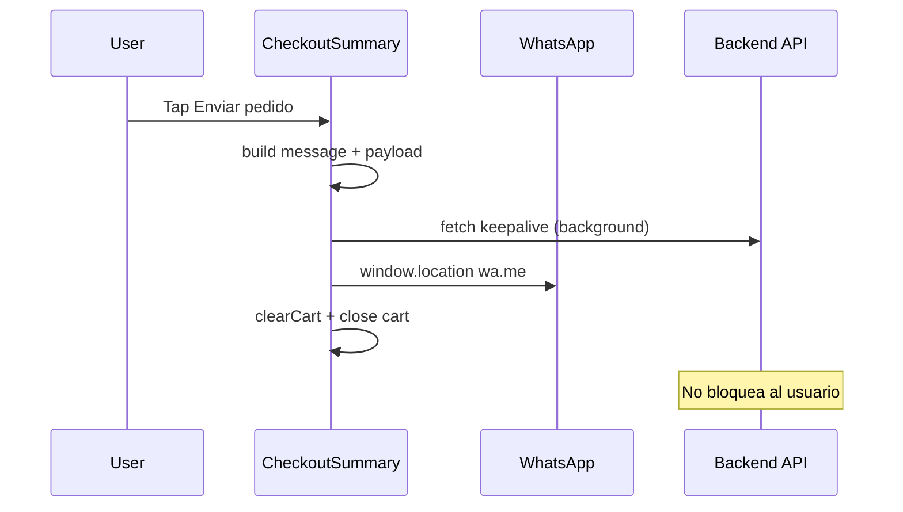

# Live Menu — WhatsApp Checkout & Background Order Save

> Status: **Approved for implementation**
> Scope: Menú live (`PublicDigitalMenuPage`) — pantalla **Confirmar pedido**

## Goal

En la pantalla de confirmación del pedido, el cliente puede pulsar **Enviar pedido** para:

1. Abrir WhatsApp del restaurante con un mensaje en texto plano que incluye **todos** los detalles del pedido (estilo OlaClick).
2. Guardar el pedido en la base de datos **en segundo plano**, sin bloquear ni interrumpir la apertura de WhatsApp.

## Contexto actual

| Pieza | Estado |
|-------|--------|
| Flujo checkout | carrito → completar pedido → confirmar pedido |
| `PublicMenuCheckoutSummary` | Muestra detalle y totales; **sin CTA final** |
| Backend `POST /public/menu/{subdomain}/orders` | Existe; requiere `customer_name`, `customer_phone`, items, etc. |
| `restaurant.whatsapp_phone` | Disponible en `PublicRestaurant` |
| Formatter WhatsApp | No implementado |
| Datos de contacto del cliente | **No se capturan** hoy; el API los exige |

## Requisitos funcionales

### RF1 — Datos de contacto (prerrequisito)

En **Completar pedido** (`PublicMenuCheckoutDetails`), agregar sección **Tus datos de contacto**:

- **Nombre** (texto, mín. 2 caracteres)
- **Teléfono** (input `tel`, mín. 8 dígitos)

Persistir en `localStorage` junto con las preferencias de checkout existentes. Mostrar nombre y teléfono en la tarjeta de detalles de **Confirmar pedido**.

### RF2 — Botón Enviar pedido

Ubicación:

- **Mobile:** barra fija inferior (junto al total), botón ancho completo encima o debajo del total compacto.
- **Desktop / tablet:** dentro del panel lateral **Total del pedido**, debajo del total final.

Etiqueta: **Enviar pedido por WhatsApp** (o **Enviar pedido** con hint de WhatsApp).

Estados:

| Estado | Comportamiento |
|--------|----------------|
| `whatsapp_phone` configurado | Botón habilitado |
| Sin WhatsApp del restaurante | Botón deshabilitado + mensaje: configurar en ajustes del negocio |
| Datos de contacto incompletos | Deshabilitado (no debería ocurrir si RF1 valida al continuar) |

Estilo: reutilizar patrón visual de `.checkoutBtn` (pill, `--dm-primary`, min-height 48px, `cursor-pointer`, transición 180ms, focus visible). Icono WhatsApp: SVG de marca (no emoji).

### RF3 — Mensaje WhatsApp (OlaClick-style)

Generar texto plano con saltos de línea y negritas WhatsApp (`*texto*`). Incluir:

- Nombre del restaurante
- Cliente: nombre y teléfono
- Tipo de pedido (entrega / recoger)
- Dirección (si delivery)
- Método de pago
- Lista de artículos con cantidad, complementos/opciones, notas por línea, subtotal y descuentos por artículo
- Subtotal, descuentos globales, envío, **total final**

Usar `formatMoney` y datos de `buildCheckoutLineBreakdowns` + `quote` + `fulfillment`.

Abrir: `https://wa.me/{digits}?text={encodeURIComponent(message)}` donde `digits` = solo dígitos de `whatsapp_phone`.

**Prioridad UX:** abrir WhatsApp **inmediatamente** al tap; no esperar respuesta del API.

### RF4 — Guardado en DB (background)

Al pulsar Enviar:

1. Construir payload `PublicOrderInput` desde carrito + fulfillment + quote.
2. Generar `Idempotency-Key` (`crypto.randomUUID()`).
3. Disparar `fetch` con `keepalive: true` a `POST /public/menu/{subdomain}/orders` — **fire-and-forget** (`void`, errores silenciosos en consola).
4. Abrir WhatsApp (paso RF3).
5. Limpiar carrito y volver al menú.

No mostrar spinner bloqueante. No modal de éxito/error del API. El restaurante recibe el pedido por WhatsApp aunque falle el guardado en DB.

**Nota:** `delivery_fee_cents` no se persiste hoy en `create_public` (gap backend conocido). El mensaje WhatsApp sí incluye el envío en el total mostrado al cliente.

## Arquitectura

```
frontend/src/lib/digital-menu/checkout/
  formatWhatsAppOrderMessage.ts   ← mensaje OlaClick-style (puro, testeable)
  buildPublicOrderInput.ts        ← mapeo carrito → PublicOrderInput
  submitPublicOrderBackground.ts  ← fetch keepalive fire-and-forget
  fulfillment.ts                  ← + customerName, customerPhone
  preferencesStorage.ts           ← persistir contacto

frontend/src/lib/api/public.ts      ← createPublicOrder (tipado)

PublicMenuCheckoutDetails.tsx     ← campos contacto
PublicMenuCheckoutSummary.tsx       ← CTA + orquestación envío
PublicMenuCart.tsx                  ← props restaurant + onOrderSent
PublicDigitalMenuPage.tsx           ← whatsapp_phone, clearCart
```

## Flujo de datos



## Manejo de errores

| Caso | Acción |
|------|--------|
| Sin `whatsapp_phone` | Botón disabled + copy explicativo |
| API falla en background | Silencioso; WhatsApp ya abierto |
| Popup bloqueado (raro en mobile) | `window.location.href` como fallback |
| Carrito vacío | No aplicable en summary |

## Accesibilidad (ui-ux-pro-max)

- Botón con `aria-label` descriptivo
- `touch-action: manipulation` en CTA móvil
- Contraste texto/botón según tema del menú (`--dm-primary` sobre `--dm-surface`)
- `prefers-reduced-motion`: sin animaciones extra
- Padding inferior del scroll compensado por barra fija (+ altura del botón)

## Fuera de alcance

- Pagos en línea
- Confirmación visual post-envío
- Persistir `delivery_fee_cents` en orders (requiere cambio backend)
- Notificaciones push al restaurante
- Traducción del mensaje WhatsApp

## Criterios de aceptación

- [ ] Cliente ingresa nombre y teléfono antes de confirmar
- [ ] Botón visible en confirmar pedido (mobile + desktop)
- [ ] Tap abre WhatsApp con mensaje completo al número del restaurante
- [ ] Pedido se POSTea en background sin delay perceptible
- [ ] Carrito se vacía y vuelve al menú tras enviar
- [ ] Sin WhatsApp configurado: botón deshabilitado con mensaje claro
