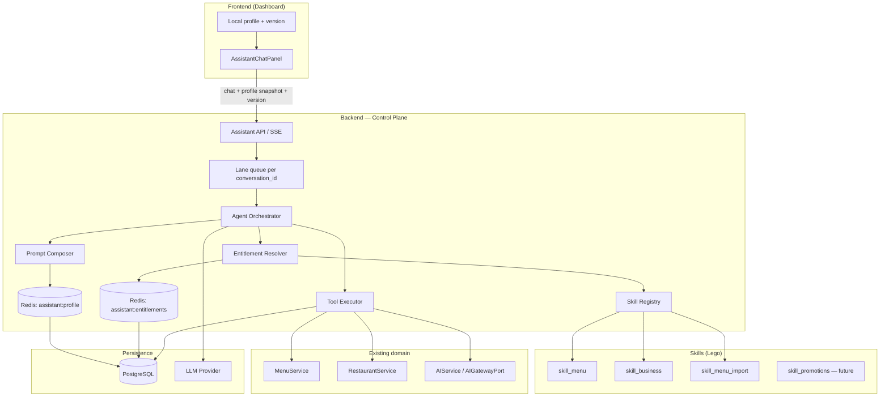
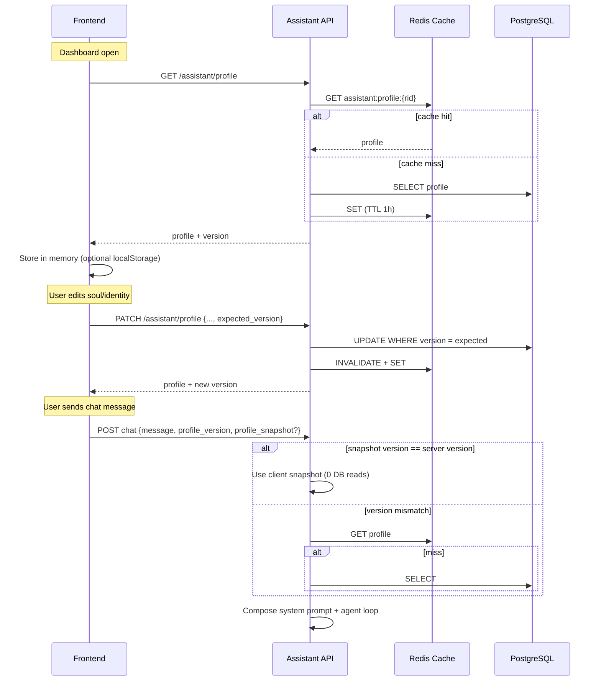
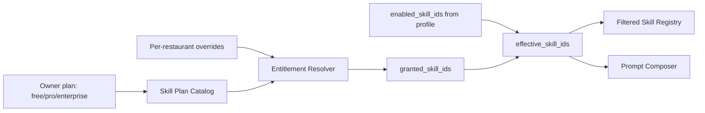
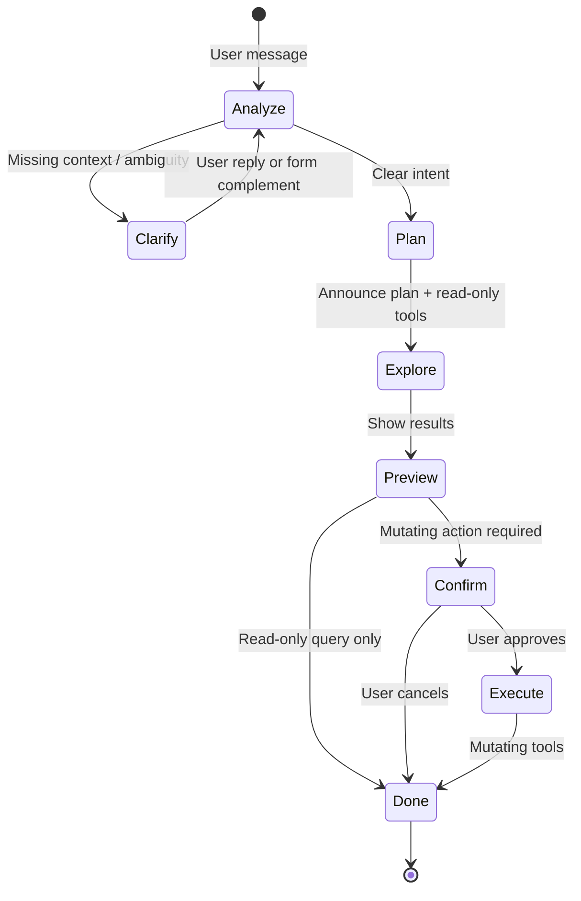
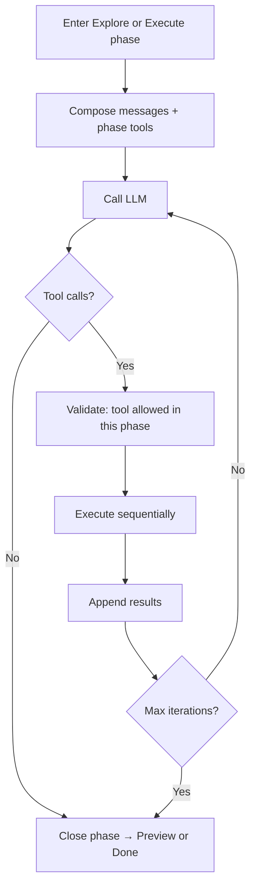

# Venddelo Agentic Assistant — Architecture Design

> **Status:** draft — pending user review before implementation plan.  
> **Scope:** AI assistant architecture for restaurant owners: natural-language dashboard control, skill-based extensibility, per-restaurant identity and soul.  
> **Explicitly out of scope (v1):** delete operations, cross-tenant actions, external channels (WhatsApp/Telegram), autonomous background sub-agents, proactive heartbeat.

---

## 1. Goal

Restaurant owners will talk to their assistant in **natural language** to perform nearly everything they can do in the dashboard today, **except delete** resources. Examples:

- *"Edit the Classic Burger product and set the price to 12.50"*
- *"Disable the 'Extra cheese' add-on on every product where it appears"*
- *"Upload this menu"* (PDF or image) → extraction → review → apply changes
- *"Change Saturday delivery hours to 10:00–22:00"*
- *"Update the restaurant name and cover photo"*

Each restaurant gets **one assistant with its own identity** (name, personality, tone). The system must be **Lego-modular**: menu and business skills today; promotions, delivery, reports, etc. tomorrow — without rewriting the core.

**OpenClaw inspiration:** agent runtime with a tool loop, skills as plug-in modules, serialized sessions per conversation, identity/soul as a prompt layer, and a central control plane — adapted for a **multi-tenant cloud SaaS**, not a local filesystem agent.

---

## 2. Current Venddelo context

| Existing piece | Status |
|----------------|--------|
| SSE chat | `POST /restaurants/{id}/assistant/conversations/{conv_id}/chat` |
| Persisted conversations | `assistant_conversations`, `assistant_messages` |
| Static prompt | `ASSISTANT_SYSTEM_PROMPT` in `prompts.py` |
| LLM | `LLMProviderPort` (stub / OpenAI streaming) |
| AI jobs | `AIGatewayPort` — menu extraction, optimization, translation |
| Menu/restaurant domain | `MenuService`, `RestaurantService`, CRUD APIs (some soft-delete) |

**Main gap:** the current assistant is **chat-only** — no tools, no actions, no per-restaurant identity.

---

## 3. Design principles

1. **Lego / Open-Closed:** each new capability = a **Skill** with its own tools; the orchestrator stays stable.
2. **Tenant isolation:** `restaurant_id` always comes from JWT/ownership, never from the LLM.
3. **No-delete policy:** the tool registry **does not expose** destructive operations; soft-disable instead of delete.
4. **DB as source of truth; cache for latency:** identity/soul live in Postgres; Redis avoids a DB read on every message.
5. **The client may send the profile in the request** to skip round-trips, with version validation on the backend.
6. **One agent turn per conversation at a time** (lane queue, OpenClaw-style) to prevent tool race conditions.
7. **Reuse existing domain services** — tools are thin adapters over `MenuService`, etc.
8. **Transparent streaming:** the user sees progress (thinking, running tool, result) via extended SSE.
9. **Per-restaurant entitlements:** not every tenant gets every skill; the platform grants, the owner enables within what is granted.

---

## 4. High-level architecture



### OpenClaw mapping

| OpenClaw concept | Venddelo equivalent |
|------------------|---------------------|
| Gateway (control plane) | FastAPI assistant module + orchestrator |
| Pi Agent loop | `AgentOrchestrator` (iterative LLM ↔ tools) |
| SOUL.md / AGENTS.md | `soul_markdown` + `identity_markdown` in DB |
| Skills folders + SKILL.md | `app/modules/assistant/skills/{name}/` |
| Local session JSONL | `assistant_messages` + tool-call metadata |
| Lane queue (1 turn/session) | Redis lock or in-process queue per `conversation_id` |
| Tool allowlist / deny | Registry filters tools; global **no delete** policy |
| Docker sandbox | Not v1 — tools call typed services, not shell |
| Heartbeat / proactive cron | Future phase |

---

## 5. Identity and Soul — storage and sync

### 5.1 Recommendation: **NOT on the frontend filesystem**

Storing `folder/{restaurant_id}/identity.md` on the client is **not appropriate** for Venddelo:

- This is a **multi-tenant cloud product**, not a local-first agent like OpenClaw (`~/.openclaw/workspace/SOUL.md`).
- Multiple devices/tabs/staff would not share state.
- No centralized audit or backup.
- The **backend must** compose the final prompt (security, injection, boundaries).

**Do use Markdown as the content format**, but stored in **PostgreSQL as TEXT**, not as disk files or repo files.

### 5.2 Proposed data model

New table `restaurant_assistant_profiles` (1:1 with `restaurants`):

| Column | Type | Description |
|--------|------|-------------|
| `restaurant_id` | UUID PK/FK | Tenant |
| `display_name` | VARCHAR(80) | Assistant name (*"Luna"*, *"ChefBot"*) |
| `identity_markdown` | TEXT | Who they are, role, expertise, declared limits |
| `soul_markdown` | TEXT | Personality, tone, values, response style |
| `enabled_skill_ids` | JSONB | **Owner-chosen subset** within what is granted (see §6.4) |
| `version` | INTEGER | Increments on each PATCH (optimistic concurrency) |
| `updated_at` | TIMESTAMPTZ | For ETag/cache |

**On restaurant creation:** seed from code templates (`templates/default_identity.md`, `default_soul.md`) copied into the initial row. `enabled_skill_ids` is initialized from the plan's default granted skills (e.g. only `menu_read` on free).

> **Important:** `enabled_skill_ids` ≠ full access. It is the owner's preference. The backend always computes `effective_skills = granted ∩ enabled` before registering tools or composing the prompt.

### 5.3 Sync flow (no DB on every message)



**Rules:**

- The **client sends** `profile_version` on every message (required).
- Optionally sends `profile_snapshot` (name + identity + soul + enabled_skills) to skip backend reads when versions match.
- If `profile_version` mismatches → backend ignores snapshot and loads from Redis/DB (response includes `profile.updated` event for FE refresh).
- **Never blindly trust** the snapshot for permissions — only for prompt composition; `restaurant_id`, entitlements, and `enabled_skill_ids` are **re-validated** server-side against the canonical version when in doubt.
- The snapshot includes `enabled_skill_ids` but **does not replace** the `granted_skill_ids` calculation; the entitlement resolver always runs on the backend before the agent loop.

### 5.4 Alternatives considered

| Approach | Pros | Cons | Verdict |
|----------|------|------|---------|
| **A — DB + Redis + request snapshot (recommended)** | Fast, multi-device, auditable | Versioning logic | ✅ |
| **B — DB only, read every message** | Simple | +5–15 ms per chat; unnecessary DB load | ❌ |
| **C — Frontend only, always send snapshot** | Zero reads | No source of truth; staff out of sync | ❌ |
| **D — .md files in Supabase Storage** | OpenClaw-familiar | I/O overhead; hard to transaction with skills | ❌ v1 |

---

## 6. Skill system (Lego)

### 6.1 Skill anatomy

Each skill is a self-contained backend package:

```
app/modules/assistant/skills/
  registry.py
  base.py                    # Protocol: SkillPort
  menu/
    SKILL.md                 # LLM instructions (when to use, limits)
    manifest.py              # id, version, required_permissions
    tools.py                 # JSON Schema definitions + handlers
    tests/
  business/
    SKILL.md
    manifest.py
    tools.py
  menu_import/
    SKILL.md
    manifest.py
    tools.py                 # Orchestrates AIGatewayPort extract + apply draft
```

**`SkillPort` interface:**

```python
# Conceptual — do not implement yet
class SkillPort(Protocol):
    id: str
    def tool_definitions(self) -> list[ToolDefinition]: ...
    async def execute(self, tool_name: str, args: dict, ctx: AgentContext) -> ToolResult: ...
    def system_prompt_section(self) -> str: ...  # Summarized SKILL.md content
```

**`AgentContext`** includes: `restaurant_id`, `user_id`, `conversation_id`, `uow`, injected services — **never** trust LLM-provided IDs without resolving by name/search within the tenant.

### 6.2 v1 skills (roadmap)

| Skill ID | Capabilities | Example tools |
|----------|--------------|---------------|
| `menu_read` | Query menu | `search_products`, `get_product`, `list_categories` |
| `menu_write` | Edit menu (no delete) | `update_product`, `create_product`, `disable_product`, `disable_option_item_globally`, `reorder_products` |
| `business` | Business settings | `update_restaurant_info`, `update_schedule`, `update_logo` |
| `menu_import` | Upload menu | `start_menu_extraction`, `get_extraction_status`, `apply_extraction_draft` |
| `promotions` | Future | `create_promotion`, `disable_promotion`, … |

Read-only skills can ship before write skills to validate the agent loop with lower risk.

### 6.3 No-delete policy

- Handlers **never call** domain `delete_*` methods.
- Products/add-ons: `is_active = false` / `is_available = false`.
- The registry rejects tools whose `effect` is `delete`.
- Contract tests: no skill exposes DELETE verbs.

### 6.4 Entitlements — not every restaurant gets every skill

Skills exist in code (Lego), but **access is gated per tenant**. Two distinct layers:

| Layer | Who controls | Meaning |
|-------|--------------|---------|
| **Granted** (`granted_skill_ids`) | Platform (plan, admin, promos) | What the restaurant **may** use |
| **Enabled** (`enabled_skill_ids`) | Restaurant owner | What the owner **wants active** now |
| **Effective** (`effective_skill_ids`) | Backend (computed) | `granted ∩ enabled` — what the agent actually loads |



#### Sources of `granted_skill_ids`

1. **Owner plan** — today `users.plan` ∈ `free` | `pro` | `enterprise` (existing schema).
2. **Plan → skills catalog** — defined in code for v1 (`assistant_skill_catalog.py`); migratable to `assistant_plan_skills` when billing becomes dynamic.
3. **Per-restaurant overrides** — optional `restaurant_assistant_entitlements` row for beta, custom enterprise, or revoking a specific skill.

Proposed table `restaurant_assistant_entitlements` (0..1 per restaurant):

| Column | Type | Description |
|--------|------|-------------|
| `restaurant_id` | UUID PK/FK | Tenant |
| `granted_extra` | JSONB | Skills added outside the plan (`["menu_import"]`) |
| `revoked` | JSONB | Skills removed even if the plan includes them |
| `expires_at` | TIMESTAMPTZ NULL | Temporary promos / beta |
| `source` | VARCHAR(40) | `admin`, `promo`, `beta`, `support` |
| `updated_at` | TIMESTAMPTZ | Audit |

**Formula:**

```
granted = plan_skills(owner.plan) ∪ granted_extra − revoked
effective = granted ∩ enabled_skill_ids
```

If `expires_at` has passed → ignore that row's `granted_extra` (job or lazy check).

#### Initial catalog (example — adjustable)

| Skill ID | Minimum plan | Notes |
|----------|--------------|-------|
| `menu_read` | `free` | Always available |
| `menu_write` | `free` | Core product value |
| `business` | `free` | Hours, name, logo |
| `menu_import` | `pro` | PDF/image extraction |
| `promotions` | `pro` | Future |
| `analytics` | `enterprise` | Future |

#### Enforcement (backend — never UI-only)

1. **Prompt composer** — only includes SKILL.md sections for `effective_skill_ids`.
2. **Runtime tool registry** — the LLM only receives tool definitions for effective skills.
3. **Tool executor** — rejects execution if `tool.skill_id ∉ effective` → `tool.error` code `skill_not_entitled`.
4. **PATCH profile** — validate `enabled_skill_ids ⊆ granted`; if the owner tries to enable a non-granted skill → `422` with blocked skill list.
5. **Chat request** — even if the client sends a snapshot with non-granted skills, the backend recalculates and uses only `effective`.

#### Cache

| Key | Value | TTL |
|-----|-------|-----|
| `assistant:entitlements:{restaurant_id}` | `{granted, plan, overrides_version}` | 1h (same strategy as profile) |

Invalidate when owner plan changes, admin overrides change, or promo expires.

#### Enriched API response

`GET /assistant/profile` returns:

```json
{
  "display_name": "Luna",
  "enabled_skill_ids": ["menu_read", "menu_write"],
  "granted_skill_ids": ["menu_read", "menu_write", "business"],
  "effective_skill_ids": ["menu_read", "menu_write"],
  "skills_catalog": [
    {
      "id": "menu_import",
      "label": "Import menu",
      "granted": false,
      "required_plan": "pro",
      "lock_reason": "upgrade_required"
    }
  ]
}
```

The frontend **does not decide** access; it only renders locks/upsell based on `granted` and `skills_catalog`.

#### Agent behavior when a skill is missing

If the user asks for something outside entitlements (*"upload this PDF"* without `menu_import`):

- The agent **does not** run tools from that skill.
- It explains the limit and, if applicable, an upgrade CTA (plan-configurable copy).
- Non-granted tools are **not exposed** to the LLM (avoids confusion and bypass attempts).

#### Alternatives considered

| Approach | Pros | Cons | Verdict |
|----------|------|------|---------|
| **A — Plan catalog + per-restaurant overrides (recommended)** | Flexible, auditable, aligns with `users.plan` | Extra resolver | ✅ |
| **B — Only `enabled_skill_ids` without a granted layer** | Simple | Owner enables Pro skills on free; not monetizable | ❌ |
| **C — Global feature flags (LaunchDarkly)** | Fast ops | Does not model per-tenant plan; extra cost | ❌ v1 |

---

## 7. Agent Loop — Plan-Act-Confirm (agentic runtime)

Yes — this will be an **agent loop**, inspired by `pi-agent-core` / OpenClaw. But it **does not jump straight to mutating data**: each turn follows a **Plan → Act (read) → Confirm → Execute (write)** pipeline.

> **What was already covered?** SSE streaming (`content.delta`, `tool.start`, `tool.result`) and human confirmation for bulk actions (§7.6).  
> **What was missing and is added here:** explicit **intent analysis** phase, plan announcement to the user, clarification questions (open text or `ChatFormComplement`), and **read-only first / mutation after** separation.

### 7.0 Per-turn pipeline (recommended)



| Phase | What the assistant does | Allowed tools | UI |
|-------|-------------------------|---------------|-----|
| **1 — Analyze** | Interpret intent, detect missing data | None (LLM only) | `agent.phase: analyzing` + text stream |
| **2 — Clarify** | Ask the user | None | Open text **or** `complement` (form) |
| **3 — Plan** | Announce what it will do, in natural language | None | Text: *"I'll search… and show you the list before disabling"* |
| **4 — Explore** | Gather context | **Read** only (`search_*`, `list_*`, `get_*`) | `agent.status: processing` + `tool.start/result` |
| **5 — Preview** | Present findings | None (summarize tool results) | Markdown list/tables |
| **6 — Confirm** | Ask OK before mutating | `request_confirmation` or `complement` | Confirm form / Yes-No buttons |
| **7 — Execute** | Apply changes | **Mutate** only (with `confirmation_token`) | `tool.start/result` + final summary |

**Hard rule (orchestrator):** tools with `effect: mutate` are **not registered** for the LLM until phase Confirm has produced a valid `confirmation_token`. The model cannot skip preview.

### 7.1 Full example — disable add-on globally

**User:** *"Disable the Extra cheese add-on on all products"*

| Phase | Assistant response (stream) | Backend |
|-------|----------------------------|---------|
| Analyze | *(internal — not shown)* | Classifies: `menu_write` + bulk + needs entity resolution |
| Plan | *"Ok. I'll analyze products that contain the **Extra cheese** add-on and show you the list before disabling it on each one."* | `agent.phase: plan` |
| Explore | *(meanwhile)* `processing…` | `agent.status: processing` → `tool.start: search_option_items` → `tool.start: list_products_by_option` |
| Preview | *"Found **12 products** with 'Extra cheese': Classic Burger, … Should I disable it on all of them?"* | `message.complete` without mutation |
| Confirm | Complement form: choice `confirm_bulk_disable` Yes / No / Some only | `complement` on `message.complete` |
| Execute | *"Done. Disabled 'Extra cheese' on 12 products."* | mutating tools with token |

The `ChatStreamProcessing` component (animated dots) shows while `agent.status === processing` **or** tools are in flight — it already exists in the frontend.

### 7.2 Clarification — open text vs `ChatFormComplement`

Reuse the existing complement (`ChatFormComplement.tsx`, schema in `frontend/docs/assistant-chat-form-complement.md`):

| Situation | Mechanism | Example |
|-----------|-----------|---------|
| Missing simple data | Open question in markdown | *"What's the exact add-on name?"* |
| Finite ambiguity (2–8 options) | `complement.type: form` with `choice` | Pick product from `search_products` candidates |
| Structured form (create product) | Multi-field `complement` | category + name + price (mock already exists) |
| Bulk confirmation | `complement` choice Yes/No/Partial | Before `disable_option_item_globally` |
| Informational only | No complement | Markdown reply |

**Emission:** complement goes on `message.complete` with the final text of the Clarify/Confirm phase (contract already documented; backend emission pending).

**Next turn:** client sends structured `formSubmission` (preferred) plus readable summary — orchestrator resumes at **Analyze** with enriched context.

### 7.3 Internal agent loop (within each phase)

Within Explore or Execute, the classic LLM ↔ tools loop remains active:



**Parameters:**

- `max_tool_iterations`: 8 per phase
- `max_tools_per_turn`: 20 total
- **Sequential** execution (lane queue per `conversation_id`)
- A turn may **end at Clarify** without running any tool — valid and expected

### 7.4 System prompt composition

Layers (order):

1. **Core policy** (static) — no-delete, tenant scope, don't invent data, **analyze intent before acting**, announce plan, read-before-write, confirm bulk mutations.
2. **Behavior policy** (static) — Plan-Act-Confirm rules from §7.0.
3. **Identity markdown** (DB).
4. **Soul markdown** (DB).
5. **Skill sections** — only `effective_skill_ids`.
6. **Restaurant context snapshot** (optional, cache).

### 7.5 Extended SSE events

| Event | Payload | When |
|-------|---------|------|
| `content.delta` | `{delta}` | Streaming text |
| `agent.phase` | `{phase: "analyzing"\|"plan"\|"explore"\|"preview"\|"confirm"\|"execute"}` | Phase change |
| `agent.status` | `{status: "idle"\|"processing"\|"awaiting_input"}` | `processing` → show dots (`ChatStreamProcessing`) |
| `agent.thinking` | `{summary?}` | Internal reasoning (optional) |
| `tool.start` | `{tool, args_summary, effect: "read"\|"mutate"}` | Before execution |
| `tool.result` | `{tool, ok, summary}` | After execution |
| `tool.error` | `{tool, code, message}` | Tool failed |
| `profile.updated` | `{version, ...}` | Client out of date |
| `message.complete` | `{message_id, content, complement?, actions_taken[], phase}` | End of sub-turn or full turn |
| `error` | `{code, message}` | Fatal failure |

A long turn may emit **multiple** `message.complete` events if it pauses at Clarify/Confirm (with `complement`) and continues on the user's next message.

`actions_taken[]` is only populated in phase Execute.

### 7.6 Human-in-the-loop confirmation

For **mutating** actions — especially bulk:

1. After **Preview**, the agent emits `complement` (form choice) or internal `request_confirmation` tool.
2. Backend generates `confirmation_token` (UUID, TTL 15 min, scoped to planned action).
3. Next message includes `confirmation_token` + user response.
4. Orchestrator enters **Execute** phase; mutating tools validate token.

If the user rejects → **Done** without mutation; token invalidated.

### 7.7 Alternatives considered

| Approach | Pros | Cons | Verdict |
|----------|------|------|---------|
| **A — Plan-Act-Confirm with orchestrator phases (recommended)** | Predictable, clear UX, gated mutation | More backend logic | ✅ |
| **B — Prompt only ("analyze before acting")** | Simple | LLM ignores rules under pressure | ❌ |
| **C — Two models (planner + executor)** | Clear separation | 2× cost, latency | ❌ v1 |

---

## 8. Entity resolution (the LLM doesn't know UUIDs)

The user says *"the classic burger"* — the agent resolves in **Explore** or asks **Clarify**:

1. Tool `search_products(query="classic burger")` → candidates.
2. If ambiguous → **Clarify** phase with `complement` choice (1–3 options) or open question.
3. Use internal `product_id` only in later phases.

**Never** require the user to supply UUIDs; they are outputs of search tools.

---

## 9. Integration with existing AI (menu import)

The `menu_import` skill **does not reimplement** extraction — it orchestrates existing jobs:

1. `start_menu_extraction` → `POST ai/jobs/extract-menu` (attachment already in Storage).
2. Poll or internal webhook → `get_extraction_status`.
3. Present draft to the user (chat summary + optional complement UI).
4. After confirmation → `apply_extraction_draft` (new tool that materializes categories/products via `MenuService`).

Reuses `ai_artifacts` for undo where applicable.

---

## 10. Security and audit

| Risk | Mitigation |
|------|------------|
| Prompt injection via owner-edited soul/identity | Length limits; immutable core policy; tools never run SQL/shell |
| Cross-tenant | `restaurant_id` from auth; tools receive ctx, not tenant args |
| Escalation to delete | Registry + code review + contract tests |
| Bulk actions | Confirmation + per-turn limit N |
| LLM cost | max iterations; profile cache; model routing (mini vs full) |
| Entitlement bypass via snapshot or prompt | Server-side resolver; tools not registered; executor rejects |
| Owner enables non-granted skill | PATCH validates `enabled ⊆ granted`; chat recalculates effective |

**Audit:** `assistant_messages.metadata` stores `{tool_calls: [{name, args_hash, result_summary, ts}]}`.

Optional phase 2: `assistant_action_log` table for analytics.

---

## 11. Target backend module layout

```
app/modules/assistant/
  api.py                          # Chat + profile CRUD endpoints
  conversation_service.py         # Existing — integrate orchestrator
  service.py                      # Evolves or delegates to agent/
  prompts.py                      # Static core policy
  schemas.py
  agent/
    orchestrator.py               # Agent loop
    lane_queue.py
    prompt_composer.py
    tool_executor.py
    context.py                    # AgentContext
  skills/
    registry.py
    base.py
    menu/
    business/
    menu_import/
  profile/
    service.py
    repository.py
    cache.py
  entitlements/
    catalog.py                  # plan → skills, UI metadata
    resolver.py                 # granted = plan + overrides − revoked
    repository.py               # restaurant_assistant_entitlements
    cache.py
```

**New port:** extend `LLMProviderPort` or add `AgentLLMPort` with **tool calling** support (function calling / structured outputs).

---

## 12. Frontend (design only)

| Piece | Responsibility |
|-------|----------------|
| `AssistantProfileSettings` | Edit name, identity, soul; skill toggles **only if granted** |
| `AssistantSkillsCatalog` | Skill list with locks, required plan, upsell |
| `useAssistantProfile()` | Initial fetch, PATCH, local version; exposes granted/effective |
| `AssistantChatPanel` | Send `profile_version` + snapshot; render tool events |
| `ChatToolProgress` | UI for `tool.start` / `tool.result` + current phase |
| `ChatStreamProcessing` | "Processing…" dots when `agent.status === processing` (already exists) |
| `ChatFormComplement` | Clarify + Confirm — reuse existing component |

Chat request shape:

```typescript
// Conceptual
{
  message: string,
  attachments?: [...],
  profile_version: number,
  profile_snapshot?: { display_name, identity_markdown, soul_markdown, enabled_skill_ids },
  formSubmission?: ChatFormSubmission,      // reply to previous complement
  confirmation_token?: string                 // approval for mutating action
}
```

---

## 13. Recommended delivery phases

| Phase | Deliverable | Value |
|-------|-------------|-------|
| **0 — Profile + entitlements** | Profile + entitlements tables, resolver, enriched API, UI toggles/locks | Identity + plan gating |
| **1 — Runtime** | Agent loop + SSE tool events + lane queue + effective skills | Lego infrastructure |
| **2 — menu_read** | Search/query menu via chat | Validate entity resolution |
| **3 — menu_write** | Edit/disable products and add-ons | Core user value |
| **4 — business** | Hours, name, logo | |
| **5 — menu_import** | PDF/image → menu | Reuses AIGateway |
| **6 — promotions + bulk** | Additional skills | |

Each phase is **independently deployable**; new skills are added to the catalog with `min_plan` without changing the orchestrator.

---

## 14. Open decisions (for review)

1. **Queue or reject** messages while the agent runs tools? (Recommendation: queue 1.)
2. **Single model or routing?** e.g. `gpt-4o-mini` for read, `gpt-4o` for write/import.
3. **Do staff share the same assistant profile** as the owner? (Recommendation: yes, 1 profile per restaurant.)
4. **Size limit** for identity/soul? (Recommendation: 4 KB each.)
5. **Plan on `users` or migrate to `restaurants`?** (Recommendation v1: resolve via owner.plan; evaluate `restaurants.plan` when one user owns multiple locations on different plans.)
6. **Admin UI for overrides** in v1 or internal SQL/API only? (Recommendation: internal admin API; admin UI in phase 2.)

---

## 15. Design definition of done

- [x] Agentic architecture defined (loop, skills, tools)
- [x] Identity/soul model with sync without DB-per-message
- [x] Explicit rejection of frontend filesystem for soul
- [x] OpenClaw alignment documented
- [x] Implementation phases proposed
- [x] Per-restaurant entitlements (granted vs enabled vs effective)
- [x] Plan-Act-Confirm pipeline with prior analysis and complement-based clarification
- [ ] User approval → next step: **implementation plan** (`writing-plans`)

---

## References

- OpenClaw Architecture: Gateway, sessions, skills, SOUL.md, lane queue — https://openclaw-openclaw.mintlify.app/concepts/architecture
- Current Venddelo assistant: `backend/docs/assistant-chat-streaming.md`
- Venddelo AI jobs: `docs/superpowers/specs/2026-06-14-phase-6-ai-services-design.md`
- Venddelo form complement: `frontend/docs/assistant-chat-form-complement.md`
