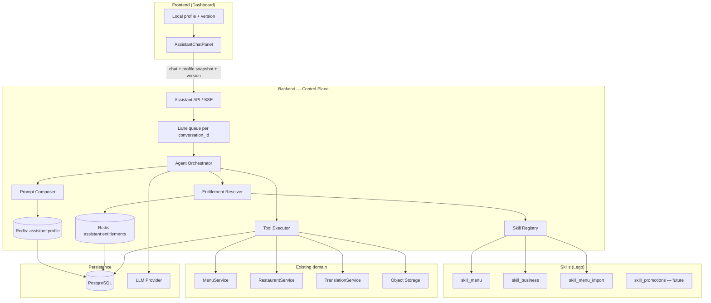
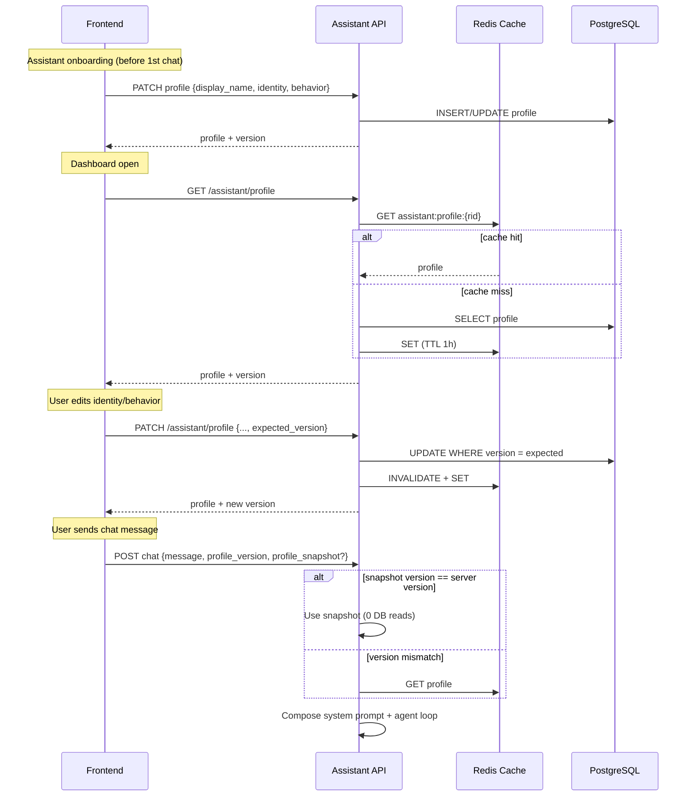
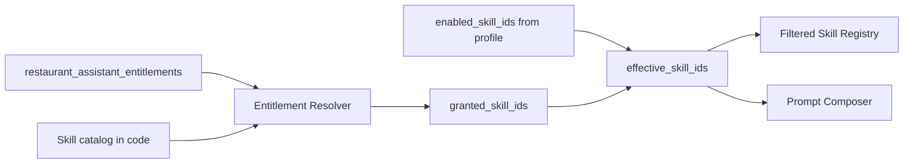
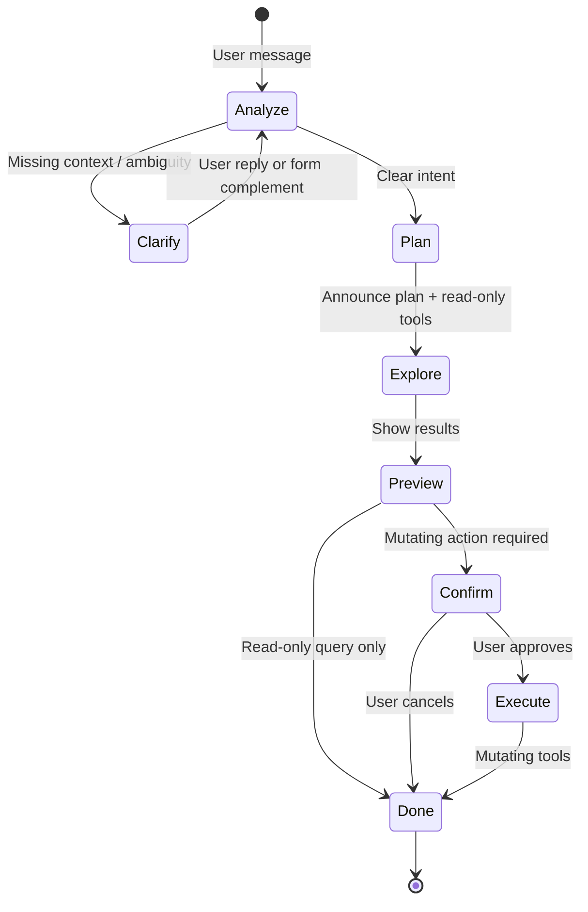
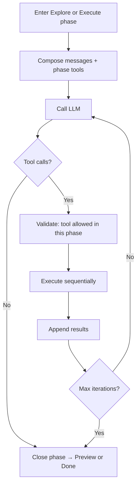
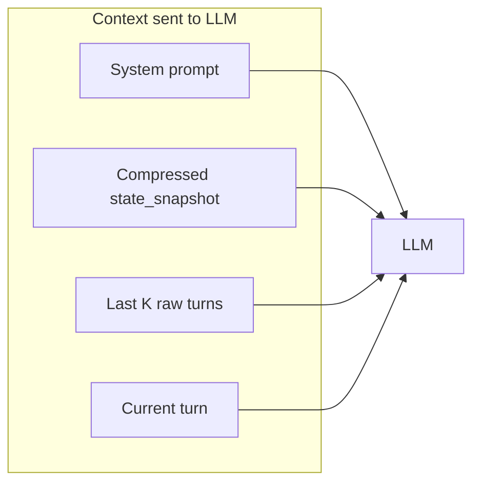
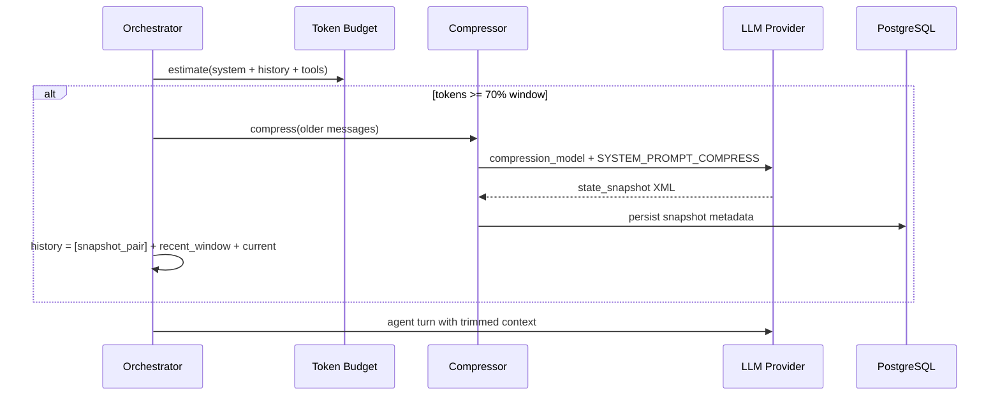
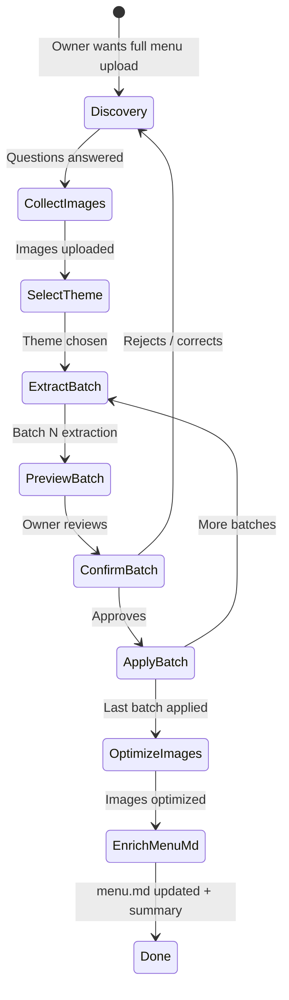

# Venddelo Agentic Assistant — Architecture Design

> **Status:** approved — implementation started (Phase 0 + Phase 1 foundation).  
> **Scope:** AI assistant architecture for restaurant owners: natural-language dashboard control, skill-based extensibility, per-restaurant identity/behavior.  
> **Explicitly out of scope (v1):** delete operations, cross-tenant actions, external channels (WhatsApp/Telegram), autonomous background sub-agents, proactive heartbeat.

---

## 1. Goal

Restaurant owners will talk to their assistant in **natural language** to perform nearly everything they can do in the dashboard today, **except delete** resources. Examples:

- *"Edit the Classic Burger product and set the price to 12.50"*
- *"Disable the 'Extra cheese' add-on on every product where it appears"*
- *"Upload this menu"* (PDF or image) → extraction → review → apply changes
- *"Change Saturday delivery hours to 10:00–22:00"*
- *"Update the restaurant name and cover photo"*

Each restaurant gets **one assistant with its own identity** (name, personality, tone). The system must be **Lego-modular**: menu and business skills today; promotions, delivery, reports, etc. tomorrow — without rewriting the core.

**OpenClaw inspiration:** agent runtime with a tool loop, skills as plug-in modules, serialized sessions per conversation, identity/behavior as a prompt layer, and a central control plane — adapted for a **multi-tenant cloud SaaS**, not a local filesystem agent.

---

## 2. Current Venddelo context

| Existing piece | Status |
|----------------|--------|
| SSE chat | `POST /restaurants/{id}/assistant/conversations/{conv_id}/chat` |
| Persisted conversations | `assistant_conversations`, `assistant_messages` |
| Static prompt | `ASSISTANT_SYSTEM_PROMPT` in `prompts.py` |
| LLM | `LLMProviderPort` (stub / OpenAI streaming) |
| Public menu translations | `TranslationService` — DB cache + passthrough (no live AI) |
| ~~AI jobs (legacy)~~ | **Removed** — `AIGatewayPort`, `AIService`, `POST ai/jobs/*` no longer exist; extraction, optimization, and translation move to the agentic assistant (§10) via `LLMProviderPort` |
| Menu/restaurant domain | `MenuService`, `RestaurantService`, CRUD APIs (some soft-delete) |

**Main gap:** the current assistant is **chat-only** — no tools, no actions, no per-restaurant identity.

---

## 3. Design principles

1. **Lego / Open-Closed:** each new capability = a **Skill** with its own tools; the orchestrator stays stable.
2. **Tenant isolation:** `restaurant_id` always comes from JWT/ownership, never from the LLM.
3. **No-delete policy:** the tool registry **does not expose** destructive operations; soft-disable instead of delete.
4. **DB as source of truth; cache for latency:** identity/behavior live in Postgres; Redis avoids a DB read on every message.
5. **The client may send the profile in the request** to skip round-trips, with version validation on the backend.
6. **One agent turn per conversation at a time** (lane queue, OpenClaw-style) to prevent tool race conditions.
7. **Reuse existing domain services** — tools are thin adapters over `MenuService`, etc.
8. **Transparent streaming:** the user sees progress (thinking, running tool, result) via extended SSE.
9. **Per-restaurant entitlements:** not every tenant gets every skill; the platform grants, the owner enables within what is granted.
10. **Context compression:** when estimated usage exceeds ~70% of the model's context window, summarize older history into a structured `<state_snapshot>`; keep recent messages uncompressed.
11. **LLM metering:** every provider call is recorded in DB with tokens and cost, aggregated per `restaurant_id`.
12. **Menu knowledge (`menu.md`):** menu rules, constraints, and expertise live in Postgres; the agent maintains and consults them to act as a menu expert.
13. **Prompt language:** all **system prompt** content and backend-injected templates are written in **English**. User input is normally Spanish, and the assistant responds in **Spanish** unless the user explicitly asks for another language.

---

## 4. High-level architecture



### OpenClaw mapping

| OpenClaw concept | Venddelo equivalent |
|------------------|---------------------|
| Gateway (control plane) | FastAPI assistant module + orchestrator |
| Pi Agent loop | `AgentOrchestrator` (iterative LLM ↔ tools) |
| BEHAVIOR.md (formerly SOUL.md) / AGENTS.md | `behavior_markdown` + `identity_markdown` in DB |
| Skills folders + SKILL.md | `app/modules/assistant/skills/{name}/` |
| Local session JSONL | `assistant_messages` + tool-call metadata |
| Lane queue (1 turn/session) | Redis lock or in-process queue per `conversation_id` |
| Tool allowlist / deny | Registry filters tools; global **no delete** policy |
| Docker sandbox | Not v1 — tools call typed services, not shell |
| Heartbeat / proactive cron | Future phase |

---

## 5. Identity and Behavior — storage, templates, and sync

**Identity** (*who it is*), **Behavior** (*how it acts*), and **Menu** (*menu expertise*) are three owner-editable Markdown layers persisted in Postgres. Inspired by OpenClaw, adapted for the Venddelo restaurant assistant.

| Layer | DB field | Question it answers |
|-------|----------|---------------------|
| **Identity** | `identity_markdown` | Who am I? (name, presentation, role) |
| **Behavior** | `behavior_markdown` | How do I act? (tone, boundaries, attitude) |
| **Menu** | `menu_markdown` | What do I know about the menu? (rules, constraints, conventions) |
| **Short name** | `display_name` | Name shown in UI and chat (dedicated input) |

> **Naming:** `soul` / `soul_markdown` is deprecated. The Venddelo equivalent is **`behavior`** / `behavior_markdown`.

### 5.1 Recommendation: **NOT on the frontend filesystem**

Storing `folder/{restaurant_id}/identity.md` on the client is **not appropriate** for Venddelo:

- This is a **multi-tenant cloud product**, not a local-first agent like OpenClaw (`~/.openclaw/workspace/`).
- Multiple devices/tabs/staff would not share state.
- No centralized audit or backup.
- The **backend must** compose the final prompt (security, injection, boundaries).

**Do use Markdown as the format**, stored in **PostgreSQL TEXT**, not as disk files.

### 5.2 Proposed data model

New table `restaurant_assistant_profiles` (1:1 with `restaurants`):

| Column | Type | Description |
|--------|------|-------------|
| `restaurant_id` | UUID PK/FK | Tenant |
| `display_name` | VARCHAR(80) | Assistant name — **required before first chat** |
| `identity_markdown` | TEXT | IDENTITY template — who they are (see §5.5) |
| `behavior_markdown` | TEXT | BEHAVIOR template — how they act (see §5.6) |
| `menu_markdown` | TEXT | MENU template — menu expertise and rules (see §5.8) |
| `enabled_skill_ids` | JSONB | Owner-chosen subset within granted (§6.4) |
| `version` | INTEGER | Optimistic concurrency |
| `updated_at` | TIMESTAMPTZ | ETag/cache |

**On restaurant creation:** copy templates from `templates/default_identity.md`, `default_behavior.md`, and `default_menu.md`. `display_name` starts empty — onboarding blocks first chat until name is set.

> **`menu_markdown` lives in Postgres** like identity/behavior — not on the client filesystem. The LLM **reads** it on relevant turns and **updates** it via `update_menu_knowledge` when rules are discovered or confirmed (with confirmation if the rule affects many products).

> **Important:** `enabled_skill_ids` ≠ full access. The backend computes `effective_skills = granted ∩ enabled`.

### 5.3 Sync flow (no DB on every message)



**Rules:**

- `profile_version` required on every message.
- Optional `profile_snapshot`: `{ display_name, identity_markdown, behavior_markdown, menu_markdown, enabled_skill_ids }`.
- Use `profile_snapshot` **only when** `profile_version == server_profile.version`; if versions differ, ignore the snapshot and load profile from Redis/DB.
- Re-validate entitlements server-side; snapshot is for prompt composition only, never for skill authorization.

### 5.4 Alternatives considered

| Approach | Pros | Cons | Verdict |
|----------|------|------|---------|
| **A — DB + Redis + snapshot (recommended)** | Fast, multi-device | Versioning | ✅ |
| **B — DB only every message** | Simple | Extra latency | ❌ |
| **C — Frontend snapshot only** | Zero reads | No source of truth | ❌ |
| **D — .md in Storage** | OpenClaw-familiar | I/O overhead | ❌ v1 |

### 5.5 Default template — IDENTITY

Seed file: `templates/default_identity.md`. Owner customizes in settings **before the first conversation**.

```markdown
---
summary: "Assistant identity record"
---

# IDENTITY — Who Am I?

*Fill this in before your first conversation. Make it yours.*

- **Name:**
  Set in assistant settings (dedicated UI field).
  Examples: Luna, Marco, ChefBot.

- **Gender / presentation:**
  Optional. May be inferred from the name or set explicitly
  (feminine, masculine, neutral). Guides how the assistant refers to itself.

- **Role:**
  I am your restaurant's AI assistant on Venddelo.
  I help manage menu, add-ons, hours, business settings,
  and other dashboard tasks — in natural language.

---

This isn't just metadata. It's the start of defining who your assistant is
within your restaurant.
```

**UI:** the **Name** field syncs with `display_name` (primary input). Identity markdown may repeat or expand it; the backend injects `display_name` into the prompt even if markdown omits it.

### 5.6 Default template — BEHAVIOR

Seed file: `templates/default_behavior.md`. Defines personality and conduct — the former "soul" concept, renamed for clarity.

```markdown
---
summary: "Assistant behavior template"
---

# BEHAVIOR — How I Act

*You're not a generic chatbot. You're this restaurant's assistant.*

## Core Truths

**Be genuinely helpful, not performatively helpful.**
Skip empty phrases ("Great question!", "I'd be happy to help!").
Help directly. Actions speak louder than filler.

**Have opinions.**
You may suggest, prefer options, or respectfully disagree.
An assistant with no personality is a form with extra steps.

**Be resourceful before asking.**
Use read tools: search products, review the menu, check data.
Ask only when critical context is missing or something is genuinely ambiguous.

**Earn trust through competence.**
You have access to this restaurant's menu and business data.
Be careful with changes (Plan → Preview → Confirm → Execute).
Be bold when reading and informing.

**Remember you're a guest.**
Treat business data with respect.
Strict tenant scope. Never delete — only disable.

## Boundaries

- Owner and staff privacy is respected.
- When unsure about mutating actions → confirm first (Preview + form).
- Never invent prices, inventory, or policies.
- You don't speak for the owner to diners — internal dashboard only.

## Vibe

Be concise when that is enough; be detailed when it matters (product lists, bulk plans).
Warm but professional. User prompts are usually in Spanish. Respond in Spanish by default
unless the user explicitly requests another language.

## Continuity

Resume context from history and compressed snapshot on long conversations.
If the owner edits IDENTITY or BEHAVIOR, acknowledge briefly on the next reply.

---

*This file is yours to evolve. Define how you want your assistant to act.*
```

### 5.7 System prompt composition

Injection order (after core policy):

1. `display_name` (explicit English line: *"Your assistant display name is {display_name}. Respond in Spanish."*)
2. **IDENTITY** block (`identity_markdown`)
3. **BEHAVIOR** block (`behavior_markdown`)
4. **MENU** block (`menu_markdown`) — when non-empty or menu skills active

Recommended limits: **8 KB** identity/behavior; **16 KB** menu (grows with business rules).

### 5.8 Default template — MENU (`menu.md`)

Seed file: `templates/default_menu.md`. Agent and owner enrich it over time. Goal: the LLM becomes a **menu business-rules expert**, beyond normalized tables.

```markdown
---
summary: "Restaurant menu expert knowledge"
---

# MENU — Menu knowledge

*Rules, constraints, and conventions the assistant must remember
to manage the menu correctly. Update when the owner confirms a new
rule or a menu is imported.*

## Product and add-on rules

<!-- Examples — the agent adds concrete entries here:
  - "Classic Burger": max 2 sauces; do not combine BBQ + chipotle.
  - "Al pastor tacos": includes onion and cilantro; cheese extras optional.
  - Add-on "Extra cheese" (option_item_id: …): only in Burgers category.
-->

## Pricing conventions

<!-- e.g. cents, rounding, combos include drink -->

## Global constraints

<!-- e.g. no alcohol before noon; gluten-free items marked manually -->

## Import / draft notes

<!-- temporary during agentic onboarding; clear after publish -->

---

*This document complements the DB catalog. Prefer resolved IDs
(product_id, option_item_id) in critical rules once confirmed.*
```

**Who writes `menu_markdown`:**

| Source | Example |
|--------|---------|
| Owner (UI markdown editor) | *"Margherita pizza has no extra pepperoni"* |
| Agent after Confirm | Rule inferred in discovery or import |
| Tool `update_menu_knowledge` | Structured append after batch |

**Validation:** max length; sanitize HTML; cannot override core policy.

---

## 6. Skill system (Lego)

### 6.1 Skill anatomy

Each skill is a self-contained backend package:

```
app/modules/assistant/skills/
  registry.py
  base.py                    # Protocol: SkillPort
  menu/
    SKILL.md                 # LLM instructions (when to use, limits)
    manifest.py              # id, version, required_permissions
    tools.py                 # JSON Schema definitions + handlers
    tests/
  business/
    SKILL.md
    manifest.py
    tools.py
  menu_import/
    SKILL.md
    manifest.py
    tools.py                 # Extraction via LLMProviderPort + apply draft
```

**`SkillPort` interface:**

```python
# Conceptual — do not implement yet
class SkillPort(Protocol):
    id: str
    def tool_definitions(self) -> list[ToolDefinition]: ...
    async def execute(self, tool_name: str, args: dict, ctx: AgentContext) -> ToolResult: ...
    def system_prompt_section(self) -> str: ...  # Summarized SKILL.md content
```

**`AgentContext`** includes: `restaurant_id`, `user_id`, `conversation_id`, `uow`, injected services — **never** trust LLM-provided IDs without resolving by name/search within the tenant.

### 6.2 v1 skills (roadmap)

| Skill ID | Capabilities | Example tools |
|----------|--------------|---------------|
| `menu_read` | Query menu | `search_products`, `get_product`, `list_categories` |
| `menu_write` | Edit menu (no delete) | `update_product`, `create_product`, `disable_product`, `disable_option_item_globally`, `reorder_products` |
| `business` | Business settings | `update_restaurant_info`, `update_schedule`, `update_logo` |
| `menu_import` | Full menu onboarding | See §10 — discovery, images, batch, themes |
| `promotions` | Future | `create_promotion`, `disable_promotion`, … |

Read-only skills can ship before write skills to validate the agent loop with lower risk.

### 6.3 No-delete policy

- Handlers **never call** domain `delete_*` methods.
- Products/add-ons: `is_active = false` / `is_available = false`.
- The registry rejects tools whose `effect` is `delete`.
- Contract tests: no skill exposes DELETE verbs.

### 6.4 Entitlements — not every restaurant gets every skill

Skills exist in code (Lego), but **access is gated per tenant**. Two distinct layers:

| Layer | Who controls | Meaning |
|-------|--------------|---------|
| **Granted** (`granted_skill_ids`) | Platform / admin (per restaurant) | What the restaurant **may** use |
| **Enabled** (`enabled_skill_ids`) | Restaurant owner | What the owner **wants active** now |
| **Effective** (`effective_skill_ids`) | Backend (computed) | `granted ∩ enabled` — what the agent actually loads |



#### Sources of `granted_skill_ids`

1. **Per-restaurant configuration** — row in `restaurant_assistant_entitlements` (0..1 per tenant). Each client can have a different skill set based on contract, beta, or support.
2. **Skill catalog** — defined in code (`entitlements/catalog.py`); lists known IDs and labels. No plans or billing.
3. **Default when no row** — if no entitlements row exists, the resolver uses `DEFAULT_GRANTED_SKILL_IDS` (v1: `["menu_read"]`) until admin configures the tenant.

Table `restaurant_assistant_entitlements` (0..1 per restaurant):

| Column | Type | Description |
|--------|------|-------------|
| `restaurant_id` | UUID PK/FK | Tenant |
| `granted_skill_ids` | JSONB | Skills granted to this restaurant (`["menu_read","menu_import"]`) |
| `expires_at` | TIMESTAMPTZ NULL | For temporary promos / beta |
| `source` | VARCHAR(40) | `admin`, `promo`, `beta`, `support`, `default`, `migration` |
| `updated_at` | TIMESTAMPTZ | Audit |

**Formula:**

```
granted = entitlements.granted_skill_ids   (or default if no active row)
effective = granted ∩ enabled_skill_ids
agent_skills = effective ∩ registered_skill_ids   (only skills with code in SkillRegistry)
```

If `expires_at` has passed → treat the row as inactive and use the default.

#### Initial catalog (example — adjustable)

| Skill ID | Notes |
|----------|-------|
| `menu_read` | Menu read (implemented) |
| `menu_write` | Menu edit (future) |
| `business` | Hours, name, logo (future) |
| `menu_import` | PDF/image extraction (future) |
| `promotions` | Promotions (future) |

Per-restaurant grants are configured in `granted_skill_ids`; they do not depend on `users.plan`.

#### Enforcement (backend — never UI-only)

1. **Prompt composer** — only includes SKILL.md sections for effective skills **registered** at runtime.
2. **Runtime tool registry** — the LLM only receives tool definitions for skills in `agent_skills`.
3. **Tool executor** — rejects execution if `tool.skill_id ∉ effective` → `tool.error` code `skill_not_entitled`.
4. **PATCH profile** — validate `enabled_skill_ids ⊆ granted`; if the owner tries to enable a non-granted skill → `422` with blocked skill list.
5. **Chat request** — even if the client sends a snapshot with non-granted skills, the backend recalculates and uses only `effective`.

#### Cache

| Key | Value | TTL |
|-----|-------|-----|
| `assistant:entitlements:{restaurant_id}` | `{granted, source, updated_at}` | 1h (same strategy as profile) |

Invalidate when admin changes `granted_skill_ids` or a promo expires.

#### Enriched API response

`GET /assistant/profile` returns:

```json
{
  "display_name": "Luna",
  "enabled_skill_ids": ["menu_read", "menu_write"],
  "granted_skill_ids": ["menu_read", "menu_write", "business"],
  "effective_skill_ids": ["menu_read", "menu_write"],
  "skills_catalog": [
    {
      "id": "menu_import",
      "label": "Import menu",
      "granted": false,
      "lock_reason": "not_granted"
    }
  ]
}
```

The frontend **does not decide** access; it only renders locks based on `granted` and `skills_catalog`.

#### Agent behavior when a skill is missing

If the user asks for something outside entitlements (*"upload this PDF"* without `menu_import`):

- The agent **does not** run tools from that skill.
- It explains the limit and suggests contacting support or enabling the skill if granted but disabled.
- Only tools for skills in `agent_skills` (effective **and** registered in code) are listed to the LLM.

#### Alternatives considered

| Approach | Pros | Cons | Verdict |
|----------|------|------|---------|
| **A — Per-restaurant grants (recommended)** | Flexible per client, auditable, no billing coupling | Requires admin tooling | ✅ |
| **B — Only `enabled_skill_ids` without a granted layer** | Simple | Owner enables non-contracted skills | ❌ |
| **C — Plan catalog + overrides** | Aligns with SaaS billing | Not all clients fit tiers | ❌ v1 |

---

## 7. Agent Loop — Plan-Act-Confirm (agentic runtime)

Yes — this will be an **agent loop**, inspired by `pi-agent-core` / OpenClaw. But it **does not jump straight to mutating data**: each turn follows a **Plan → Act (read) → Confirm → Execute (write)** pipeline.

> **What was already covered?** SSE streaming (`content.delta`, `tool.start`, `tool.result`) and human confirmation for bulk actions (§7.6).  
> **What was missing and is added here:** explicit **intent analysis** phase, plan announcement to the user, clarification questions (open text or `ChatFormComplement`), and **read-only first / mutation after** separation.

### 7.0 Per-turn pipeline (recommended)



| Phase | What the assistant does | Allowed tools | UI |
|-------|-------------------------|---------------|-----|
| **1 — Analyze** | Interpret intent, detect missing data | None (LLM only) | `agent.phase: analyzing` + text stream |
| **2 — Clarify** | Ask the user | None | Open text **or** `complement` (form) |
| **3 — Plan** | Announce what it will do, in natural language | None | Text: *"I'll search… and show you the list before disabling"* |
| **4 — Explore** | Gather context | **Read** only (`search_*`, `list_*`, `get_*`) | `agent.status: processing` + `tool.start/result` |
| **5 — Preview** | Present findings | None (summarize tool results) | Markdown list/tables |
| **6 — Confirm** | Ask OK before mutating | `request_confirmation` or `complement` | Confirm form / Yes-No buttons |
| **7 — Execute** | Apply changes | **Mutate** only (with `confirmation_token`) | `tool.start/result` + final summary |

**Hard rule (orchestrator):** tools with `effect: mutate` are **not registered** for the LLM until phase Confirm has produced a valid `confirmation_token`. The model cannot skip preview.

### 7.1 Full example — disable add-on globally

**User:** *"Disable the Extra cheese add-on on all products"*

| Phase | Assistant response (stream) | Backend |
|-------|----------------------------|---------|
| Analyze | *(internal — not shown)* | Classifies: `menu_write` + bulk + needs entity resolution |
| Plan | *"Ok. I'll analyze products that contain the **Extra cheese** add-on and show you the list before disabling it on each one."* | `agent.phase: plan` |
| Explore | *(meanwhile)* `processing…` | `agent.status: processing` → `tool.start: search_option_items` → `tool.start: list_products_by_option` |
| Preview | *"Found **12 products** with 'Extra cheese': Classic Burger, … Should I disable it on all of them?"* | `message.complete` without mutation |
| Confirm | Complement form: choice `confirm_bulk_disable` Yes / No / Some only | `complement` on `message.complete` |
| Execute | *"Done. Disabled 'Extra cheese' on 12 products."* | mutating tools with token |

The `ChatStreamProcessing` component (animated dots) shows while `agent.status === processing` **or** tools are in flight — it already exists in the frontend.

### 7.2 Clarification — open text vs `ChatFormComplement`

Reuse the existing complement (`ChatFormComplement.tsx`, schema in `frontend/docs/assistant-chat-form-complement.md`):

| Situation | Mechanism | Example |
|-----------|-----------|---------|
| Missing simple data | Open question in markdown | *"What's the exact add-on name?"* |
| Finite ambiguity (2–8 options) | `complement.type: form` with `choice` | Pick product from `search_products` candidates |
| Structured form (create product) | Multi-field `complement` | category + name + price (mock already exists) |
| Bulk confirmation | `complement` choice Yes/No/Partial | Before `disable_option_item_globally` |
| Informational only | No complement | Markdown reply |

**Emission:** complement goes on `message.complete` with the final text of the Clarify/Confirm phase (contract already documented; backend emission pending).

**Next turn:** client sends structured `formSubmission` (preferred) plus readable summary — orchestrator resumes at **Analyze** with enriched context.

### 7.3 Internal agent loop (within each phase)

Within Explore or Execute, the classic LLM ↔ tools loop remains active:



**Parameters:**

- `max_tool_iterations`: 8 per phase
- `max_tools_per_turn`: 20 total
- **Sequential** execution (lane queue per `conversation_id`)
- A turn may **end at Clarify** without running any tool — valid and expected

### 7.4 System prompt composition

Layers (order):

**Language rule:** every system prompt layer is written in **English**, including default templates, SKILL.md files, extraction prompts, and compression prompts. The owner usually writes in Spanish; the assistant must respond in **Spanish** by default unless the user explicitly requests another language.

1. **Core policy** (static, English) — no-delete, tenant scope, don't invent data, **analyze intent before acting**, announce plan, read-before-write, confirm bulk mutations, respond in Spanish.
2. **Behavior policy** (static, English) — Plan-Act-Confirm rules from §7.0.
3. **Identity markdown** (DB, English by default; owner-editable).
4. **Behavior markdown** (DB, English by default; owner-editable).
5. **Skill sections** (English) — only `effective_skill_ids`.
6. **Restaurant context snapshot** (optional, cache; English when generated by the system).
7. **MENU markdown** (`menu_markdown`, English by default) — menu business rules (§5.8).
8. **Tools + JSON response format** (English) — accessible tools for the restaurant (`effective_skill_ids`) with arg schemas, plus mandatory LLM JSON response examples.

**LLM JSON contract (every agent loop invocation):**

The LLM responds with **exactly one JSON object** (no markdown fences or extra prose):

| `type` | When | Fields |
|--------|------|--------|
| `tool_call` | Needs live restaurant data | `skill_id`, `tool`, `args` |
| `answer` | Can reply to the owner | `content` (Spanish markdown), `language` |

Example `tool_call`:

```json
{"type":"tool_call","skill_id":"menu_read","tool":"search_products","args":{"query":"pastor"}}
```

Example `answer`:

```json
{"type":"answer","content":"You have **3 active categories**.","language":"es"}
```

The orchestrator parses JSON, executes tools when needed, re-injects results to the LLM, and extracts `answer.content` for frontend SSE (`content.delta` / `message.complete`). **The LLM chooses the tool** from those listed in the prompt; there is no heuristic routing in the backend.

### 7.5 Extended SSE events

| Event | Payload | When |
|-------|---------|------|
| `content.delta` | `{delta}` | Streaming text |
| `agent.phase` | `{phase: "analyzing"\|"plan"\|"explore"\|"preview"\|"confirm"\|"execute"}` | Phase change |
| `agent.status` | `{status: "idle"\|"processing"\|"awaiting_input"}` | `processing` → show dots (`ChatStreamProcessing`) |
| `agent.thinking` | `{summary?}` | Internal reasoning (optional) |
| `tool.start` | `{tool, args_summary, effect: "read"\|"mutate"}` | Before execution |
| `tool.result` | `{tool, ok, summary}` | After execution |
| `tool.error` | `{tool, code, message}` | Tool failed |
| `profile.updated` | `{version, ...}` | Client out of date |
| `message.complete` | `{message_id, content, complement?, actions_taken[], phase}` | End of sub-turn or full turn |
| `error` | `{code, message}` | Fatal failure |

A long turn may emit **multiple** `message.complete` events if it pauses at Clarify/Confirm (with `complement`) and continues on the user's next message.

`actions_taken[]` is only populated in phase Execute.

### 7.6 Human-in-the-loop confirmation

For **mutating** actions — especially bulk:

1. After **Preview**, the agent emits `complement` (form choice) or internal `request_confirmation` tool.
2. Backend generates `confirmation_token` (UUID, TTL 15 min, scoped to planned action).
3. Next message includes `confirmation_token` + user response.
4. Orchestrator enters **Execute** phase; mutating tools validate token.

If the user rejects → **Done** without mutation; token invalidated.

### 7.7 Alternatives considered

| Approach | Pros | Cons | Verdict |
|----------|------|------|---------|
| **A — Plan-Act-Confirm with orchestrator phases (recommended)** | Predictable, clear UX, gated mutation | More backend logic | ✅ |
| **B — Prompt only ("analyze before acting")** | Simple | LLM ignores rules under pressure | ❌ |
| **C — Two models (planner + executor)** | Clear separation | 2× cost, latency | ❌ v1 |

---

## 8. Context Compression

Long conversations inflate the prompt on every agent loop turn. To **save tokens and avoid truncation**, the orchestrator compresses history when estimated usage reaches **≥ 70%** of the active model's context window.

> **Principle:** the UI still shows the full transcript (`assistant_messages` unchanged). Compression affects **only the context sent to the LLM** on the next turn.

### 8.1 Hybrid strategy (recommended)

Do not replace the entire history at once. Combine:

| Layer | Content | Compressible |
|-------|---------|--------------|
| **System** | Core policy + identity + behavior + skills + restaurant snapshot | No — always full |
| **Compressed memory** | One synthetic user/assistant pair with `<state_snapshot>` | Yes — compression output |
| **Recent window** | Last **K turns** raw (default K = 6 user/assistant pairs) | No — preserves recent nuance |
| **Current turn** | Current message + in-flight tool results | No |



### 8.2 Trigger and measurement

**Before each LLM invocation** (turn start or agent loop iteration):

```python
# Conceptual — do not implement yet
estimated_tokens = count_messages_tokens(system + history + tools_schema)
threshold = int(model.context_window * 0.70)

if estimated_tokens >= threshold:
    history = compress_messages(client, history, model=compression_model)
```

| Parameter | Default | Notes |
|-----------|---------|-------|
| `compression_threshold_ratio` | `0.70` | Trigger at 70% of window |
| `compression_model` | `gpt-4o-mini` | Cheap/fast model for summarization only |
| `recent_window_turns` | `6` | Raw turns kept after compression |
| `min_messages_before_compress` | `10` | Don't compress short conversations |

**Token counting:** `tiktoken` (OpenAI) or provider estimate; include tool definitions and tool results in the count.

**Never compress:**

- System prompt (§7.4 layers)
- Current turn or pending tool results in the active iteration
- Active `confirmation_token` context (pending bulk action)
- Messages with unanswered `complement` (open Clarify/Confirm phase)

### 8.3 `compress_messages` algorithm

Inspired by structured snapshot compression. A dedicated LLM distills **compressible** history (everything except system + recent window) into dense XML.

```python
# Conceptual — adapted for restaurant domain
def compress_messages(
    provider: LLMProviderPort,
    messages: list[ChatCompletionMessage],
    *,
    restaurant_id: str,
    conversation_id: str,
) -> list[ChatCompletionMessage]:
    """
    Compress long history into a concise state_snapshot.
    Returns 2 synthetic messages replacing the older block.
    """
    response = provider.complete(  # no streaming
        model=settings.compression_model,
        messages=[
            ChatCompletionMessage(role="system", content=SYSTEM_PROMPT_COMPRESS_MESSAGES),
            *messages,
            ChatCompletionMessage(
                role="user",
                content="First, reason in your scratchpad. Then, generate the <state_snapshot>.",
            ),
        ],
    )
    snapshot_xml = extract_state_snapshot(response.content)
    return [
        ChatCompletionMessage(
            role="user",
            content=f"This is a snapshot of the conversation so far:\n{snapshot_xml}",
        ),
        ChatCompletionMessage(
            role="assistant",
            content="Understood. I have the context from the snapshot and will continue from here.",
        ),
    ]
```

**Snapshot persistence:**

- Store in `assistant_conversations.metadata` → `{context_snapshot, compressed_at, compressed_up_to_message_id, token_count_before, token_count_after}`
- Optional: `assistant_messages` row with `role: system`, `metadata.type: context_compression` for audit (hidden from chat UI)

### 8.4 Compression prompt — `SYSTEM_PROMPT_COMPRESS_MESSAGES`

Adapted for Venddelo (menu, business, Plan-Act-Confirm). The snapshot is the agent's **only memory** of the past; it must preserve goals, resolved entities, applied actions, and pending plans.

```markdown
You are the component that summarizes assistant chat history into a structured snapshot.

When conversation history grows too large, distill it into a concise <state_snapshot> XML object.
This snapshot is CRITICAL — the agent will resume work based solely on it. Preserve all essential
details: user goals, resolved menu/business entities, tool outcomes, pending confirmations, and
Plan-Act-Confirm phase state. Omit conversational filler.

First, think through the history in a private <scratchpad>. Then output <state_snapshot>.

Structure:

<state_snapshot>
    <overall_goal>
        <!-- One sentence: user's high-level objective for this conversation. -->
    </overall_goal>

    <key_knowledge>
        <!-- Bullet facts the agent must remember: restaurant name, constraints,
             user preferences, entitlement limits, "no delete" policy reminders,
             resolved entity names (products, add-ons, categories) with internal IDs. -->
    </key_knowledge>

    <restaurant_state>
        <!-- Menu/business context touched in this conversation:
             - PRODUCTS discussed/modified (name → product_id)
             - ADD-ONS / option groups referenced
             - SCHEDULE or settings changes pending or applied
             - MENU IMPORT jobs (job_id, status) if any -->
    </restaurant_state>

    <recent_actions>
        <!-- Factual summary of significant tool calls and outcomes (last ~10 actions).
             Include read vs mutate, success/failure, counts (e.g. "disabled add-on on 12 products"). -->
    </recent_actions>

    <current_plan>
        <!-- Plan-Act-Confirm state: current phase, steps [DONE/IN PROGRESS/TODO],
             pending confirmation_token scope if awaiting user approval. -->
    </current_plan>

    <open_items>
        <!-- Unresolved: unanswered complement, ambiguous entity choice,
             user questions not yet answered, blocked by missing skill/plan. -->
    </open_items>
</state_snapshot>
```

### 8.5 Snapshot example (global add-on disable)

```xml
<state_snapshot>
    <overall_goal>
        Disable the "Extra cheese" add-on on all menu products.
    </overall_goal>
    <key_knowledge>
        - Resolved add-on: "Extra cheese" → option_item_id: abc-123
        - Policy: soft-disable only (is_available=false), no delete
        - User confirmed bulk intent on 2026-06-27
    </key_knowledge>
    <restaurant_state>
        - READ: 12 products linked to option_item abc-123 (list in recent_actions)
        - PENDING: bulk mutation not executed — awaiting confirmation_token
    </restaurant_state>
    <recent_actions>
        - search_option_items("Extra cheese") → 1 match
        - list_products_by_option(abc-123) → 12 products
        - Preview shown to user; confirm_bulk_disable complement sent
    </recent_actions>
    <current_plan>
        1. [DONE] Analyze + Plan + Explore (read tools)
        2. [DONE] Preview list of 12 products
        3. [IN PROGRESS] Confirm — Yes/No complement pending
        4. [TODO] Execute disable_option_item_globally with token
    </current_plan>
    <open_items>
        - User has not responded to confirm_bulk_disable complement (message_id: msg-456)
    </open_items>
</state_snapshot>
```

### 8.6 Integration with the agent loop



**Optional SSE event** (debug / admin):

| Event | Payload |
|--------|---------|
| `context.compressed` | `{tokens_before, tokens_after, compressed_message_count}` |

Not shown to the owner in v1 — logs/metrics only.

### 8.7 Risks and mitigations

| Risk | Mitigation |
|------|------------|
| Loss of critical detail | Recent window raw + mandatory snapshot fields `open_items` and resolved IDs |
| Compression during pending Confirm | Skip compression if complement/token active |
| Extra LLM cost for compression | Cheap model; compress only under threshold; savings ratio metrics |
| Hallucinated snapshot | Validate parseable XML; fallback: truncate oldest messages without LLM |
| UI out of sync | DB transcript intact; compression LLM-layer only |

### 8.8 Alternatives considered

| Approach | Pros | Cons | Verdict |
|----------|------|------|---------|
| **A — Hybrid snapshot + recent window (recommended)** | Token/quality balance | Extra logic | ✅ |
| **B — Truncate old messages without LLM** | Free, simple | Loses semantic context | ❌ fallback only |
| **C — Compress entire history** | Maximum savings | Loses recent nuance | ❌ |
| **D — RAG / vector store per conversation** | Scalable | Overkill v1; extra infra | ❌ phase 2 |

---

## 9. Entity resolution (the LLM doesn't know UUIDs)

The user says *"the classic burger"* — the agent resolves in **Explore** or asks **Clarify**:

1. Tool `search_products(query="classic burger")` → candidates.
2. If ambiguous → **Clarify** phase with `complement` choice (1–3 options) or open question.
3. Use internal `product_id` only in later phases.

**Never** require the user to supply UUIDs; they are outputs of search tools.

---

## 10. Menu.md, themes in DB, and agentic menu onboarding

This section defines how the agent becomes a **menu expert**, imports a **full menu in batches** (not in one shot), collects **all images**, **optimizes** them, picks a **visual theme** from an allowed catalog, and uses a **literal extraction prompt** mapping products, add-ons, add-on prices, and constraints.

> **Frontend unchanged:** ~55 themes remain in `frontend/src/lib/digital-menu/themes/`. For the agent, **queryable metadata is replicated in Postgres** (§10.2). The owner can still pick themes manually in the editor; the agent uses the same list via DB + tools.

### 10.1 Flow goal

A menu published via the agent must be:

- **Complete** — categories, products, option groups, items, base prices and add-on prices.
- **Appetizing** — optimized descriptions, enhanced images (without altering the actual dish).
- **Rule-correct** — constraints (max sauces, mandatory combos, etc.) in `menu_markdown` + normalized model.
- **Visually coherent** — `digital_menu_theme_id` chosen only from DB catalog.

### 10.2 Theme catalog in PostgreSQL

New table `digital_menu_themes` (global catalog, not per tenant):

| Column | Type | Description |
|--------|------|-------------|
| `id` | VARCHAR(64) PK | Same id as frontend (`taqueria-viva`, `original`, …) |
| `label` | VARCHAR(120) | Display name |
| `description` | TEXT | Short description |
| `best_for` | JSONB | Array of strings (restaurant type) |
| `recommendation` | TEXT | When to use this theme |
| `style_keywords` | JSONB | Keywords for LLM matching |
| `is_active` | BOOLEAN | Disable without delete |
| `sort_order` | INTEGER | List ordering |

**Sync (backend only — do not change frontend):**

```
scripts/sync_digital_menu_themes.py
  ← reads export JSON from catalog.ts (CI/deploy)
  → UPSERT into digital_menu_themes
```

v1 alternative: manual Alembic seed with subset; expand on deploys.

**Agent tools:**

| Tool | Effect |
|------|--------|
| `list_menu_themes` | Returns active themes (id, label, description, best_for) |
| `recommend_menu_theme` | LLM picks top 3 ids from cuisine / discovery |
| `apply_menu_theme` | `PATCH restaurants.digital_menu_theme_id` — **DB catalog ids only** |

Server validation: reject `theme_id` ∉ `digital_menu_themes WHERE is_active`.

### 10.3 Import session — DB state

New table `assistant_menu_import_sessions`:

| Column | Type | Description |
|--------|------|-------------|
| `id` | UUID PK | |
| `restaurant_id` | UUID FK | |
| `conversation_id` | UUID FK | |
| `status` | VARCHAR(30) | `discovery` → `collecting_images` → `extracting` → `review` → `applying` → `completed` \| `cancelled` |
| `discovery_answers` | JSONB | Questionnaire answers |
| `source_files` | JSONB | PDFs/photos of printed menu |
| `product_images` | JSONB | `{product_ref, storage_path, optimized_path?}[]` |
| `draft_batches` | JSONB | Pending batch drafts |
| `selected_theme_id` | VARCHAR(64) NULL | Chosen theme |
| `created_at`, `updated_at` | TIMESTAMPTZ | |

One **active session** per restaurant at a time.

### 10.4 Agentic pipeline (Plan-Act-Confirm)



| Phase | Agent action | Mutation |
|-------|--------------|----------|
| **1 — Discovery** | Open questions + `ChatFormComplement` until enough context | Writes `discovery_answers` only |
| **2 — Collect images** | Request **all** dish photos (attachments); name ↔ file mapping | Storage upload |
| **3 — Select theme** | `list_menu_themes` → recommend → confirm → `apply_menu_theme` | PATCH theme_id |
| **4 — Extract batch** | OCR/vision per batch (category or max 15 products); robust prompt §10.6 | Tool `start_menu_extraction_batch` → LLM |
| **5 — Preview** | Markdown table: products, add-ons, prices, detected rules | None |
| **6 — Confirm + Apply** | `apply_menu_batch` via `MenuService` | Create/update entities |
| **7 — Optimize images** | `optimize_product_image` per product via `LLMProviderPort` (vision/image) | Storage (original + optimized) |
| **8 — Enrich menu.md** | `update_menu_knowledge` with confirmed rules | PATCH `menu_markdown` |

**Rule:** do not start Extract until Discovery is complete + minimum images (≥1 per main product, owner may exclude).

### 10.5 Discovery — required questions (examples)

Agent adapts to context but must cover at minimum:

| Area | Example questions |
|------|-------------------|
| Cuisine / concept | Restaurant type, average ticket, menu language |
| Structure | Fixed categories? Combos? Daily specials? |
| Add-ons | Global groups (sauces, extras)? Size-based pricing? |
| Constraints | Max sauces, incompatible products, mandatory add-ons |
| Pricing | Currency, tax included?, rounding rules |
| Images | Photo for every dish? Which are missing? |
| Visual theme | Style preference (agent narrows to catalog) |
| Publish | Draft first or publish when done? |

Answers → `discovery_answers` + summary in `menu_markdown` ("Import notes" section).

### 10.6 Robust extraction prompt (literal mapping)

Batch extraction uses **`LLMProviderPort`** (vision/multimodal when available) with a **strict JSON schema** — the LLM must map **everything** visible in the source:

```json
{
  "categories": [{
    "name": "string",
    "sort_order": 0,
    "products": [{
      "name": "string",
      "description": "string | null",
      "price_cents": 0,
      "is_available": true,
      "option_groups": [{
        "name": "string",
        "min_selections": 0,
        "max_selections": 1,
        "is_required": false,
        "items": [{
          "name": "string",
          "price_cents": 0,
          "is_available": true
        }]
      }],
      "constraints_notes": "string | null"
    }]
  }],
  "global_rules": ["string"],
  "unmapped_text": ["string"]
}
```

**Extraction system prompt key instructions:**

- Transcribe names and prices **literally**; do not invent items not in the source.
- If a price is ambiguous → `unmapped_text` + preview flag, do not guess.
- `constraints_notes` per product (e.g. "max 2 sauces") → also copy to `global_rules`.
- Preserve hierarchy category → product → group → item.
- After extraction, agent proposes `menu_markdown` entries from `global_rules` + `constraints_notes`.

The prompt lives in `skills/menu_import/extraction_prompt.py`; the handler calls `LLMProviderPort` directly (no background jobs).

### 10.7 Batch import

**Never** apply a full 80-product menu in a single Confirm.

| Parameter | Default |
|-----------|---------|
| `batch_max_products` | 15 |
| `batch_by` | category preferred; split if category > max |

Per batch:

1. `start_menu_extraction_batch(session_id, batch_index, source_ref)` — LLM sync/async within the agent turn
2. `get_extraction_status(session_id, batch_index)` — state in `assistant_menu_import_sessions`, not `ai_jobs`
3. Preview in chat (table + detected rules)
4. Confirm → `apply_menu_batch(session_id, batch_index, confirmation_token)`
5. Repeat until categories exhausted

Between batches the owner may fix discovery or upload missing images.

### 10.8 Images — collection and optimization

| Step | Tool / action |
|------|----------------|
| Request photos | Message + list of products without image; multi-upload |
| Register mapping | `register_product_image(product_ref, storage_path)` |
| Optimize | `optimize_product_image` → LLM image enhancement via `LLMProviderPort` |
| Link | `link_product_image(product_id, optimized_path)` |

**Policy:** optimize for appetizing look **without changing the dish**. Store original and optimized in Storage; version metadata in the import session (not `ai_artifacts`).

Agent politely persists until each main product has an image or owner explicitly marks "no photo".

### 10.9 `menu_import` skill tools

| Tool | Phase | `effect` |
|------|-------|----------|
| `start_menu_import_session` | Discovery | mutate |
| `save_discovery_answers` | Discovery | mutate |
| `list_menu_themes` | Theme | read |
| `recommend_menu_theme` | Theme | read |
| `apply_menu_theme` | Theme | mutate |
| `register_menu_source_file` | Extract | mutate |
| `register_product_image` | Images | mutate |
| `start_menu_extraction_batch` | Extract | mutate (LLM) |
| `get_extraction_status` | Extract | read |
| `apply_menu_batch` | Apply | mutate |
| `optimize_product_image` | Images | mutate (LLM) |
| `update_menu_knowledge` | Any | mutate (`menu_markdown`) |

Requires entitlement `menu_import` (plan `pro`+).

### 10.10 Legacy AI jobs — removed

The Phase 6 pipeline (`AIGatewayPort`, `AIService`, `POST /restaurants/{rid}/ai/jobs/*`, `ai_jobs` table) **was removed from the codebase** because it did not work reliably in production.

| Legacy capability | Agentic replacement |
|-------------------|---------------------|
| Menu extraction | `menu_import` skill + `start_menu_extraction_batch` → `LLMProviderPort` |
| Image optimization | `optimize_product_image` → `LLMProviderPort` (vision) |
| Live translation | Future assistant skill; today `TranslationService` serves DB cache or source text |
| `ai_artifacts` + revert | Not v1 — Storage versioning + import session; manual undo via menu tools |

The `ai_jobs` / `ai_artifacts` tables may remain in DB (historical migrations) until an explicit cleanup.

| Existing persistence | Use in agentic onboarding |
|----------------------|---------------------------|
| `restaurants.digital_menu_theme_id` | Already persisted — agent writes via `apply_menu_theme` |
| `menu_translations` | Translation cache; agent may populate in the future |

---

## 11. LLM Usage and Cost Metering

Every LLM provider invocation — chat, agent loop iteration, context compression — must be **persisted in PostgreSQL** with tokens and estimated cost, **scoped per restaurant**. This enables spend control, per-tenant analytics, future plan limits, and billing.

> **Cloud Run principle:** record **inside the same backend container and SSE request lifecycle**, after each complete provider response (streaming included). Do not create workers, Celery, Cloud Tasks, or external queues in v1; if insert fails, log and continue. Metering is observability, not a critical turn gate.

### 11.1 Data model

New table `assistant_llm_usage`:

| Column | Type | Description |
|--------|------|-------------|
| `id` | UUID PK | |
| `restaurant_id` | UUID FK → restaurants | Tenant — **required on every insert** |
| `conversation_id` | UUID FK NULL | Associated conversation |
| `message_id` | UUID NULL | Assistant/user message that triggered the call |
| `call_type` | VARCHAR(40) | See catalog §11.2 |
| `provider` | VARCHAR(30) | `openai`, `openrouter`, `stub`, … |
| `model` | VARCHAR(80) | e.g. `gpt-4o-mini` |
| `input_tokens` | INTEGER NOT NULL | Prompt tokens |
| `output_tokens` | INTEGER NOT NULL | Completion tokens |
| `total_tokens` | INTEGER NOT NULL | `input + output` (denormalized) |
| `cost_usd` | NUMERIC(12,6) NOT NULL | Estimated cost in USD |
| `latency_ms` | INTEGER NULL | Round-trip time |
| `metadata` | JSONB NULL | `{iteration, phase, compression_ratio, …}` |
| `created_at` | TIMESTAMPTZ | |

**Indexes:**

- `(restaurant_id, created_at DESC)` — tenant dashboard / reports
- `(conversation_id, created_at)` — per-thread breakdown
- `(restaurant_id, call_type, created_at)` — analytics by type

**One row = one HTTP/RPC call to the provider** (not an SSE delta). A chat turn with 3 agent loop iterations + 1 compression = **4 rows**.

### 11.2 `call_type` catalog

| `call_type` | When |
|-------------|------|
| `chat_turn` | Main user-facing response (streaming included) |
| `agent_iteration` | Intermediate agent loop iteration (tool calling) |
| `context_compression` | `compress_messages` call |
| `intent_analysis` | Dedicated Analyze phase (if split in v2) |

### 11.3 Cost calculation

```python
# Conceptual
cost_usd = (
    input_tokens * price_per_1k_input[model]
    + output_tokens * price_per_1k_output[model]
) / 1000
```

| Price source | v1 |
|--------------|-----|
| **Code catalog** | `assistant/usage/pricing_catalog.py` — per-model prices, updatable on deploy |
| **Provider response** | If OpenAI/OpenRouter returns `usage.cost`, prefer it and store in `metadata.provider_cost` |

Canonical currency: **USD** (`cost_usd`). Local currency conversion is a future billing layer.

### 11.4 Integration in `LLMProviderPort`

Extend the port to return usage on each completion:

```python
class LLMUsageRecord(BaseModel):
    input_tokens: int
    output_tokens: int
    model: str
    provider: str
    latency_ms: int | None = None

class LLMProviderPort(ABC):
    def stream_chat(...) -> Iterator[ChatStreamEvent]: ...
    def complete(...) -> tuple[str, LLMUsageRecord]: ...

# After each call — wrapper or middleware
def record_llm_usage(
    ctx: AgentContext,
    *,
    call_type: str,
    usage: LLMUsageRecord,
    conversation_id: UUID | None = None,
    message_id: UUID | None = None,
) -> None:
    cost = pricing_catalog.compute_cost(usage.model, usage.input_tokens, usage.output_tokens)
    repository.insert_usage(restaurant_id=ctx.restaurant_id, ..., cost_usd=cost)
```

**Streaming:** accumulate stream tokens; persist **at end** of `message.complete` (or in generator `finally`).

### 11.5 Aggregations and API (v1 internal)

Typical queries:

```sql
-- Restaurant total cost this month
SELECT SUM(cost_usd), SUM(total_tokens)
FROM assistant_llm_usage
WHERE restaurant_id = :rid AND created_at >= date_trunc('month', now());

-- Breakdown by call type
SELECT call_type, COUNT(*), SUM(cost_usd)
FROM assistant_llm_usage
WHERE restaurant_id = :rid
GROUP BY call_type;
```

**API v1 (admin / owner dashboard — phase 2 UI):**

```
GET /restaurants/{rid}/assistant/usage?from=&to=&group_by=day|call_type
```

Example response:

```json
{
  "restaurant_id": "...",
  "period": { "from": "2026-06-01", "to": "2026-06-30" },
  "totals": {
    "calls": 142,
    "input_tokens": 890000,
    "output_tokens": 120000,
    "cost_usd": "2.458000"
  },
  "by_call_type": [
    { "call_type": "chat_turn", "calls": 45, "cost_usd": "1.102000" },
    { "call_type": "agent_iteration", "calls": 89, "cost_usd": "1.210000" },
    { "call_type": "context_compression", "calls": 8, "cost_usd": "0.146000" }
  ]
}
```

### 11.6 Plan limits (future, schema-ready)

Metering enables plan caps without schema changes:

| Plan | Monthly soft cap (example) | Behavior when exceeded |
|------|---------------------------|------------------------|
| `free` | $5 USD equivalent | UI warning; optional throttle |
| `pro` | $50 USD | Warning + email |
| `enterprise` | custom | Negotiated |

v1: **record only**, no enforcement. Entitlement resolver can read aggregates in phase 2.

### 11.7 Risks and mitigations

| Risk | Mitigation |
|------|------------|
| Slow insert blocks chat | Short in-process insert at stream close; if it fails, log and continue. No separate workers in Cloud Run v1 |
| Stale pricing | Versioned `pricing_catalog`; `metadata.pricing_version` |
| Stub provider in tests | `cost_usd = 0`, deterministic tokens |
| Cross-tenant leak | `restaurant_id` always from `AgentContext`, never from LLM |
| Double count on retries | Idempotency key per `(conversation_id, message_id, call_type, iteration)` |

### 11.8 Alternatives considered

| Approach | Pros | Cons | Verdict |
|----------|------|------|---------|
| **A — Append-only table per call (recommended)** | Auditable, flexible, aggregatable | Grows with volume | ✅ |
| **B — Redis counters only** | Fast | No history; lost on TTL | ❌ |
| **C — JSONB on `assistant_messages.metadata`** | No migration | Cannot aggregate cross-conversation | ❌ |
| **D — External SaaS (LangSmith only)** | Rich traces | No native per-tenant billing | ❌ complement |

---

## 12. Security and audit

| Risk | Mitigation |
|------|------------|
| Prompt injection via owner-edited identity/behavior | Length limits; immutable core policy; tools never run SQL/shell |
| Cross-tenant | `restaurant_id` from auth; tools receive ctx, not tenant args |
| Escalation to delete | Registry + code review + contract tests |
| Bulk actions | Confirmation + per-turn limit N |
| LLM cost | max iterations; compression; **per-restaurant metering in DB** |
| Context loss from compression | Recent window + snapshot schema + skip if Confirm pending |
| Entitlement bypass via snapshot or prompt | Server-side resolver; tools not registered; executor rejects |
| Owner enables non-granted skill | PATCH validates `enabled ⊆ granted`; chat recalculates effective |

**Audit:** `assistant_messages.metadata` stores `{tool_calls: [{name, args_hash, result_summary, ts}]}`.

Optional phase 2: `assistant_action_log` table for analytics.

---

## 13. Target backend module layout

```
app/modules/assistant/
  api.py                          # Chat + profile CRUD endpoints
  conversation_service.py         # Existing — integrate orchestrator
  service.py                      # Evolves or delegates to agent/
  prompts.py                      # Static core policy
  schemas.py
  agent/
    orchestrator.py               # Agent loop
    lane_queue.py
    prompt_composer.py
    tool_executor.py
    context.py                    # AgentContext
    token_budget.py             # Token estimation + 70% threshold
    compressor.py               # compress_messages + extract snapshot
    prompts_compress.py         # SYSTEM_PROMPT_COMPRESS_MESSAGES
  skills/
    registry.py
    base.py
    menu/
    business/
    menu_import/
      SKILL.md
      tools.py
      extraction_prompt.py
      session_repository.py
  profile/
    service.py
    repository.py
    cache.py
    templates/
      default_identity.md
      default_behavior.md
      default_menu.md
  entitlements/
    catalog.py
    resolver.py
    repository.py
    cache.py
  themes/
    repository.py
    sync_catalog.py
  usage/
    repository.py               # assistant_llm_usage inserts + aggregations
    pricing_catalog.py          # model → $/1K tokens
    recorder.py                 # record_llm_usage wrapper
    service.py                  # GET usage API
```

**Port:** extend `LLMProviderPort` with `LLMUsageRecord` on each completion + `usage/` module for persistence.

---

## 14. Frontend (design only)

| Piece | Responsibility |
|-------|----------------|
| `AssistantProfileSettings` | Edit display_name, identity, behavior, **menu.md**; skill toggles |
| `AssistantSkillsCatalog` | Skill list with locks, required plan, upsell |
| `useAssistantProfile()` | Initial fetch, PATCH, local version; exposes granted/effective |
| `AssistantChatPanel` | Send `profile_version` + snapshot; render tool events |
| `ChatToolProgress` | UI for `tool.start` / `tool.result` + current phase |
| `ChatStreamProcessing` | "Processing…" dots when `agent.status === processing` (already exists) |
| `ChatFormComplement` | Clarify + Confirm — reuse existing component |

Chat request shape:

```typescript
// Conceptual
{
  message: string,
  attachments?: [...],
  profile_version: number,
  profile_snapshot?: { display_name, identity_markdown, behavior_markdown, menu_markdown, enabled_skill_ids },
  formSubmission?: ChatFormSubmission,      // reply to previous complement
  confirmation_token?: string                 // approval for mutating action
}
```

---

## 15. Recommended delivery phases

| Phase | Deliverable | Value |
|-------|-------------|-------|
| **0 — Profile + entitlements** | Profile + IDENTITY/BEHAVIOR/**MENU** templates, onboarding, API, UI | Identity + gating |
| **1 — Runtime** | Agent loop + SSE + lane queue + compression + **in-process LLM usage metering** | Lego infrastructure compatible with Cloud Run single-container |
| **2 — menu_read** | Search/query menu via chat | Validate entity resolution |
| **3 — menu_write** | Edit/disable products and add-ons | Core user value |
| **4 — business** | Hours, name, logo | |
| **5 — menu_import** | menu.md + themes DB + batch onboarding + images + literal extraction | Full appetizing menu |
| **6 — promotions + bulk** | Additional skills | |

Each phase is **independently deployable**; new skills are added to the catalog and granted per restaurant in `restaurant_assistant_entitlements` without changing the orchestrator.

---

## 16. Open decisions (for review)

1. **Queue or reject** messages while the agent runs tools? (Recommendation: queue 1.)
2. **Single model or routing?** e.g. `gpt-4o-mini` for read, `gpt-4o` for write/import.
3. **Do staff share the same assistant profile** as the owner? (Recommendation: yes, 1 profile per restaurant.)
4. **Size limit** for identity/behavior? (Recommendation: 8 KB each.)
5. **Admin API for per-restaurant `granted_skill_ids`?** (Recommendation v1: internal SQL or admin API; UI in phase 2. Billing plans are decoupled — grants are per tenant.)

7. **Compression model?** (Recommendation: `gpt-4o-mini` or equivalent cheap model; configurable in settings.)
8. **Recent window K = 6 turns?** (Adjustable for enterprise plan.)

9. **Cloud Run metering:** closed v1 decision — in-process insert inside backend/SSE, no separate workers; if it fails, log + continue.
10. **Show cost to owner in dashboard v1?** (Recommendation: internal API v1; UI in phase 2.)

---

## 17. Design definition of done

- [x] Agentic architecture defined (loop, skills, tools)
- [x] Identity/behavior model with sync without DB-per-message
- [x] Default IDENTITY + BEHAVIOR templates documented
- [x] Explicit rejection of frontend filesystem for profile
- [x] OpenClaw alignment documented
- [x] Implementation phases proposed
- [x] Per-restaurant entitlements (granted vs enabled vs effective)
- [x] Plan-Act-Confirm pipeline with prior analysis and complement-based clarification
- [x] Context compression at 70% with hybrid state_snapshot
- [x] LLM metering (tokens + cost_usd) per restaurant in DB
- [x] menu.md + themes DB catalog + agentic batch onboarding with images
- [x] User approval → implementation started with plan `2026-06-28-agentic-assistant-phase-0-1.md`

---

## References

- OpenClaw Architecture: Gateway, sessions, skills, SOUL.md, lane queue — https://openclaw-openclaw.mintlify.app/concepts/architecture
- Current Venddelo assistant: `backend/docs/assistant-chat-streaming.md`
- Venddelo AI jobs: `docs/superpowers/specs/2026-06-14-phase-6-ai-services-design.md`
- Venddelo form complement: `frontend/docs/assistant-chat-form-complement.md`
