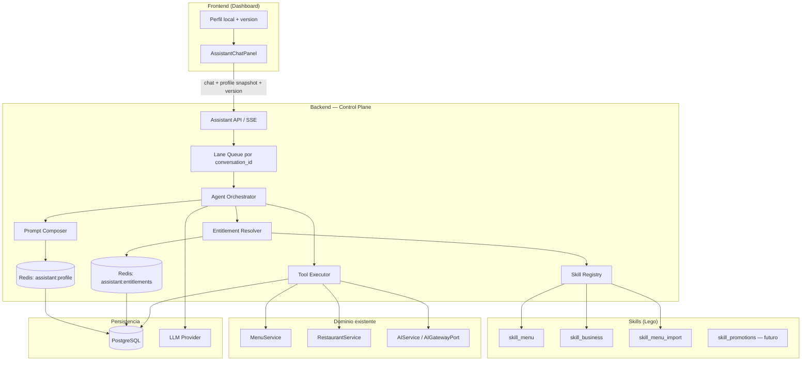
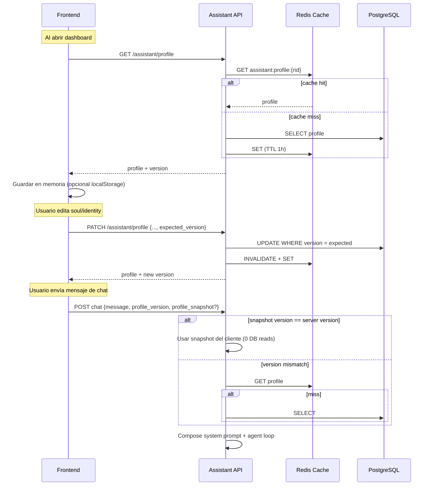
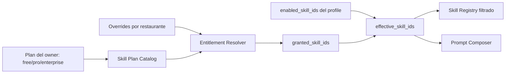
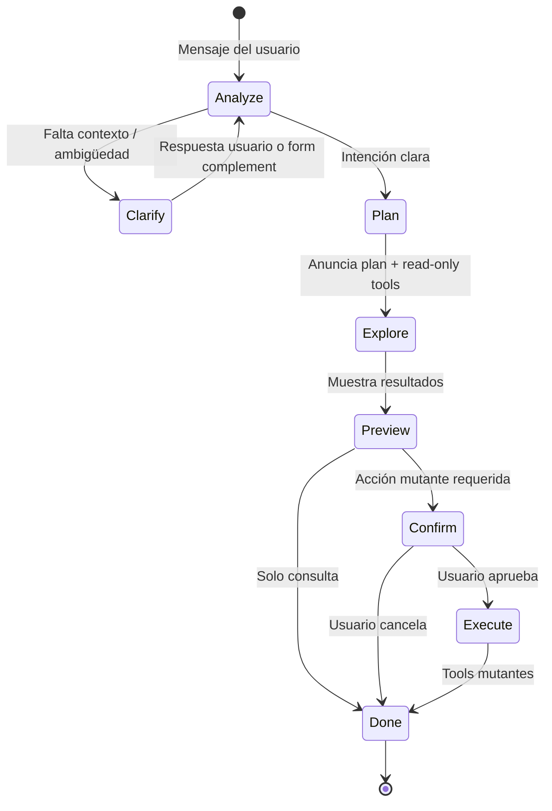
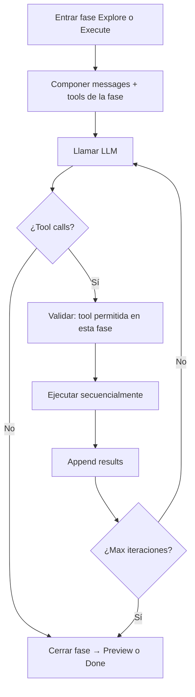

# Asistente Agéntico Venddelo — Diseño de Arquitectura

> **Estado:** borrador — pendiente de revisión del usuario antes del plan de implementación.  
> **Alcance:** arquitectura del asistente IA para dueños de restaurante: control del dashboard en lenguaje natural, extensible por skills, con identidad y alma propias por restaurante.  
> **Explícitamente fuera de alcance (v1):** eliminar entidades, acciones fuera del tenant, canales externos (WhatsApp/Telegram), sub-agentes autónomos en background, heartbeat proactivo.

---

## 1. Objetivo

El dueño de restaurante podrá hablar con su asistente en **lenguaje natural** para ejecutar casi todo lo que hoy hace en el dashboard, **excepto eliminar** recursos. Ejemplos:

- *"Edita el producto Hamburguesa clásica y ponle precio 12.500"*
- *"Deshabilita el complemento 'Queso extra' en todos los productos donde aparezca"*
- *"Sube este menú"* (PDF o imagen) → extracción + revisión + aplicar cambios
- *"Cambia el horario de delivery los sábados a 10:00–22:00"*
- *"Actualiza el nombre del restaurante y la foto de portada"*

Cada restaurante tendrá **un asistente con identidad propia** (nombre, personalidad, tono). El sistema debe ser **modular tipo Lego**: hoy skills de menú y negocio; mañana promociones, delivery, reportes, etc., sin reescribir el núcleo.

**Inspiración OpenClaw:** runtime agéntico con loop de herramientas, skills como módulos plug-in, sesiones serializadas por conversación, identidad/soul como capa de prompt, y control plane central — adaptado a un **SaaS multi-tenant en la nube**, no a un agente local en filesystem.

---

## 2. Contexto actual en Venddelo

| Pieza existente | Estado |
|-----------------|--------|
| Chat SSE | `POST /restaurants/{id}/assistant/conversations/{conv_id}/chat` |
| Conversaciones persistidas | `assistant_conversations`, `assistant_messages` |
| Prompt estático | `ASSISTANT_SYSTEM_PROMPT` en `prompts.py` |
| LLM | `LLMProviderPort` (stub / OpenAI streaming) |
| AI jobs | `AIGatewayPort` — extracción de menú, optimización, traducción |
| Dominio menu/restaurant | `MenuService`, `RestaurantService`, APIs CRUD (incluye soft-delete en algunos casos) |

**Gap principal:** el asistente actual es **chat-only** — no tiene tools, no ejecuta acciones, no tiene identidad por restaurante.

---

## 3. Principios de diseño

1. **Lego / Open-Closed:** cada capacidad nueva = un **Skill** con tools propias; el orchestrator no cambia.
2. **Tenant isolation:** `restaurant_id` siempre viene del JWT/ownership, nunca del LLM.
3. **No-delete policy:** el registry de tools **no expone** operaciones destructivas; soft-disable en lugar de borrar.
4. **DB como fuente de verdad; caché para latencia:** identidad/soul viven en Postgres; Redis evita leer DB en cada mensaje.
5. **El cliente puede enviar el perfil en el request** para evitar round-trip, con validación de versión en backend.
6. **Un turno agéntico por conversación a la vez** (lane queue, estilo OpenClaw) para evitar race conditions en tools.
7. **Reutilizar servicios de dominio existentes** — los tools son adaptadores finos sobre `MenuService`, etc.
8. **Streaming transparente:** el usuario ve progreso (pensando, ejecutando tool, resultado) vía SSE ampliado.
9. **Entitlements por restaurante:** no todos los tenants tienen acceso a todas las skills; la plataforma concede, el owner activa dentro de lo concedido.

---

## 4. Arquitectura de alto nivel



### Comparación con OpenClaw

| Concepto OpenClaw | Equivalente Venddelo |
|-------------------|----------------------|
| Gateway (control plane) | FastAPI assistant module + orchestrator |
| Pi Agent loop | `AgentOrchestrator` (LLM ↔ tools iterativo) |
| SOUL.md / AGENTS.md | `soul_markdown` + `identity_markdown` en DB |
| Skills folders + SKILL.md | `app/modules/assistant/skills/{name}/` |
| Session JSONL local | `assistant_messages` + metadata de tool calls |
| Lane queue (1 turno/sesión) | Redis lock o cola in-process por `conversation_id` |
| Tool allowlist / deny | Registry filtra tools; política global **no delete** |
| Sandbox Docker | No v1 — tools llaman servicios tipados, no shell |
| Heartbeat / cron proactivo | Fase futura |

---

## 5. Identidad y Soul — dónde guardar y cómo sincronizar

### 5.1 Recomendación: **NO en filesystem del frontend**

Guardar `carpeta/{restaurant_id}/identity.md` en el cliente **no es adecuado** para Venddelo:

- Es un producto **multi-tenant en la nube**, no un agente local tipo OpenClaw (`~/.openclaw/workspace/SOUL.md`).
- Múltiples dispositivos/pestañas/staff no compartirían el mismo estado.
- No hay auditoría ni backup centralizado.
- El backend **debe** ser quien compone el prompt final (seguridad, inyección, límites).

**Sí usar Markdown como formato de contenido**, pero almacenado en **PostgreSQL como TEXT**, no como archivos en disco ni en el repo.

### 5.2 Modelo de datos propuesto

Nueva tabla `restaurant_assistant_profiles` (1:1 con `restaurants`):

| Columna | Tipo | Descripción |
|---------|------|-------------|
| `restaurant_id` | UUID PK/FK | Tenant |
| `display_name` | VARCHAR(80) | Nombre del asistente (*"Luna"*, *"ChefBot"*) |
| `identity_markdown` | TEXT | Quién es, rol, expertise, límites declarados |
| `soul_markdown` | TEXT | Personalidad, tono, valores, estilo de respuesta |
| `enabled_skill_ids` | JSONB | Subconjunto **elegido por el owner** dentro de lo concedido (ver §6.4) |
| `version` | INTEGER | Incrementa en cada PATCH (optimistic concurrency) |
| `updated_at` | TIMESTAMPTZ | Para ETag/cache |

**Defaults al crear restaurante:** plantillas en código (`templates/default_identity.md`, `default_soul.md`) copiadas a la fila inicial. `enabled_skill_ids` se inicializa con las skills concedidas por defecto del plan (p.ej. solo `menu_read` en free).

> **Importante:** `enabled_skill_ids` ≠ acceso total. Es la preferencia del owner. El backend siempre calcula `effective_skills = granted ∩ enabled` antes de registrar tools o componer el prompt.

### 5.3 Flujo de sincronización (sin DB en cada mensaje)



**Reglas:**

- El **cliente envía** `profile_version` en cada mensaje (obligatorio).
- Opcionalmente envía `profile_snapshot` (name + identity + soul + enabled_skills) para evitar lectura en backend cuando la versión coincide.
- Si `profile_version` no coincide → backend ignora snapshot y carga desde Redis/DB (respuesta incluye `profile.updated` event para que el FE refresque).
- **Nunca confiar ciegamente** en el snapshot para permisos — solo para composición de prompt; `restaurant_id`, entitlements y `enabled_skill_ids` se **re-validan** server-side contra la versión canónica si hay duda.
- El snapshot incluye `enabled_skill_ids` pero **no** sustituye el cálculo de `granted_skill_ids`; el resolver de entitlements corre siempre en el backend antes del agent loop.

### 5.4 Alternativas consideradas

| Enfoque | Pros | Contras | Veredicto |
|---------|------|---------|-----------|
| **A — DB + Redis + snapshot en request (recomendado)** | Rápido, multi-device, auditable | Lógica de versionado | ✅ |
| **B — Solo DB, leer cada mensaje** | Simple | +5–15 ms por chat; carga DB innecesaria | ❌ |
| **C — Solo frontend, enviar siempre snapshot** | Cero reads | Sin source of truth; staff desincronizados | ❌ |
| **D — Archivos .md en Supabase Storage** | Familiar OpenClaw | Overhead I/O; difícil transaccionar con skills | ❌ v1 |

---

## 6. Sistema de Skills (Lego)

### 6.1 Anatomía de un Skill

Cada skill es un paquete backend autocontenido:

```
app/modules/assistant/skills/
  registry.py
  base.py                    # Protocol: SkillPort
  menu/
    SKILL.md                 # Instrucciones para el LLM (cuándo usar, límites)
    manifest.py              # id, version, required_permissions
    tools.py                 # Definiciones JSON Schema + handlers
    tests/
  business/
    SKILL.md
    manifest.py
    tools.py
  menu_import/
    SKILL.md
    manifest.py
    tools.py                 # Dispara AIGatewayPort extract + apply draft
```

**`SkillPort` interface:**

```python
# Conceptual — no implementar aún
class SkillPort(Protocol):
    id: str
    def tool_definitions(self) -> list[ToolDefinition]: ...
    async def execute(self, tool_name: str, args: dict, ctx: AgentContext) -> ToolResult: ...
    def system_prompt_section(self) -> str: ...  # Contenido de SKILL.md resumido
```

**`AgentContext`** incluye: `restaurant_id`, `user_id`, `conversation_id`, `uow`, servicios inyectados, **nunca** confía en IDs del LLM sin resolver por nombre/búsqueda dentro del tenant.

### 6.2 Skills v1 (roadmap)

| Skill ID | Capacidades | Tools ejemplo |
|----------|-------------|---------------|
| `menu_read` | Consultar menú | `search_products`, `get_product`, `list_categories` |
| `menu_write` | Editar menú (no delete) | `update_product`, `create_product`, `disable_product`, `disable_option_item_globally`, `reorder_products` |
| `business` | Datos del negocio | `update_restaurant_info`, `update_schedule`, `update_logo` |
| `menu_import` | Subir menú | `start_menu_extraction`, `get_extraction_status`, `apply_extraction_draft` |
| `promotions` | Futuro | `create_promotion`, `disable_promotion`, … |

Skills de **solo lectura** pueden activarse antes que escritura para validar el loop agéntico con bajo riesgo.

### 6.3 Política no-delete

- Los handlers **no llaman** a `delete_*` del dominio.
- Productos/complementos: `is_active = false` / `is_available = false`.
- El registry rechaza registrar tools cuyo `effect` sea `delete`.
- Tests de contrato: ningún skill expone verbos DELETE.

### 6.4 Entitlements — no todos los restaurantes ven todas las skills

Las skills existen en el código (Lego), pero **el acceso es gated por tenant**. Dos capas distintas:

| Capa | Quién controla | Qué significa |
|------|----------------|---------------|
| **Granted** (`granted_skill_ids`) | Plataforma (plan, admin, promos) | Lo que el restaurante **puede** usar |
| **Enabled** (`enabled_skill_ids`) | Owner del restaurante | Lo que el owner **quiere activo** ahora |
| **Effective** (`effective_skill_ids`) | Backend (calculado) | `granted ∩ enabled` — lo que el agente realmente carga |



#### Fuentes de `granted_skill_ids`

1. **Plan del owner** — hoy `users.plan` ∈ `free` | `pro` | `enterprise` (existente en el schema).
2. **Catálogo plan → skills** — definido en código v1 (`assistant_skill_catalog.py`); migrable a tabla `assistant_plan_skills` cuando haya billing dinámico.
3. **Overrides por restaurante** — fila opcional `restaurant_assistant_entitlements` para beta, enterprise custom, o revocar una skill concreta.

Tabla propuesta `restaurant_assistant_entitlements` (0..1 por restaurante):

| Columna | Tipo | Descripción |
|---------|------|-------------|
| `restaurant_id` | UUID PK/FK | Tenant |
| `granted_extra` | JSONB | Skills añadidas fuera del plan (`["menu_import"]`) |
| `revoked` | JSONB | Skills quitadas aunque el plan las incluya |
| `expires_at` | TIMESTAMPTZ NULL | Para promos temporales / beta |
| `source` | VARCHAR(40) | `admin`, `promo`, `beta`, `support` |
| `updated_at` | TIMESTAMPTZ | Auditoría |

**Fórmula:**

```
granted = plan_skills(owner.plan) ∪ granted_extra − revoked
effective = granted ∩ enabled_skill_ids
```

Si `expires_at` pasó → ignorar `granted_extra` de esa fila (job o check lazy).

#### Catálogo inicial (ejemplo — ajustable)

| Skill ID | Plan mínimo | Notas |
|----------|-------------|-------|
| `menu_read` | `free` | Siempre disponible |
| `menu_write` | `free` | Core del producto |
| `business` | `free` | Horarios, nombre, logo |
| `menu_import` | `pro` | Extracción PDF/imagen |
| `promotions` | `pro` | Futuro |
| `analytics` | `enterprise` | Futuro |

#### Enforcement (backend — nunca solo UI)

1. **Prompt composer** — solo incluye secciones SKILL.md de `effective_skill_ids`.
2. **Tool registry en runtime** — el LLM solo recibe tool definitions de skills efectivas.
3. **Tool executor** — rechaza ejecución si `tool.skill_id ∉ effective` → `tool.error` código `skill_not_entitled`.
4. **PATCH profile** — validar `enabled_skill_ids ⊆ granted`; si el owner intenta activar una skill no concedida → `422` con lista de skills bloqueadas.
5. **Chat request** — aunque el cliente envíe snapshot con skills no concedidas, el backend recalcula y usa solo `effective`.

#### Caché

| Key | Valor | TTL |
|-----|-------|-----|
| `assistant:entitlements:{restaurant_id}` | `{granted, plan, overrides_version}` | 1h (misma estrategia que profile) |

Invalidar al cambiar plan del owner, overrides admin, o expiración promo.

#### Respuesta API enriquecida

`GET /assistant/profile` devuelve:

```json
{
  "display_name": "Luna",
  "enabled_skill_ids": ["menu_read", "menu_write"],
  "granted_skill_ids": ["menu_read", "menu_write", "business"],
  "effective_skill_ids": ["menu_read", "menu_write"],
  "skills_catalog": [
    {
      "id": "menu_import",
      "label": "Importar menú",
      "granted": false,
      "required_plan": "pro",
      "lock_reason": "upgrade_required"
    }
  ]
}
```

El frontend **no decide** acceso; solo renderiza locks/upsell según `granted` y `skills_catalog`.

#### Comportamiento del agente cuando falta skill

Si el usuario pide algo fuera de entitlements (*"sube este PDF"* sin `menu_import`):

- El agente **no** ejecuta tools de esa skill.
- Responde explicando el límite y, si aplica, CTA de upgrade (copy configurable por plan).
- No se filtra al LLM la existencia de tools no concedidas (evita confusión e intentos de bypass).

#### Alternativas consideradas

| Enfoque | Pros | Contras | Veredicto |
|---------|------|---------|-----------|
| **A — Plan catalog + overrides por restaurante (recomendado)** | Flexible, auditable, alinea con `users.plan` | Resolver extra | ✅ |
| **B — Solo `enabled_skill_ids` sin capa granted** | Simple | Owner activa skills Pro en free; no monetizable | ❌ |
| **C — Feature flags globales (LaunchDarkly)** | Ops rápido | No modela plan por tenant; coste extra | ❌ v1 |

---

## 7. Agent Loop — Plan-Act-Confirm (runtime agéntico)

Sí — será un **agent loop**, inspirado en `pi-agent-core` / OpenClaw. Pero **no salta directo a mutar datos**: cada turno sigue un pipeline **Plan → Act (read) → Confirm → Execute (write)**.

> **¿Qué ya estaba contemplado?** El streaming SSE (`content.delta`, `tool.start`, `tool.result`) y la confirmación humana para acciones masivas (§7.5).  
> **Qué faltaba y se añade aquí:** fase explícita de **análisis de intención**, anuncio del plan al usuario, preguntas de clarificación (texto abierto o `ChatFormComplement`), y separación **read-only primero / mutación después**.

### 7.0 Pipeline por turno (recomendado)



| Fase | Qué hace el asistente | Tools permitidas | UI |
|------|------------------------|------------------|-----|
| **1 — Analyze** | Interpreta intención, detecta datos faltantes | Ninguna (solo LLM) | `agent.phase: analyzing` + texto stream |
| **2 — Clarify** | Pregunta al usuario | Ninguna | Texto abierto **o** `complement` (form) |
| **3 — Plan** | Anuncia qué hará, en lenguaje natural | Ninguna | Texto: *"Voy a buscar… y te muestro la lista antes de desactivar"* |
| **4 — Explore** | Recopila contexto | Solo **read** (`search_*`, `list_*`, `get_*`) | `agent.status: processing` + `tool.start/result` |
| **5 — Preview** | Presenta hallazgos | Ninguna (resume tool results) | Markdown con lista/tablas |
| **6 — Confirm** | Pide OK antes de mutar | `request_confirmation` o `complement` | Form confirm / botones Sí-No |
| **7 — Execute** | Aplica cambios | Solo **mutate** (con `confirmation_token`) | `tool.start/result` + resumen final |

**Regla dura (orchestrator):** tools con `effect: mutate` **no se registran** en el LLM hasta que la fase Confirm haya producido un `confirmation_token` válido. El modelo no puede saltarse el preview.

### 7.1 Ejemplo completo — deshabilitar complemento globalmente

**Usuario:** *"Deshabilita el complemento Queso extra en todos los productos"*

| Fase | Respuesta del asistente (stream) | Backend |
|------|----------------------------------|---------|
| Analyze | *(interno — no visible)* | Clasifica: `menu_write` + bulk + necesita resolver entidad |
| Plan | *"Ok. Voy a analizar los productos que contienen el complemento **Queso extra** y te mostraré la lista antes de desactivarlo en cada uno."* | `agent.phase: plan` |
| Explore | *(mientras tanto)* `procesando…` | `agent.status: processing` → `tool.start: search_option_items` → `tool.start: list_products_by_option` |
| Preview | *"Encontré **12 productos** con 'Queso extra': Hamburguesa clásica, … ¿Procedo a desactivarlo en todos?"* | `message.complete` sin mutación |
| Confirm | Complement form: choice `confirm_bulk_disable` Sí / No / Solo algunos | `complement` en `message.complete` |
| Execute | *"Listo. Desactivé 'Queso extra' en 12 productos."* | tools mutantes con token |

El componente `ChatStreamProcessing` (dots animados) se muestra mientras `agent.status === processing` **o** hay tools en vuelo — ya existe en el frontend.

### 7.2 Clarificación — texto abierto vs `ChatFormComplement`

Reutilizar el complement existente (`ChatFormComplement.tsx`, schema en `frontend/docs/assistant-chat-form-complement.md`):

| Situación | Mecanismo | Ejemplo |
|-----------|-----------|---------|
| Falta un dato simple | Pregunta abierta en markdown | *"¿Cuál es el nombre exacto del complemento?"* |
| Ambigüedad finita (2–8 opciones) | `complement.type: form` con `choice` | Elegir producto entre candidatos de `search_products` |
| Formulario estructurado (crear producto) | `complement` multi-field | category + name + price (mock ya existe) |
| Confirmación bulk | `complement` choice Sí/No/Parcial | Antes de `disable_option_item_globally` |
| Solo informativo | Sin complement | Respuesta markdown |

**Emisión:** el complement va en `message.complete` junto al texto final de la fase Clarify/Confirm (contrato ya documentado; hoy pendiente en backend).

**Siguiente turno:** el cliente envía `formSubmission` estructurado (preferido) además del resumen legible — el orchestrator retoma en fase **Analyze** con contexto enriquecido.

### 7.3 Agent loop interno (dentro de cada fase)

Dentro de Explore o Execute, el loop clásico LLM ↔ tools sigue activo:



**Parámetros:**

- `max_tool_iterations`: 8 por fase
- `max_tools_per_turn`: 20 total
- Ejecución **secuencial** (lane queue por `conversation_id`)
- Un turno puede **terminar en Clarify** sin haber ejecutado ningún tool — válido y esperado

### 7.4 Composición del system prompt

Capas (orden):

1. **Core policy** (estático) — no-delete, tenant scope, no inventar datos, **analizar intención antes de actuar**, anunciar plan, read-before-write, confirmar mutaciones masivas.
2. **Behavior policy** (estático) — reglas Plan-Act-Confirm del §7.0.
3. **Identity markdown** (DB).
4. **Soul markdown** (DB).
5. **Skill sections** — solo `effective_skill_ids`.
6. **Restaurant context snapshot** (opcional, cache).

### 7.5 Eventos SSE ampliados

| Evento | Payload | Cuándo |
|--------|---------|--------|
| `content.delta` | `{delta}` | Texto streaming |
| `agent.phase` | `{phase: "analyzing"\|"plan"\|"explore"\|"preview"\|"confirm"\|"execute"}` | Cambio de fase |
| `agent.status` | `{status: "idle"\|"processing"\|"awaiting_input"}` | `processing` → mostrar dots (`ChatStreamProcessing`) |
| `agent.thinking` | `{summary?}` | Razonamiento interno (opcional) |
| `tool.start` | `{tool, args_summary, effect: "read"\|"mutate"}` | Antes de ejecutar |
| `tool.result` | `{tool, ok, summary}` | Después de ejecutar |
| `tool.error` | `{tool, code, message}` | Tool falló |
| `profile.updated` | `{version, ...}` | Cliente desactualizado |
| `message.complete` | `{message_id, content, complement?, actions_taken[], phase}` | Fin de sub-turno o turno completo |
| `error` | `{code, message}` | Fallo fatal |

Un turno largo puede emitir **varios** `message.complete` si se pausa en Clarify/Confirm (con `complement`) y continúa en el siguiente mensaje del usuario.

`actions_taken[]` solo se llena en fase Execute.

### 7.6 Confirmación humana (human-in-the-loop)

Para acciones **mutantes** — especialmente bulk:

1. Tras **Preview**, el agente emite `complement` (form choice) o tool interna `request_confirmation`.
2. Backend genera `confirmation_token` (UUID, TTL 15 min, scoped a acción planificada).
3. Siguiente mensaje incluye `confirmation_token` + respuesta del usuario.
4. Orchestrator entra en fase **Execute**; tools mutantes validan token.

Si el usuario rechaza → fase **Done** sin mutación; token invalidado.

### 7.7 Alternativas consideradas

| Enfoque | Pros | Contras | Veredicto |
|---------|------|---------|-----------|
| **A — Plan-Act-Confirm con fases en orchestrator (recomendado)** | Predecible, UX clara, mutación gated | Más lógica en backend | ✅ |
| **B — Solo prompt ("analiza antes de actuar")** | Simple | El LLM ignora reglas bajo presión | ❌ |
| **C — Dos modelos (planner + executor)** | Separación clara | Coste 2×, latencia | ❌ v1 |

---

## 8. Resolución de entidades (el LLM no conoce UUIDs)

El usuario dice *"la hamburguesa clásica"* — el agente debe resolver en fase **Explore** o pedir **Clarify**:

1. Tool `search_products(query="hamburguesa clásica")` → candidatos.
2. Si ambiguo → fase **Clarify** con `complement` choice (opciones 1–3) o pregunta abierta.
3. Usar `product_id` interno solo en fases posteriores.

**Nunca** pasar UUIDs al LLM como input requerido del usuario; son output de tools de búsqueda.

---

## 9. Integración con AI existente (menu import)

El skill `menu_import` **no reimplementa** extracción — orquesta jobs existentes:

1. `start_menu_extraction` → `POST ai/jobs/extract-menu` (adjunto ya subido a Storage).
2. Polling o webhook interno → `get_extraction_status`.
3. Presenta borrador al usuario (resumen en chat + complement UI opcional).
4. Tras confirmación → `apply_extraction_draft` (nuevo tool que materializa categorías/productos vía `MenuService`).

Reutiliza `ai_artifacts` para undo cuando aplique.

---

## 10. Seguridad y auditoría

| Riesgo | Mitigación |
|--------|------------|
| Prompt injection vía soul/identity editado por owner | Sanitizar longitud; core policy inmutable; tools no ejecutan SQL/raw |
| Cross-tenant | `restaurant_id` de auth; tools reciben ctx, no args de tenant |
| Escalada a delete | Registry + code review + tests de contrato |
| Acciones masivas | Confirmación + límite N por turno |
| Coste LLM | max iterations; cache de profile; model routing (mini vs full) |
| Bypass de entitlements vía snapshot o prompt | Resolver server-side; tools no registradas; executor rechaza |
| Owner activa skill no concedida | PATCH valida `enabled ⊆ granted`; chat recalcula effective |

**Auditoría:** `assistant_messages.metadata` guarda `{tool_calls: [{name, args_hash, result_summary, ts}]}`.

Opcional fase 2: tabla `assistant_action_log` para analytics.

---

## 11. Estructura de módulos backend (objetivo)

```
app/modules/assistant/
  api.py                          # Endpoints chat + profile CRUD
  conversation_service.py         # Existente — integrar orchestrator
  service.py                      # Evoluciona o delega a agent/
  prompts.py                      # Core policy estática
  schemas.py
  agent/
    orchestrator.py               # Agent loop
    lane_queue.py
    prompt_composer.py
    tool_executor.py
    context.py                    # AgentContext
  skills/
    registry.py
    base.py
    menu/
    business/
    menu_import/
  profile/
    service.py
    repository.py
    cache.py
  entitlements/
    catalog.py                  # plan → skills, metadata UI
    resolver.py                 # granted = plan + overrides − revoked
    repository.py               # restaurant_assistant_entitlements
    cache.py
```

**Puerto nuevo:** extender `LLMProviderPort` o crear `AgentLLMPort` con soporte **tool calling** (function calling / structured outputs).

---

## 12. Frontend (solo diseño)

| Pieza | Responsabilidad |
|-------|-----------------|
| `AssistantProfileSettings` | Editar name, identity, soul; toggles de skills **solo si granted** |
| `AssistantSkillsCatalog` | Lista skills con locks, plan requerido, upsell |
| `useAssistantProfile()` | Fetch inicial, PATCH, version local; expone granted/effective |
| `AssistantChatPanel` | Enviar `profile_version` + snapshot; render tool events |
| `ChatToolProgress` | UI para `tool.start` / `tool.result` + fase actual |
| `ChatStreamProcessing` | Dots "procesando…" cuando `agent.status === processing` (ya existe) |
| `ChatFormComplement` | Clarify + Confirm — reutilizar componente existente |

Al enviar chat:

```typescript
// Conceptual
{
  message: string,
  attachments?: [...],
  profile_version: number,
  profile_snapshot?: { display_name, identity_markdown, soul_markdown, enabled_skill_ids },
  formSubmission?: ChatFormSubmission,      // respuesta a complement previo
  confirmation_token?: string                 // aprobación de acción mutante
}
```

---

## 13. Fases de entrega recomendadas

| Fase | Entregable | Valor |
|------|------------|-------|
| **0 — Perfil + entitlements** | Tablas profile + entitlements, resolver, API enriquecida, UI toggles/locks | Identidad + gating por plan |
| **1 — Runtime** | Agent loop + SSE tool events + lane queue + effective skills | Infraestructura Lego |
| **2 — menu_read** | Búsqueda/consulta menú vía chat | Validar resolución entidades |
| **3 — menu_write** | Editar/deshabilitar productos y complementos | Core user value |
| **4 — business** | Horarios, nombre, logo | |
| **5 — menu_import** | PDF/imagen → menú | Reusa AIGateway |
| **6 — promotions + bulk** | Skills adicionales | |

Cada fase es **desplegable independiente**; nuevas skills se añaden al catálogo con `min_plan` sin cambiar el orchestrator.

---

## 14. Decisiones abiertas (para revisión)

1. **¿Encolar o rechazar** mensajes mientras el agente ejecuta tools? (Recomendación: encolar 1.)
2. **¿Modelo único o routing?** p.ej. `gpt-4o-mini` para read, `gpt-4o` para write/import.
3. **¿Staff comparten el mismo assistant profile** que el owner? (Recomendación: sí, 1 profile por restaurant.)
4. **¿Límite de tamaño** identity/soul? (Recomendación: 4 KB cada uno.)
5. **¿Plan en `users` o migrar a `restaurants`?** (Recomendación v1: resolver vía owner.plan; evaluar `restaurants.plan` cuando un user tenga varios locales con planes distintos.)
6. **¿Admin UI para overrides** en v1 o solo SQL/API interna? (Recomendación: API admin interna; UI admin en fase 2.)

---

## 15. Definición de done (diseño)

- [x] Arquitectura agéntica definida (loop, skills, tools)
- [x] Modelo identity/soul con sync sin DB-per-message
- [x] Rechazo explícito de filesystem frontend para soul
- [x] Alineación con OpenClaw documentada
- [x] Fases de implementación propuestas
- [x] Entitlements por restaurante (granted vs enabled vs effective)
- [x] Pipeline Plan-Act-Confirm con análisis previo y clarificación vía complement
- [ ] Aprobación del usuario → siguiente paso: **plan de implementación** (`writing-plans`)

---

## Referencias

- OpenClaw Architecture: Gateway, sessions, skills, SOUL.md, lane queue — https://openclaw-openclaw.mintlify.app/concepts/architecture
- Venddelo assistant actual: `backend/docs/assistant-chat-streaming.md`
- Venddelo AI jobs: `docs/superpowers/specs/2026-06-14-phase-6-ai-services-design.md`
- Venddelo form complement: `frontend/docs/assistant-chat-form-complement.md`
