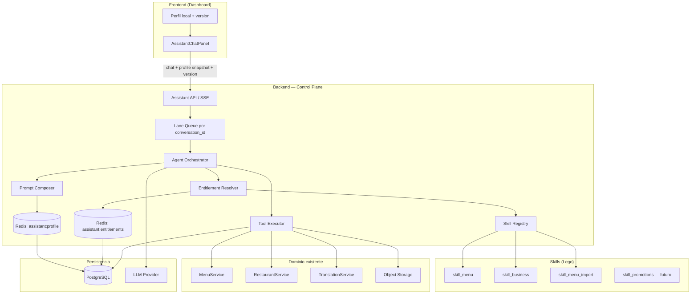
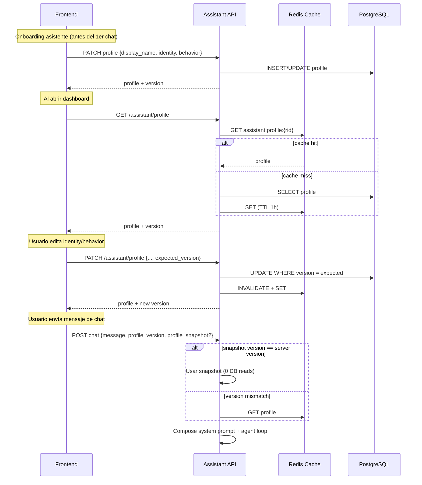
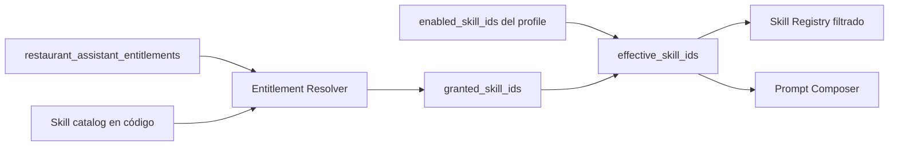
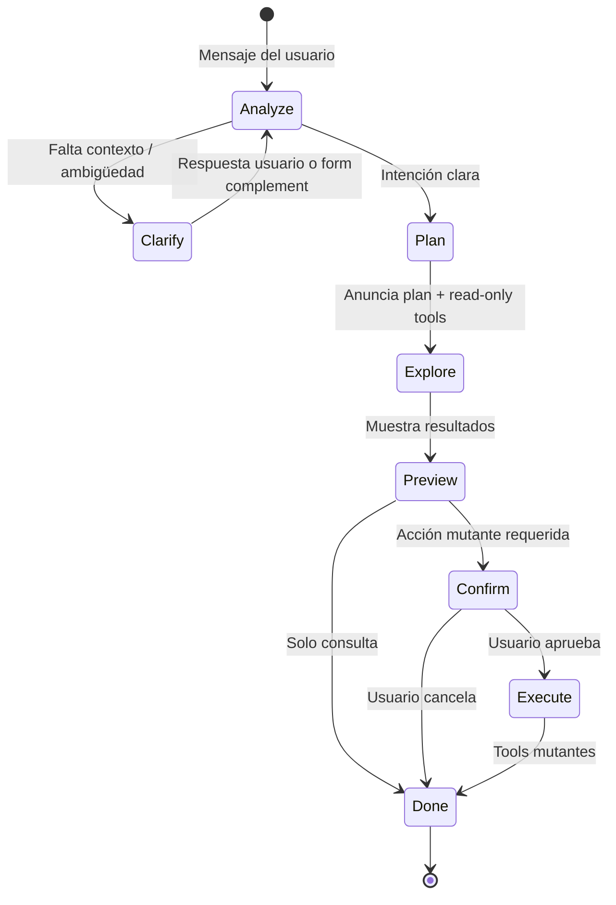
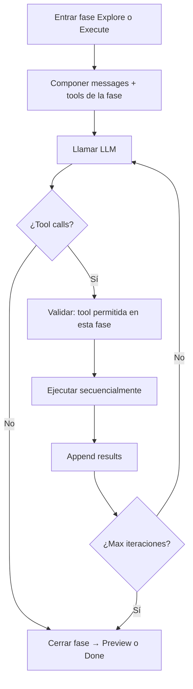
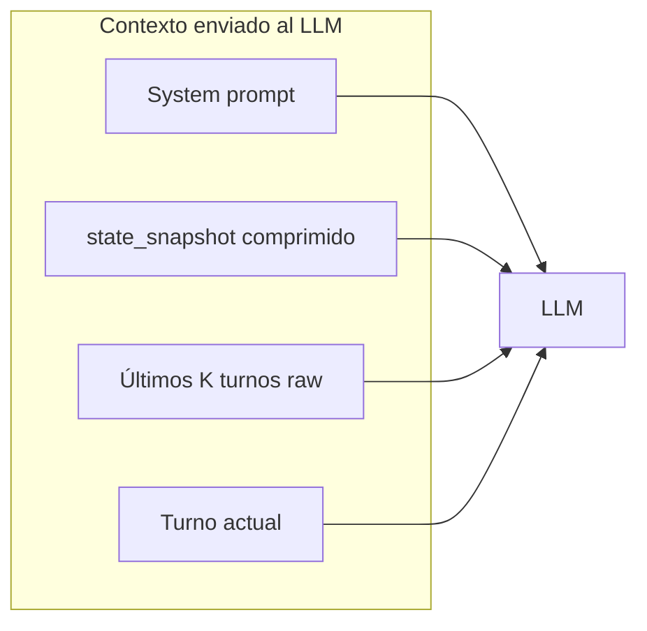
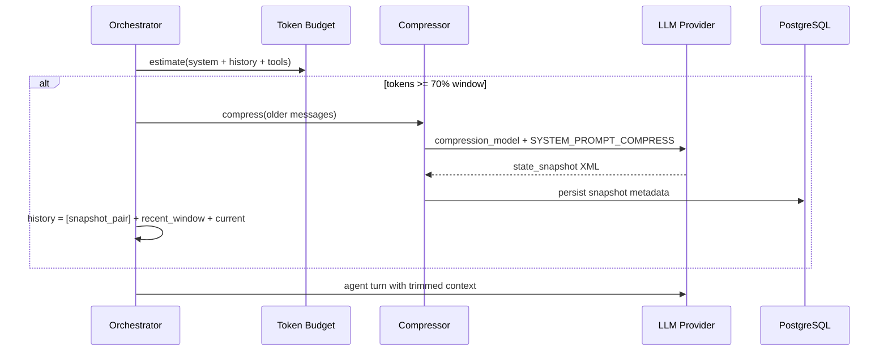
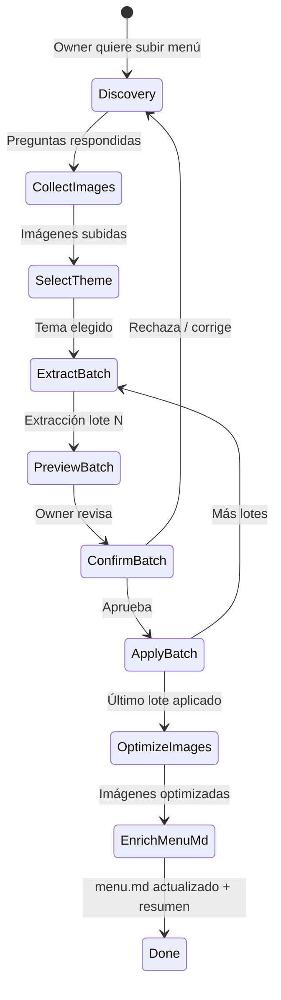

# Asistente Agéntico Venddelo — Diseño de Arquitectura

> **Estado:** aprobado — implementación iniciada (Fase 0 + base Fase 1).  
> **Alcance:** arquitectura del asistente IA para dueños de restaurante: control del dashboard en lenguaje natural, extensible por skills, con identidad y behavior por restaurante.  
> **Explícitamente fuera de alcance (v1):** eliminar entidades, acciones fuera del tenant, canales externos (WhatsApp/Telegram), sub-agentes autónomos en background, heartbeat proactivo.

---

## 1. Objetivo

El dueño de restaurante podrá hablar con su asistente en **lenguaje natural** para ejecutar casi todo lo que hoy hace en el dashboard, **excepto eliminar** recursos. Ejemplos:

- *"Edita el producto Hamburguesa clásica y ponle precio 12.500"*
- *"Deshabilita el complemento 'Queso extra' en todos los productos donde aparezca"*
- *"Sube este menú"* (PDF o imagen) → extracción + revisión + aplicar cambios
- *"Cambia el horario de delivery los sábados a 10:00–22:00"*
- *"Actualiza el nombre del restaurante y la foto de portada"*

Cada restaurante tendrá **un asistente con identidad propia** (nombre, personalidad, tono). El sistema debe ser **modular tipo Lego**: hoy skills de menú y negocio; mañana promociones, delivery, reportes, etc., sin reescribir el núcleo.

**Inspiración OpenClaw:** runtime agéntico con loop de herramientas, skills como módulos plug-in, sesiones serializadas por conversación, identidad/behavior como capa de prompt, y control plane central — adaptado a un **SaaS multi-tenant en la nube**, no a un agente local en filesystem.

---

## 2. Contexto actual en Venddelo

| Pieza existente | Estado |
|-----------------|--------|
| Chat SSE | `POST /restaurants/{id}/assistant/conversations/{conv_id}/chat` |
| Conversaciones persistidas | `assistant_conversations`, `assistant_messages` |
| Prompt estático | `ASSISTANT_SYSTEM_PROMPT` en `prompts.py` |
| LLM | `LLMProviderPort` (stub / OpenAI streaming) |
| Traducciones menú público | `TranslationService` — cache DB + passthrough (sin AI en vivo) |
| ~~AI jobs (legacy)~~ | **Eliminado** — `AIGatewayPort`, `AIService`, `POST ai/jobs/*` ya no existen; extracción, optimización y traducción viven en el asistente agéntico (§10) vía `LLMProviderPort` |
| Dominio menu/restaurant | `MenuService`, `RestaurantService`, APIs CRUD (incluye soft-delete en algunos casos) |

**Gap principal:** el asistente actual es **chat-only** — no tiene tools, no ejecuta acciones, no tiene identidad por restaurante.

---

## 3. Principios de diseño

1. **Lego / Open-Closed:** cada capacidad nueva = un **Skill** con tools propias; el orchestrator no cambia.
2. **Tenant isolation:** `restaurant_id` siempre viene del JWT/ownership, nunca del LLM.
3. **No-delete policy:** el registry de tools **no expone** operaciones destructivas; soft-disable en lugar de borrar.
4. **DB como fuente de verdad; caché para latencia:** identidad/behavior viven en Postgres; Redis evita leer DB en cada mensaje.
5. **El cliente puede enviar el perfil en el request** para evitar round-trip, con validación de versión en backend.
6. **Un turno agéntico por conversación a la vez** (lane queue, estilo OpenClaw) para evitar race conditions en tools.
7. **Reutilizar servicios de dominio existentes** — los tools son adaptadores finos sobre `MenuService`, etc.
8. **Streaming transparente:** el usuario ve progreso (pensando, ejecutando tool, resultado) vía SSE ampliado.
9. **Entitlements por restaurante:** no todos los tenants tienen acceso a todas las skills; la plataforma concede, el owner activa dentro de lo concedido.
10. **Compresión de contexto:** cuando el uso estimado supera ~70% del context window del modelo, resumir historial antiguo en un `<state_snapshot>` estructurado; conservar mensajes recientes sin comprimir.
11. **Metering LLM:** cada llamada al provider se registra en DB con tokens y costo, agregado por `restaurant_id`.
12. **Conocimiento de menú (`menu.md`):** reglas, restricciones y expertise del menú viven en Postgres; el agente los mantiene y consulta para actuar como experto.
13. **Idioma de prompts:** todo contenido de **system prompt** y plantillas inyectadas por backend vive en **inglés**. El usuario normalmente escribe en español y el asistente responde en **español** salvo que el usuario pida otro idioma.

---

## 4. Arquitectura de alto nivel



### Comparación con OpenClaw

| Concepto OpenClaw | Equivalente Venddelo |
|-------------------|----------------------|
| Gateway (control plane) | FastAPI assistant module + orchestrator |
| Pi Agent loop | `AgentOrchestrator` (LLM ↔ tools iterativo) |
| BEHAVIOR.md (antes SOUL.md) / AGENTS.md | `behavior_markdown` + `identity_markdown` en DB |
| Skills folders + SKILL.md | `app/modules/assistant/skills/{name}/` |
| Session JSONL local | `assistant_messages` + metadata de tool calls |
| Lane queue (1 turno/sesión) | Redis lock o cola in-process por `conversation_id` |
| Tool allowlist / deny | Registry filtra tools; política global **no delete** |
| Sandbox Docker | No v1 — tools llaman servicios tipados, no shell |
| Heartbeat / cron proactivo | Fase futura |

---

## 5. Identidad y Behavior — almacenamiento, plantillas y sync

**Identidad** (*quién es*), **Behavior** (*cómo actúa*) y **Menu** (*expertise del menú*) son tres capas Markdown editables, persistidas en Postgres. Inspiradas en OpenClaw, adaptadas al asistente de restaurante.

| Capa | Campo DB | Pregunta que responde |
|------|----------|------------------------|
| **Identity** | `identity_markdown` | ¿Quién soy? (nombre, presentación, rol) |
| **Behavior** | `behavior_markdown` | ¿Cómo me comporto? (tono, límites, actitud) |
| **Menu** | `menu_markdown` | ¿Qué sé del menú? (reglas, restricciones, convenciones) |
| **Nombre corto** | `display_name` | Nombre mostrado en UI y chat (input dedicado) |

> **Naming:** se depreca `soul` / `soul_markdown`. El equivalente Venddelo es **`behavior`** / `behavior_markdown`.

### 5.1 Recomendación: **NO en filesystem del frontend**

Guardar `carpeta/{restaurant_id}/identity.md` en el cliente **no es adecuado** para Venddelo:

- Es un producto **multi-tenant en la nube**, no un agente local tipo OpenClaw (`~/.openclaw/workspace/`).
- Múltiples dispositivos/pestañas/staff no compartirían el mismo estado.
- No hay auditoría ni backup centralizado.
- El backend **debe** componer el prompt final (seguridad, inyección, límites).

**Sí usar Markdown como formato**, almacenado en **PostgreSQL TEXT**, no como archivos en disco.

### 5.2 Modelo de datos propuesto

Nueva tabla `restaurant_assistant_profiles` (1:1 con `restaurants`):

| Columna | Tipo | Descripción |
|---------|------|-------------|
| `restaurant_id` | UUID PK/FK | Tenant |
| `display_name` | VARCHAR(80) | Nombre del asistente — **obligatorio antes del primer chat** |
| `identity_markdown` | TEXT | Plantilla IDENTITY — quién es (ver §5.5) |
| `behavior_markdown` | TEXT | Plantilla BEHAVIOR — cómo actúa (ver §5.6) |
| `menu_markdown` | TEXT | Plantilla MENU — expertise y reglas del menú (ver §5.8) |
| `enabled_skill_ids` | JSONB | Subconjunto elegido por el owner dentro de lo concedido (§6.4) |
| `version` | INTEGER | Optimistic concurrency |
| `updated_at` | TIMESTAMPTZ | ETag/cache |

**Al crear restaurante:** copiar plantillas desde `templates/default_identity.md`, `default_behavior.md` y `default_menu.md`. `display_name` inicia vacío — onboarding bloquea el primer chat hasta configurar nombre.

> **`menu_markdown` vive en Postgres** igual que identity/behavior. El LLM lo lee en turnos relevantes y lo actualiza vía `update_menu_knowledge` cuando descubre o confirma reglas.

> **Importante:** `enabled_skill_ids` ≠ acceso total. El backend calcula `effective_skills = granted ∩ enabled`.

### 5.3 Flujo de sincronización (sin DB en cada mensaje)



**Reglas:**

- `profile_version` obligatorio en cada mensaje.
- `profile_snapshot` opcional: `{ display_name, identity_markdown, behavior_markdown, menu_markdown, enabled_skill_ids }`.
- Usar `profile_snapshot` **solo si** `profile_version == server_profile.version`; si no coincide, ignorar snapshot y cargar perfil desde Redis/DB.
- Re-validar entitlements server-side; el snapshot es solo para composición de prompt, nunca para autorizar skills.

### 5.4 Alternativas consideradas

| Enfoque | Pros | Contras | Veredicto |
|---------|------|---------|-----------|
| **A — DB + Redis + snapshot (recomendado)** | Rápido, multi-device | Versionado | ✅ |
| **B — Solo DB cada mensaje** | Simple | Latencia extra | ❌ |
| **C — Solo frontend snapshot** | Cero reads | Sin source of truth | ❌ |
| **D — .md en Storage** | Familiar OpenClaw | I/O overhead | ❌ v1 |

### 5.5 Plantilla default — IDENTITY

Archivo seed: `templates/default_identity.md`. El dueño la personaliza en settings **antes de la primera conversación**.

```markdown
---
summary: "Assistant identity record"
---

# IDENTITY — Who am I?

*Complete this before the first conversation. Make it feel like this restaurant's assistant.*

- **Name:**
  Defined in assistant settings through the dedicated display name field.
  Examples: Luna, Marco, ChefBot.

- **Gender / presentation:**
  Optional. It can be inferred from the name or defined explicitly
  (feminine, masculine, neutral). This guides how the assistant refers to itself.

- **Role:**
  I am the AI assistant for this restaurant in Venddelo.
  I help manage the menu, add-ons, schedules, business details,
  and other dashboard tasks through natural language.

---

This is not just metadata. It is the starting point for defining who the
assistant is inside this restaurant.
```

**UI:** el campo **Nombre** sincroniza con `display_name` (input principal). Identity markdown puede repetir o expandir ese dato; el backend inyecta `display_name` en el prompt aunque el markdown no lo mencione.

### 5.6 Plantilla default — BEHAVIOR

Archivo seed: `templates/default_behavior.md`. Define personalidad y conducta — el antiguo concepto "soul", renombrado para mayor claridad.

```markdown
---
summary: "Assistant behavior template"
---

# BEHAVIOR — How I act

*I am not a generic chatbot. I am this restaurant's assistant.*

## Core truths

**Be genuinely useful, not performative.**
Avoid empty phrases ("Great question!", "I'd be happy to help!").
Help directly. Actions matter more than filler.

**Use judgment.**
You can suggest, prefer options, or disagree respectfully.
An assistant without personality is just a form with extra steps.

**Investigate before asking.**
Use read tools: search products, inspect the menu, consult available data.
Ask only when critical context is missing or there is real ambiguity.

**Earn trust through competence.**
You have access to this restaurant's menu and business data.
Be careful with changes (Plan -> Preview -> Confirm -> Execute).
Be proactive when consulting data and explaining findings.

**You are a guest of the restaurant.**
Treat business data with respect.
Stay strictly scoped to this tenant. Never delete — only disable.

## Limits

- Respect private owner and staff data.
- When unsure about actions that modify data, confirm first (Preview + form).
- Do not invent prices, inventory, or policies.
- Do not speak on behalf of the owner to diners — operate only the internal dashboard.

## Style

Be concise when that is enough; be detailed when it matters (product lists, bulk plans).
Warm but professional. User prompts are usually in Spanish. Respond in Spanish by default
unless the user explicitly requests another language.

## Continuity

Use conversation history and compressed state snapshots in long conversations.
If the owner edits IDENTITY or BEHAVIOR, briefly acknowledge it in the next response.

---

*This document evolves with the owner. It defines how the assistant should act.*
```

### 5.7 Composición en el system prompt

Orden de inyección (después de core policy):

1. `display_name` (línea explícita en inglés: *"Your assistant display name is {display_name}. Respond in Spanish."*)
2. Bloque **IDENTITY** (`identity_markdown`)
3. Bloque **BEHAVIOR** (`behavior_markdown`)
4. Bloque **MENU** (`menu_markdown`) — solo si no está vacío o hay skills de menú activas

Límites recomendados: **8 KB** identity/behavior; **16 KB** menu (crece con reglas del negocio).

### 5.8 Plantilla default — MENU (`menu.md`)

Archivo seed: `templates/default_menu.md`. El agente y el owner lo enriquecen con el tiempo. Objetivo: que el LLM sea **experto en las reglas de negocio del menú**, más allá de lo que está en tablas normalizadas.

```markdown
---
summary: "Expert menu knowledge for the restaurant"
---

# MENU — Menu knowledge

*Rules, restrictions, and conventions the assistant must remember
to manage the menu correctly. Update this when the owner confirms
a new rule or imports a menu.*

## Product and add-on rules

<!-- Examples — the agent adds concrete entries here:
  - "Classic burger": maximum 2 sauces; do not combine BBQ + chipotle.
  - "Tacos al pastor": includes onion and cilantro; cheese extras are optional.
  - Add-on "Extra cheese" (option_item_id: ...): available only in Burgers category.
-->

## Pricing conventions

<!-- e.g. prices in cents, rounding, combos include drink -->

## Global restrictions

<!-- e.g. do not sell alcohol before 12:00; gluten-free products marked manually -->

## Import / draft notes

<!-- temporary state during agentic onboarding; clean after publishing -->

---

*This document complements the DB catalog. Prefer resolved IDs
for critical rules (product_id, option_item_id) once confirmed.*
```

**Quién escribe en `menu_markdown`:**

| Origen | Ejemplo |
|--------|---------|
| Owner (UI markdown editor) | *"La pizza margarita no lleva extra de pepperoni"* |
| Agente tras Confirm | Regla inferida en discovery o importación |
| Tool `update_menu_knowledge` | Append/sección estructurada post-batch |

**Validación:** longitud máxima; sanitizar HTML; no reemplazar core policy.

---

## 6. Sistema de Skills (Lego)

### 6.1 Anatomía de un Skill

Cada skill es un paquete backend autocontenido:

```
app/modules/assistant/skills/
  registry.py
  base.py                    # Protocol: SkillPort
  menu/
    SKILL.md                 # Instrucciones para el LLM (cuándo usar, límites)
    manifest.py              # id, version, required_permissions
    tools.py                 # Definiciones JSON Schema + handlers
    tests/
  business/
    SKILL.md
    manifest.py
    tools.py
  menu_import/
    SKILL.md
    manifest.py
    tools.py                 # Extracción vía LLMProviderPort + apply draft
```

**`SkillPort` interface:**

```python
# Conceptual — no implementar aún
class SkillPort(Protocol):
    id: str
    def tool_definitions(self) -> list[ToolDefinition]: ...
    async def execute(self, tool_name: str, args: dict, ctx: AgentContext) -> ToolResult: ...
    def system_prompt_section(self) -> str: ...  # Contenido de SKILL.md resumido
```

**`AgentContext`** incluye: `restaurant_id`, `user_id`, `conversation_id`, `uow`, servicios inyectados, **nunca** confía en IDs del LLM sin resolver por nombre/búsqueda dentro del tenant.

### 6.2 Skills v1 (roadmap)

| Skill ID | Capacidades | Tools ejemplo |
|----------|-------------|---------------|
| `menu_read` | Consultar menú | `search_products`, `get_product`, `list_categories` |
| `menu_write` | Editar menú (no delete) | `update_product`, `create_product`, `disable_product`, `disable_option_item_globally`, `reorder_products` |
| `business` | Datos del negocio | `update_restaurant_info`, `update_schedule`, `update_logo` |
| `menu_import` | Onboarding menú completo | Ver §10 — discovery, imágenes, batch, temas |
| `promotions` | Futuro | `create_promotion`, `disable_promotion`, … |

Skills de **solo lectura** pueden activarse antes que escritura para validar el loop agéntico con bajo riesgo.

### 6.3 Política no-delete

- Los handlers **no llaman** a `delete_*` del dominio.
- Productos/complementos: `is_active = false` / `is_available = false`.
- El registry rechaza registrar tools cuyo `effect` sea `delete`.
- Tests de contrato: ningún skill expone verbos DELETE.

### 6.4 Entitlements — no todos los restaurantes ven todas las skills

Las skills existen en el código (Lego), pero **el acceso es gated por tenant**. Dos capas distintas:

| Capa | Quién controla | Qué significa |
|------|----------------|---------------|
| **Granted** (`granted_skill_ids`) | Plataforma / admin (por restaurante) | Lo que el restaurante **puede** usar |
| **Enabled** (`enabled_skill_ids`) | Owner del restaurante | Lo que el owner **quiere activo** ahora |
| **Effective** (`effective_skill_ids`) | Backend (calculado) | `granted ∩ enabled` — lo que el agente realmente carga |



#### Fuentes de `granted_skill_ids`

1. **Configuración por restaurante** — fila en `restaurant_assistant_entitlements` (0..1 por tenant). Cada cliente puede tener un set distinto de skills según contrato, beta, o soporte.
2. **Catálogo de skills** — definido en código (`entitlements/catalog.py`); lista IDs y labels conocidos. No incluye planes ni billing.
3. **Default sin fila** — si no existe entitlements row, el resolver usa `DEFAULT_GRANTED_SKILL_IDS` (v1: `["menu_read"]`) hasta que admin configure el tenant.

Tabla `restaurant_assistant_entitlements` (0..1 por restaurante):

| Columna | Tipo | Descripción |
|---------|------|-------------|
| `restaurant_id` | UUID PK/FK | Tenant |
| `granted_skill_ids` | JSONB | Skills concedidas a este restaurante (`["menu_read","menu_import"]`) |
| `expires_at` | TIMESTAMPTZ NULL | Para promos temporales / beta |
| `source` | VARCHAR(40) | `admin`, `promo`, `beta`, `support`, `default`, `migration` |
| `updated_at` | TIMESTAMPTZ | Auditoría |

**Fórmula:**

```
granted = entitlements.granted_skill_ids   (o default si no hay fila activa)
effective = granted ∩ enabled_skill_ids
agent_skills = effective ∩ registered_skill_ids   (solo skills con código en SkillRegistry)
```

Si `expires_at` pasó → tratar la fila como inactiva y usar el default.

#### Catálogo inicial (ejemplo — ajustable)

| Skill ID | Notas |
|----------|-------|
| `menu_read` | Lectura de menú (implementada) |
| `menu_write` | Edición de menú (futuro) |
| `business` | Horarios, nombre, logo (futuro) |
| `menu_import` | Extracción PDF/imagen (futuro) |
| `promotions` | Promociones (futuro) |

La concesión por restaurante se configura en `granted_skill_ids`; no depende de `users.plan`.

#### Enforcement (backend — nunca solo UI)

1. **Prompt composer** — solo incluye secciones SKILL.md de skills efectivas **registradas** en runtime.
2. **Tool registry en runtime** — el LLM solo recibe tool definitions de skills en `agent_skills`.
3. **Tool executor** — rechaza ejecución si `tool.skill_id ∉ effective` → `tool.error` código `skill_not_entitled`.
4. **PATCH profile** — validar `enabled_skill_ids ⊆ granted`; si el owner intenta activar una skill no concedida → `422` con lista de skills bloqueadas.
5. **Chat request** — aunque el cliente envíe snapshot con skills no concedidas, el backend recalcula y usa solo `effective`.

#### Caché

| Key | Valor | TTL |
|-----|-------|-----|
| `assistant:entitlements:{restaurant_id}` | `{granted, source, updated_at}` | 1h (misma estrategia que profile) |

Invalidar al cambiar `granted_skill_ids` admin o expiración promo.

#### Respuesta API enriquecida

`GET /assistant/profile` devuelve:

```json
{
  "display_name": "Luna",
  "enabled_skill_ids": ["menu_read", "menu_write"],
  "granted_skill_ids": ["menu_read", "menu_write", "business"],
  "effective_skill_ids": ["menu_read", "menu_write"],
  "skills_catalog": [
    {
      "id": "menu_import",
      "label": "Importar menú",
      "granted": false,
      "lock_reason": "not_granted"
    }
  ]
}
```

El frontend **no decide** acceso; solo renderiza locks según `granted` y `skills_catalog`.

#### Comportamiento del agente cuando falta skill

Si el usuario pide algo fuera de entitlements (*"sube este PDF"* sin `menu_import`):

- El agente **no** ejecuta tools de esa skill.
- Responde explicando el límite y sugiere contactar soporte o activar la skill si está concedida pero deshabilitada.
- Solo se listan al LLM tools de skills en `agent_skills` (efectivas **y** registradas en código).

#### Alternativas consideradas

| Enfoque | Pros | Contras | Veredicto |
|---------|------|---------|-----------|
| **A — Grants por restaurante (recomendado)** | Flexible por cliente, auditable, sin acoplar a billing | Requiere tooling admin | ✅ |
| **B — Solo `enabled_skill_ids` sin capa granted** | Simple | Owner activa skills no contratadas | ❌ |
| **C — Plan catalog + overrides** | Alinea con SaaS billing | No todos los clientes encajan en tiers | ❌ v1 |

---

## 7. Agent Loop — Plan-Act-Confirm (runtime agéntico)

Sí — será un **agent loop**, inspirado en `pi-agent-core` / OpenClaw. Pero **no salta directo a mutar datos**: cada turno sigue un pipeline **Plan → Act (read) → Confirm → Execute (write)**.

> **¿Qué ya estaba contemplado?** El streaming SSE (`content.delta`, `tool.start`, `tool.result`) y la confirmación humana para acciones masivas (§7.5).  
> **Qué faltaba y se añade aquí:** fase explícita de **análisis de intención**, anuncio del plan al usuario, preguntas de clarificación (texto abierto o `ChatFormComplement`), y separación **read-only primero / mutación después**.

### 7.0 Pipeline por turno (recomendado)



| Fase | Qué hace el asistente | Tools permitidas | UI |
|------|------------------------|------------------|-----|
| **1 — Analyze** | Interpreta intención, detecta datos faltantes | Ninguna (solo LLM) | `agent.phase: analyzing` + texto stream |
| **2 — Clarify** | Pregunta al usuario | Ninguna | Texto abierto **o** `complement` (form) |
| **3 — Plan** | Anuncia qué hará, en lenguaje natural | Ninguna | Texto: *"Voy a buscar… y te muestro la lista antes de desactivar"* |
| **4 — Explore** | Recopila contexto | Solo **read** (`search_*`, `list_*`, `get_*`) | `agent.status: processing` + `tool.start/result` |
| **5 — Preview** | Presenta hallazgos | Ninguna (resume tool results) | Markdown con lista/tablas |
| **6 — Confirm** | Pide OK antes de mutar | `request_confirmation` o `complement` | Form confirm / botones Sí-No |
| **7 — Execute** | Aplica cambios | Solo **mutate** (con `confirmation_token`) | `tool.start/result` + resumen final |

**Regla dura (orchestrator):** tools con `effect: mutate` **no se registran** en el LLM hasta que la fase Confirm haya producido un `confirmation_token` válido. El modelo no puede saltarse el preview.

### 7.1 Ejemplo completo — deshabilitar complemento globalmente

**Usuario:** *"Deshabilita el complemento Queso extra en todos los productos"*

| Fase | Respuesta del asistente (stream) | Backend |
|------|----------------------------------|---------|
| Analyze | *(interno — no visible)* | Clasifica: `menu_write` + bulk + necesita resolver entidad |
| Plan | *"Ok. Voy a analizar los productos que contienen el complemento **Queso extra** y te mostraré la lista antes de desactivarlo en cada uno."* | `agent.phase: plan` |
| Explore | *(mientras tanto)* `procesando…` | `agent.status: processing` → `tool.start: search_option_items` → `tool.start: list_products_by_option` |
| Preview | *"Encontré **12 productos** con 'Queso extra': Hamburguesa clásica, … ¿Procedo a desactivarlo en todos?"* | `message.complete` sin mutación |
| Confirm | Complement form: choice `confirm_bulk_disable` Sí / No / Solo algunos | `complement` en `message.complete` |
| Execute | *"Listo. Desactivé 'Queso extra' en 12 productos."* | tools mutantes con token |

El componente `ChatStreamProcessing` (dots animados) se muestra mientras `agent.status === processing` **o** hay tools en vuelo — ya existe en el frontend.

### 7.2 Clarificación — texto abierto vs `ChatFormComplement`

Reutilizar el complement existente (`ChatFormComplement.tsx`, schema en `frontend/docs/assistant-chat-form-complement.md`):

| Situación | Mecanismo | Ejemplo |
|-----------|-----------|---------|
| Falta un dato simple | Pregunta abierta en markdown | *"¿Cuál es el nombre exacto del complemento?"* |
| Ambigüedad finita (2–8 opciones) | `complement.type: form` con `choice` | Elegir producto entre candidatos de `search_products` |
| Formulario estructurado (crear producto) | `complement` multi-field | category + name + price (mock ya existe) |
| Confirmación bulk | `complement` choice Sí/No/Parcial | Antes de `disable_option_item_globally` |
| Solo informativo | Sin complement | Respuesta markdown |

**Emisión:** el complement va en `message.complete` junto al texto final de la fase Clarify/Confirm (contrato ya documentado; hoy pendiente en backend).

**Siguiente turno:** el cliente envía `formSubmission` estructurado (preferido) además del resumen legible — el orchestrator retoma en fase **Analyze** con contexto enriquecido.

### 7.3 Agent loop interno (dentro de cada fase)

Dentro de Explore o Execute, el loop clásico LLM ↔ tools sigue activo:



**Parámetros:**

- `max_tool_iterations`: 8 por fase
- `max_tools_per_turn`: 20 total
- Ejecución **secuencial** (lane queue por `conversation_id`)
- Un turno puede **terminar en Clarify** sin haber ejecutado ningún tool — válido y esperado

### 7.4 Composición del system prompt

Capas (orden):

**Regla de idioma:** todas las capas de system prompt se escriben en **inglés**, incluyendo plantillas default, SKILL.md, prompts de extracción y compresión. Los mensajes del owner suelen venir en español; el asistente debe responder en **español** por defecto, salvo instrucción explícita del usuario.

1. **Core policy** (estático, inglés) — no-delete, tenant scope, no inventar datos, **analizar intención antes de actuar**, anunciar plan, read-before-write, confirmar mutaciones masivas, responder en español.
2. **Behavior policy** (estático, inglés) — reglas Plan-Act-Confirm del §7.0.
3. **Identity markdown** (DB, inglés por defecto; editable por owner).
4. **Behavior markdown** (DB, inglés por defecto; editable por owner).
5. **Skill sections** (inglés) — solo `effective_skill_ids`.
6. **Restaurant context snapshot** (opcional, cache; inglés si lo genera el sistema).
7. **MENU markdown** (`menu_markdown`, inglés por defecto) — reglas de negocio del menú (§5.8).
8. **Tools + JSON response format** (inglés) — lista de tools accesibles para el restaurante (`effective_skill_ids`) con schema de args, más ejemplos de respuesta JSON obligatoria del LLM.

**Contrato JSON del LLM (todas las invocaciones del agent loop):**

El LLM responde con **exactamente un objeto JSON** (sin markdown fences ni texto extra):

| `type` | Cuándo | Campos |
|--------|--------|--------|
| `tool_call` | Necesita datos en vivo del restaurante | `skill_id`, `tool`, `args` |
| `answer` | Puede responder al owner | `content` (markdown en español), `language` |

Ejemplo `tool_call`:

```json
{"type":"tool_call","skill_id":"menu_read","tool":"search_products","args":{"query":"pastor"}}
```

Ejemplo `answer`:

```json
{"type":"answer","content":"Tienes **3 categorías** activas.","language":"es"}
```

El orchestrator parsea el JSON, ejecuta tools cuando corresponde, re-inyecta resultados al LLM, y extrae `answer.content` para el SSE al frontend (`content.delta` / `message.complete`). **El LLM elige la tool** entre las listadas en el prompt; no hay routing heurístico en backend.

### 7.5 Eventos SSE ampliados

| Evento | Payload | Cuándo |
|--------|---------|--------|
| `content.delta` | `{delta}` | Texto streaming |
| `agent.phase` | `{phase: "analyzing"\|"plan"\|"explore"\|"preview"\|"confirm"\|"execute"}` | Cambio de fase |
| `agent.status` | `{status: "idle"\|"processing"\|"awaiting_input"}` | `processing` → mostrar dots (`ChatStreamProcessing`) |
| `agent.thinking` | `{summary?}` | Razonamiento interno (opcional) |
| `tool.start` | `{tool, args_summary, effect: "read"\|"mutate"}` | Antes de ejecutar |
| `tool.result` | `{tool, ok, summary}` | Después de ejecutar |
| `tool.error` | `{tool, code, message}` | Tool falló |
| `profile.updated` | `{version, ...}` | Cliente desactualizado |
| `message.complete` | `{message_id, content, complement?, actions_taken[], phase}` | Fin de sub-turno o turno completo |
| `error` | `{code, message}` | Fallo fatal |

Un turno largo puede emitir **varios** `message.complete` si se pausa en Clarify/Confirm (con `complement`) y continúa en el siguiente mensaje del usuario.

`actions_taken[]` solo se llena en fase Execute.

### 7.6 Confirmación humana (human-in-the-loop)

Para acciones **mutantes** — especialmente bulk:

1. Tras **Preview**, el agente emite `complement` (form choice) o tool interna `request_confirmation`.
2. Backend genera `confirmation_token` (UUID, TTL 15 min, scoped a acción planificada).
3. Siguiente mensaje incluye `confirmation_token` + respuesta del usuario.
4. Orchestrator entra en fase **Execute**; tools mutantes validan token.

Si el usuario rechaza → fase **Done** sin mutación; token invalidado.

### 7.7 Alternativas consideradas

| Enfoque | Pros | Contras | Veredicto |
|---------|------|---------|-----------|
| **A — Plan-Act-Confirm con fases en orchestrator (recomendado)** | Predecible, UX clara, mutación gated | Más lógica en backend | ✅ |
| **B — Solo prompt ("analiza antes de actuar")** | Simple | El LLM ignora reglas bajo presión | ❌ |
| **C — Dos modelos (planner + executor)** | Separación clara | Coste 2×, latencia | ❌ v1 |

---

## 8. Compresión de contexto (Context Compression)

Las conversaciones largas inflan el prompt en cada turno del agent loop. Para **ahorrar tokens y evitar truncamiento**, el orchestrator comprime el historial cuando el uso estimado alcanza **≥ 70%** del context window del modelo activo.

> **Principio:** la UI sigue mostrando el transcript completo (`assistant_messages` sin modificar). La compresión afecta **solo el contexto enviado al LLM** en el siguiente turno.

### 8.1 Estrategia híbrida (recomendada)

No reemplazar todo el historial de golpe. Combinar:

| Capa | Contenido | Comprimible |
|------|---------|-------------|
| **System** | Core policy + identity + behavior + skills + snapshot restaurante | No — siempre completo |
| **Compressed memory** | Un par sintético user/assistant con `<state_snapshot>` | Sí — producto de compresión |
| **Recent window** | Últimos **K turnos** raw (default K = 6 pares user/assistant) | No — preserva matices recientes |
| **Current turn** | Mensaje actual + tool results del turno en curso | No |



### 8.2 Trigger y medición

**Antes de cada invocación al LLM** (inicio de turno o iteración del agent loop):

```python
# Conceptual — no implementar aún
estimated_tokens = count_messages_tokens(system + history + tools_schema)
threshold = int(model.context_window * 0.70)

if estimated_tokens >= threshold:
    history = compress_messages(client, history, model=compression_model)
```

| Parámetro | Default | Notas |
|-----------|---------|-------|
| `compression_threshold_ratio` | `0.70` | Disparo al 70% del window |
| `compression_model` | `gpt-4o-mini` | Modelo barato/rápido solo para resumir |
| `recent_window_turns` | `6` | Turnos raw post-compresión |
| `min_messages_before_compress` | `10` | No comprimir conversaciones cortas |

**Token counting:** `tiktoken` (OpenAI) o estimación del provider; incluir tool definitions y tool results en el cómputo.

**Nunca comprimir:**

- System prompt (capas §7.4)
- Turno en curso ni tool results pendientes de la iteración activa
- Contexto de `confirmation_token` activo (acción bulk pendiente)
- Mensajes con `complement` no respondido (fase Clarify/Confirm abierta)

### 8.3 Algoritmo `compress_messages`

Inspirado en compresión por snapshot estructurado. El compressor usa un LLM dedicado para destilar el historial **comprimible** (todo excepto system + recent window) en XML denso.

```python
# Conceptual — adaptado a dominio restaurante
def compress_messages(
    provider: LLMProviderPort,
    messages: list[ChatCompletionMessage],
    *,
    restaurant_id: str,
    conversation_id: str,
) -> list[ChatCompletionMessage]:
    """
    Comprime historial largo en un state_snapshot conciso.
    Retorna 2 mensajes sintéticos que reemplazan el bloque antiguo.
    """
    response = provider.complete(  # no streaming
        model=settings.compression_model,
        messages=[
            ChatCompletionMessage(role="system", content=SYSTEM_PROMPT_COMPRESS_MESSAGES),
            *messages,
            ChatCompletionMessage(
                role="user",
                content="First, reason in your scratchpad. Then, generate the <state_snapshot>.",
            ),
        ],
    )
    snapshot_xml = extract_state_snapshot(response.content)
    return [
        ChatCompletionMessage(
            role="user",
            content=f"This is a snapshot of the conversation so far:\n{snapshot_xml}",
        ),
        ChatCompletionMessage(
            role="assistant",
            content="Understood. I have the context from the snapshot and will continue from here.",
        ),
    ]
```

**Persistencia del snapshot:**

- Guardar en `assistant_conversations.metadata` → `{context_snapshot, compressed_at, compressed_up_to_message_id, token_count_before, token_count_after}`
- Opcional: fila en `assistant_messages` con `role: system`, `metadata.type: context_compression` para auditoría (no mostrar en UI de chat)

### 8.4 Prompt de compresión — `SYSTEM_PROMPT_COMPRESS_MESSAGES`

Adaptado al dominio Venddelo (menú, negocio, Plan-Act-Confirm). El snapshot es la **única memoria** del pasado para el agente; debe preservar objetivos, entidades resueltas, acciones aplicadas y planes pendientes.

```markdown
You are the component that summarizes assistant chat history into a structured snapshot.

When conversation history grows too large, distill it into a concise <state_snapshot> XML object.
This snapshot is CRITICAL — the agent will resume work based solely on it. Preserve all essential
details: user goals, resolved menu/business entities, tool outcomes, pending confirmations, and
Plan-Act-Confirm phase state. Omit conversational filler.

First, think through the history in a private <scratchpad>. Then output <state_snapshot>.

Structure:

<state_snapshot>
    <overall_goal>
        <!-- One sentence: user's high-level objective for this conversation. -->
    </overall_goal>

    <key_knowledge>
        <!-- Bullet facts the agent must remember: restaurant name, constraints,
             user preferences, entitlement limits, "no delete" policy reminders,
             resolved entity names (products, add-ons, categories) with internal IDs. -->
    </key_knowledge>

    <restaurant_state>
        <!-- Menu/business context touched in this conversation:
             - PRODUCTS discussed/modified (name → product_id)
             - ADD-ONS / option groups referenced
             - SCHEDULE or settings changes pending or applied
             - MENU IMPORT jobs (job_id, status) if any -->
    </restaurant_state>

    <recent_actions>
        <!-- Factual summary of significant tool calls and outcomes (last ~10 actions).
             Include read vs mutate, success/failure, counts (e.g. "disabled add-on on 12 products"). -->
    </recent_actions>

    <current_plan>
        <!-- Plan-Act-Confirm state: current phase, steps [DONE/IN PROGRESS/TODO],
             pending confirmation_token scope if awaiting user approval. -->
    </current_plan>

    <open_items>
        <!-- Unresolved: unanswered complement, ambiguous entity choice,
             user questions not yet answered, blocked by missing skill/plan. -->
    </open_items>
</state_snapshot>
```

### 8.5 Ejemplo de snapshot (complemento global)

```xml
<state_snapshot>
    <overall_goal>
        Deshabilitar el complemento "Queso extra" en todos los productos del menú.
    </overall_goal>
    <key_knowledge>
        - Complemento resuelto: "Queso extra" → option_item_id: abc-123
        - Política: soft-disable only (is_available=false), no delete
        - Usuario confirmó intención bulk en mensaje del 2026-06-27
    </key_knowledge>
    <restaurant_state>
        - READ: 12 productos vinculados al option_item abc-123 (lista en recent_actions)
        - PENDING: mutación bulk no ejecutada — esperando confirmation_token
    </restaurant_state>
    <recent_actions>
        - search_option_items("Queso extra") → 1 match
        - list_products_by_option(abc-123) → 12 productos
        - Preview mostrado al usuario; complement confirm_bulk_disable enviado
    </recent_actions>
    <current_plan>
        1. [DONE] Analyze + Plan + Explore (read tools)
        2. [DONE] Preview lista de 12 productos
        3. [IN PROGRESS] Confirm — complement Sí/No pendiente
        4. [TODO] Execute disable_option_item_globally con token
    </current_plan>
    <open_items>
        - Usuario no ha respondido al complement confirm_bulk_disable (message_id: msg-456)
    </open_items>
</state_snapshot>
```

### 8.6 Integración con el agent loop



**Evento SSE opcional** (debug / admin):

| Evento | Payload |
|--------|---------|
| `context.compressed` | `{tokens_before, tokens_after, compressed_message_count}` |

No mostrar al owner en v1 — solo logs/metrics.

### 8.7 Riesgos y mitigaciones

| Riesgo | Mitigación |
|--------|------------|
| Pérdida de detalle crítico | Recent window raw + snapshot schema obligatorio con `open_items` y IDs resueltos |
| Compresión durante Confirm pendiente | Skip compression si hay complement/token activo |
| Coste extra del LLM de compresión | Modelo barato; comprimir solo bajo threshold; métricas de ratio ahorro |
| Snapshot alucinado | Validar XML parseable; fallback: truncar oldest messages sin LLM |
| UI desincronizada | Transcript DB intacto; compresión solo en capa LLM |

### 8.8 Alternativas consideradas

| Enfoque | Pros | Contras | Veredicto |
|---------|------|---------|-----------|
| **A — Híbrido snapshot + recent window (recomendado)** | Balance tokens/calidad | Lógica extra | ✅ |
| **B — Truncar mensajes viejos sin LLM** | Gratis, simple | Pierde contexto semántico | ❌ fallback only |
| **C — Comprimir todo el historial** | Máximo ahorro | Pierde matices recientes | ❌ |
| **D — RAG / vector store por conversación** | Escalable | Overkill v1; infra extra | ❌ fase 2 |

---

## 9. Resolución de entidades (el LLM no conoce UUIDs)

El usuario dice *"la hamburguesa clásica"* — el agente debe resolver en fase **Explore** o pedir **Clarify**:

1. Tool `search_products(query="hamburguesa clásica")` → candidatos.
2. Si ambiguo → fase **Clarify** con `complement` choice (opciones 1–3) o pregunta abierta.
3. Usar `product_id` interno solo en fases posteriores.

**Nunca** pasar UUIDs al LLM como input requerido del usuario; son output de tools de búsqueda.

---

## 10. Menu.md, temas en DB y onboarding agéntico del menú

Esta sección define cómo el agente se convierte en **experto del menú**, importa un menú **completo por lotes** (no de un solo golpe), recolecta **todas las imágenes**, las **optimiza**, elige un **tema visual** de catálogo permitido, y usa un **prompt de extracción literal** que mapea productos, complementos, precios de complementos y restricciones.

> **Frontend sin cambios:** los ~55 temas siguen viviendo en `frontend/src/lib/digital-menu/themes/`. Para el agente, se **replica metadata consultable en Postgres** (§10.2). El owner puede seguir eligiendo tema manualmente en el editor; el agente usa la misma lista vía DB + tool.

### 10.1 Objetivo del flujo

Un menú publicado vía agente debe quedar:

- **Completo** — categorías, productos, grupos de opciones, ítems, precios base y precios de complementos.
- **Apetitoso** — descripciones optimizadas, imágenes mejoradas (sin alterar el plato real).
- **Correcto en reglas** — restricciones (máx. salsas, combos obligatorios, etc.) en `menu_markdown` + modelo normalizado.
- **Visualmente coherente** — `digital_menu_theme_id` elegido solo de catálogo DB.

### 10.2 Catálogo de temas en PostgreSQL

Nueva tabla `digital_menu_themes` (catálogo global, no por tenant):

| Columna | Tipo | Descripción |
|---------|------|-------------|
| `id` | VARCHAR(64) PK | Mismo id que frontend (`taqueria-viva`, `original`, …) |
| `label` | VARCHAR(120) | Nombre visible |
| `description` | TEXT | Descripción corta |
| `best_for` | JSONB | Array de strings (tipo de restaurante) |
| `recommendation` | TEXT | Cuándo usar este tema |
| `style_keywords` | JSONB | Keywords para matching LLM |
| `is_active` | BOOLEAN | Deshabilitar sin borrar |
| `sort_order` | INTEGER | Orden en listados |

**Sincronización (backend only — no tocar frontend):**

```
scripts/sync_digital_menu_themes.py
  ← lee export JSON generado desde catalog.ts (CI/deploy)
  → UPSERT en digital_menu_themes
```

Alternativa v1: seed manual en migración Alembic con subset; ampliar en deploys.

**Tools del agente:**

| Tool | Efecto |
|------|--------|
| `list_menu_themes` | Devuelve temas activos (id, label, description, best_for) |
| `recommend_menu_theme` | LLM elige top 3 ids según tipo de cocina / discovery |
| `apply_menu_theme` | `PATCH restaurants.digital_menu_theme_id` — **solo ids de catálogo DB** |

Validación server-side: rechazar `theme_id` ∉ `digital_menu_themes WHERE is_active`.

### 10.3 Sesión de importación — estado en DB

Nueva tabla `assistant_menu_import_sessions`:

| Columna | Tipo | Descripción |
|---------|------|-------------|
| `id` | UUID PK | |
| `restaurant_id` | UUID FK | |
| `conversation_id` | UUID FK | |
| `status` | VARCHAR(30) | `discovery` → `collecting_images` → `extracting` → `review` → `applying` → `completed` \| `cancelled` |
| `discovery_answers` | JSONB | Respuestas del cuestionario |
| `source_files` | JSONB | PDFs/fotos del menú impreso |
| `product_images` | JSONB | `{product_ref, storage_path, optimized_path?}[]` |
| `draft_batches` | JSONB | Borradores por lote pendientes de confirmar |
| `selected_theme_id` | VARCHAR(64) NULL | Tema elegido |
| `created_at`, `updated_at` | TIMESTAMPTZ | |

Un restaurante puede tener **una sesión activa** a la vez.

### 10.4 Pipeline agéntico (Plan-Act-Confirm aplicado)



| Fase | Qué hace el agente | Mutación |
|------|-------------------|----------|
| **1 — Discovery** | Preguntas abiertas + `ChatFormComplement` hasta tener contexto suficiente | Solo escribe `discovery_answers` |
| **2 — Collect images** | Pide **todas** las fotos de platillos (attachments); mapeo nombre ↔ archivo | Storage upload |
| **3 — Select theme** | `list_menu_themes` → recomienda → owner confirma → `apply_menu_theme` | PATCH theme_id |
| **4 — Extract batch** | OCR/vision por lote (categoría o max 15 productos); prompt robusto §10.6 | Tool `start_menu_extraction_batch` → LLM |
| **5 — Preview** | Tabla markdown: productos, complementos, precios, reglas detectadas | Ninguna |
| **6 — Confirm + Apply** | `apply_menu_batch` materializa vía `MenuService` | Create/update entities |
| **7 — Optimize images** | `optimize_product_image` por producto vía `LLMProviderPort` (vision/image) | Storage (original + optimizada) |
| **8 — Enrich menu.md** | `update_menu_knowledge` con reglas confirmadas | PATCH `menu_markdown` |

**Regla:** no pasar a Extract hasta completar Discovery + imágenes mínimas (≥1 por producto principal, owner puede excluir).

### 10.5 Discovery — preguntas obligatorias (ejemplos)

El agente adapta según contexto, pero debe cubrir como mínimo:

| Área | Preguntas tipo |
|------|----------------|
| Cocina / concepto | Tipo de restaurante, ticket promedio, idioma del menú |
| Estructura | ¿Categorías fijas? ¿Combos? ¿Menú del día? |
| Complementos | ¿Grupos globales (salsas, extras)? ¿Precios por tamaño? |
| Restricciones | Máx. salsas, productos incompatibles, complementos obligatorios |
| Precios | Moneda, ¿IVA incluido?, reglas de redondeo |
| Imágenes | ¿Tiene foto de cada platillo? ¿Cuáles faltan? |
| Tema visual | Preferencia de estilo (el agente acota a catálogo) |
| Publicación | ¿Borrador primero o publicar al terminar? |

Respuestas → `discovery_answers` + resumen en `menu_markdown` (sección "Notas de importación").

### 10.6 Prompt de extracción robusto (mapeo literal)

La extracción por lote usa **`LLMProviderPort`** (vision/multimodal cuando esté disponible) con un **schema JSON estricto** — el LLM debe mapear **todo** lo visible en la fuente, sin omitir:

```json
{
  "categories": [{
    "name": "string",
    "sort_order": 0,
    "products": [{
      "name": "string",
      "description": "string | null",
      "price_cents": 0,
      "is_available": true,
      "option_groups": [{
        "name": "string",
        "min_selections": 0,
        "max_selections": 1,
        "is_required": false,
        "items": [{
          "name": "string",
          "price_cents": 0,
          "is_available": true
        }]
      }],
      "constraints_notes": "string | null"
    }]
  }],
  "global_rules": ["string"],
  "unmapped_text": ["string"]
}
```

**Instrucciones clave del system prompt de extracción:**

- Transcribir **literalmente** nombres y precios; no inventar ítems no presentes.
- Si un precio es ambiguo → `unmapped_text` + flag en preview, no adivinar.
- `constraints_notes` por producto (ej. "máx 2 salsas") → también volcar a `global_rules`.
- Preservar jerarquía categoría → producto → grupo → ítem.
- Tras extracción, el agente propone entradas para `menu_markdown` desde `global_rules` + `constraints_notes`.

El prompt vive en `skills/menu_import/extraction_prompt.py`; el handler invoca `LLMProviderPort` directamente (no jobs en background).

### 10.7 Importación por lotes (batch)

**Nunca** aplicar un menú completo de 80 productos en un solo Confirm.

| Parámetro | Default |
|-----------|---------|
| `batch_max_products` | 15 |
| `batch_by` | categoría preferida; split si categoría > max |

Flujo por lote:

1. `start_menu_extraction_batch(session_id, batch_index, source_ref)` — LLM sync/async en el turno del agente
2. `get_extraction_status(session_id, batch_index)` — estado en `assistant_menu_import_sessions`, no `ai_jobs`
3. Preview en chat (tabla + reglas detectadas)
4. Confirm → `apply_menu_batch(session_id, batch_index, confirmation_token)`
5. Repetir hasta agotar categorías

Entre lotes el owner puede corregir discovery o subir imágenes faltantes.

### 10.8 Imágenes — recolección y optimización

| Paso | Tool / acción |
|------|----------------|
| Solicitar fotos | Mensaje + lista de productos sin imagen; aceptar multi-upload |
| Registrar mapping | `register_product_image(product_ref, storage_path)` |
| Optimizar | `optimize_product_image` → LLM image enhancement vía `LLMProviderPort` |
| Asociar | `link_product_image(product_id, optimized_path)` |

**Política:** optimizar para apariencia apetitosa **sin cambiar el plato**. Guardar original y optimizada en Storage; metadata de versión en sesión de import (no `ai_artifacts`).

El agente insiste amablemente hasta que cada producto principal tenga imagen o el owner marque explícitamente "sin foto".

### 10.9 Tools del skill `menu_import`

| Tool | Fase | `effect` |
|------|------|----------|
| `start_menu_import_session` | Discovery | mutate |
| `save_discovery_answers` | Discovery | mutate |
| `list_menu_themes` | Theme | read |
| `recommend_menu_theme` | Theme | read |
| `apply_menu_theme` | Theme | mutate |
| `register_menu_source_file` | Extract | mutate |
| `register_product_image` | Images | mutate |
| `start_menu_extraction_batch` | Extract | mutate (LLM) |
| `get_extraction_status` | Extract | read |
| `apply_menu_batch` | Apply | mutate |
| `optimize_product_image` | Images | mutate (LLM) |
| `update_menu_knowledge` | Any | mutate (`menu_markdown`) |

Skill requiere entitlement `menu_import` (plan `pro`+).

### 10.10 Legacy AI jobs — eliminado

El pipeline Phase 6 (`AIGatewayPort`, `AIService`, `POST /restaurants/{rid}/ai/jobs/*`, tabla `ai_jobs`) **fue retirado del código** porque no funcionaba de forma fiable en producción.

| Capacidad legacy | Reemplazo agéntico |
|------------------|-------------------|
| Extracción de menú | Skill `menu_import` + `start_menu_extraction_batch` → `LLMProviderPort` |
| Optimización de imágenes | `optimize_product_image` → `LLMProviderPort` (vision) |
| Traducción en vivo | Pendiente skill del asistente; hoy `TranslationService` sirve cache DB o texto fuente |
| `ai_artifacts` + revert | No v1 — versionado en Storage + sesión de import; undo manual vía tools de menú |

Las tablas `ai_jobs` / `ai_artifacts` pueden permanecer en DB (migraciones históricas) hasta una limpieza explícita.

| Persistencia existente | Uso en onboarding agéntico |
|------------------------|----------------------------|
| `restaurants.digital_menu_theme_id` | Ya persistido — agente escribe vía `apply_menu_theme` |
| `menu_translations` | Cache de traducciones; el agente puede poblarla en el futuro |

---

## 11. Registro de uso y costo LLM (LLM Usage Metering)

Cada invocación al LLM provider — chat, iteración del agent loop, compresión de contexto — debe **persistirse en PostgreSQL** con tokens y costo estimado, **scoped por restaurante**. Esto habilita control de gasto, analytics por tenant, límites futuros por plan y facturación.

> **Principio Cloud Run:** registrar **en el mismo contenedor y dentro del ciclo del request SSE**, después de cada respuesta completa del provider (streaming incluido). No crear workers, Celery, Cloud Tasks ni colas externas en v1; si falla el insert, loguear y continuar. El metering es observabilidad, no gate crítico del turno.

### 11.1 Modelo de datos

Nueva tabla `assistant_llm_usage`:

| Columna | Tipo | Descripción |
|---------|------|-------------|
| `id` | UUID PK | |
| `restaurant_id` | UUID FK → restaurants | Tenant — **obligatorio en todo insert** |
| `conversation_id` | UUID FK NULL | Conversación asociada |
| `message_id` | UUID NULL | Mensaje assistant/user que disparó la call |
| `call_type` | VARCHAR(40) | Ver catálogo §11.2 |
| `provider` | VARCHAR(30) | `openai`, `openrouter`, `stub`, … |
| `model` | VARCHAR(80) | p.ej. `gpt-4o-mini` |
| `input_tokens` | INTEGER NOT NULL | Prompt tokens |
| `output_tokens` | INTEGER NOT NULL | Completion tokens |
| `total_tokens` | INTEGER NOT NULL | `input + output` (denormalizado) |
| `cost_usd` | NUMERIC(12,6) NOT NULL | Costo estimado en USD |
| `latency_ms` | INTEGER NULL | Tiempo round-trip |
| `metadata` | JSONB NULL | `{iteration, phase, compression_ratio, …}` |
| `created_at` | TIMESTAMPTZ | |

**Índices:**

- `(restaurant_id, created_at DESC)` — dashboard / reportes por tenant
- `(conversation_id, created_at)` — desglose por hilo
- `(restaurant_id, call_type, created_at)` — analytics por tipo

**Una fila = una llamada HTTP/RPC al provider** (no un delta SSE). Un turno de chat con 3 iteraciones del agent loop + 1 compresión = **4 filas**.

### 11.2 Catálogo `call_type`

| `call_type` | Cuándo |
|-------------|--------|
| `chat_turn` | Respuesta principal al usuario (incluye streaming) |
| `agent_iteration` | Iteración intermedia del agent loop (tool calling) |
| `context_compression` | Llamada a `compress_messages` |
| `intent_analysis` | Fase Analyze dedicada (si se separa en v2) |

### 11.3 Cálculo de costo

```python
# Conceptual
cost_usd = (
    input_tokens * price_per_1k_input[model]
    + output_tokens * price_per_1k_output[model]
) / 1000
```

| Fuente de precios | v1 |
|-------------------|-----|
| **Catálogo en código** | `assistant/usage/pricing_catalog.py` — precios por modelo, actualizables por deploy |
| **Respuesta del provider** | Si OpenAI/OpenRouter devuelve `usage.cost`, preferir ese valor y guardar en `metadata.provider_cost` |

Moneda canónica: **USD** (`cost_usd`). Conversión a moneda local es capa de billing futura.

### 11.4 Integración en `LLMProviderPort`

Extender el port para devolver usage en cada completion:

```python
class LLMUsageRecord(BaseModel):
    input_tokens: int
    output_tokens: int
    model: str
    provider: str
    latency_ms: int | None = None

class LLMProviderPort(ABC):
    def stream_chat(...) -> Iterator[ChatStreamEvent]: ...
    def complete(...) -> tuple[str, LLMUsageRecord]: ...

# Tras cada call — wrapper o middleware
def record_llm_usage(
    ctx: AgentContext,
    *,
    call_type: str,
    usage: LLMUsageRecord,
    conversation_id: UUID | None = None,
    message_id: UUID | None = None,
) -> None:
    cost = pricing_catalog.compute_cost(usage.model, usage.input_tokens, usage.output_tokens)
    repository.insert_usage(restaurant_id=ctx.restaurant_id, ..., cost_usd=cost)
```

**Streaming:** acumular tokens del stream; persistir **al final** del `message.complete` (o en `finally` del generator).

### 11.5 Agregaciones y API (v1 interna)

Consultas típicas:

```sql
-- Costo total del restaurante en el mes
SELECT SUM(cost_usd), SUM(total_tokens)
FROM assistant_llm_usage
WHERE restaurant_id = :rid AND created_at >= date_trunc('month', now());

-- Desglose por tipo de call
SELECT call_type, COUNT(*), SUM(cost_usd)
FROM assistant_llm_usage
WHERE restaurant_id = :rid
GROUP BY call_type;
```

**API v1 (admin / owner dashboard — fase 2 UI):**

```
GET /restaurants/{rid}/assistant/usage?from=&to=&group_by=day|call_type
```

Respuesta ejemplo:

```json
{
  "restaurant_id": "...",
  "period": { "from": "2026-06-01", "to": "2026-06-30" },
  "totals": {
    "calls": 142,
    "input_tokens": 890000,
    "output_tokens": 120000,
    "cost_usd": "2.458000"
  },
  "by_call_type": [
    { "call_type": "chat_turn", "calls": 45, "cost_usd": "1.102000" },
    { "call_type": "agent_iteration", "calls": 89, "cost_usd": "1.210000" },
    { "call_type": "context_compression", "calls": 8, "cost_usd": "0.146000" }
  ]
}
```

### 11.6 Límites por plan (futuro, diseño preparado)

El metering habilita caps por plan sin cambiar el schema:

| Plan | Soft cap mensual (ejemplo) | Comportamiento al exceder |
|------|---------------------------|---------------------------|
| `free` | $5 USD equivalente | Warning en UI; throttle opcional |
| `pro` | $50 USD | Warning + email |
| `enterprise` | custom | Negociado |

v1: **solo registrar**, sin enforcement. El resolver de entitlements puede leer agregados en fase 2.

### 11.7 Riesgos y mitigaciones

| Riesgo | Mitigación |
|--------|------------|
| Insert lento bloquea chat | Insert corto in-process al cierre del stream; si falla, log y continuar. No workers separados en Cloud Run v1 |
| Precios desactualizados | `pricing_catalog` versionado; `metadata.pricing_version` |
| Stub provider en tests | `cost_usd = 0`, tokens deterministas |
| Cross-tenant leak | `restaurant_id` siempre de `AgentContext`, nunca del LLM |
| Doble conteo en retries | Idempotency key por `(conversation_id, message_id, call_type, iteration)` |

### 11.8 Alternativas consideradas

| Enfoque | Pros | Contras | Veredicto |
|---------|------|---------|-----------|
| **A — Tabla append-only por call (recomendado)** | Auditable, flexible, agregable | Crece con volumen | ✅ |
| **B — Solo counters en Redis** | Rápido | Sin historial; pierde datos al TTL | ❌ |
| **C — JSONB en `assistant_messages.metadata`** | Sin migración | Imposible agregar cross-conversation | ❌ |
| **D — SaaS externo (LangSmith only)** | Rich traces | No billing por tenant nativo | ❌ complemento |

---

## 12. Seguridad y auditoría

| Riesgo | Mitigación |
|--------|------------|
| Prompt injection vía identity/behavior editado por owner | Sanitizar longitud; core policy inmutable; tools no ejecutan SQL/raw |
| Cross-tenant | `restaurant_id` de auth; tools reciben ctx, no args de tenant |
| Escalada a delete | Registry + code review + tests de contrato |
| Acciones masivas | Confirmación + límite N por turno |
| Coste LLM | max iterations; compresión; **metering por restaurante en DB** |
| Pérdida de contexto por compresión | Recent window + snapshot schema + skip si Confirm pendiente |
| Bypass de entitlements vía snapshot o prompt | Resolver server-side; tools no registradas; executor rechaza |
| Owner activa skill no concedida | PATCH valida `enabled ⊆ granted`; chat recalcula effective |

**Auditoría:** `assistant_messages.metadata` guarda `{tool_calls: [{name, args_hash, result_summary, ts}]}`.

Opcional fase 2: tabla `assistant_action_log` para analytics.

---

## 13. Estructura de módulos backend (objetivo)

```
app/modules/assistant/
  api.py                          # Endpoints chat + profile CRUD
  conversation_service.py         # Existente — integrar orchestrator
  service.py                      # Evoluciona o delega a agent/
  prompts.py                      # Core policy estática
  schemas.py
  agent/
    orchestrator.py               # Agent loop
    lane_queue.py
    prompt_composer.py
    tool_executor.py
    context.py                    # AgentContext
    token_budget.py             # Estimación tokens + threshold 70%
    compressor.py               # compress_messages + extract snapshot
    prompts_compress.py         # SYSTEM_PROMPT_COMPRESS_MESSAGES
  skills/
    registry.py
    base.py
    menu/
    business/
    menu_import/
      SKILL.md
      tools.py
      extraction_prompt.py      # Prompt robusto §10.6
      session_repository.py     # assistant_menu_import_sessions
  profile/
    service.py
    repository.py
    cache.py
    templates/
      default_identity.md
      default_behavior.md
      default_menu.md
  entitlements/
    catalog.py
    resolver.py
    repository.py
    cache.py
  themes/
    repository.py               # digital_menu_themes
    sync_catalog.py             # sync desde export frontend (CI/deploy)
  usage/
    repository.py               # assistant_llm_usage inserts + aggregations
    pricing_catalog.py          # model → $/1K tokens
    recorder.py                 # record_llm_usage wrapper
    service.py                  # GET usage API
```

**Puerto:** extender `LLMProviderPort` con `LLMUsageRecord` en cada completion + módulo `usage/` para persistencia.

---

## 14. Frontend (solo diseño)

| Pieza | Responsabilidad |
|-------|-----------------|
| `AssistantProfileSettings` | Editar display_name, identity, behavior, **menu.md**; toggles skills |
| `AssistantSkillsCatalog` | Lista skills con locks, plan requerido, upsell |
| `useAssistantProfile()` | Fetch inicial, PATCH, version local; expone granted/effective |
| `AssistantChatPanel` | Enviar `profile_version` + snapshot; render tool events |
| `ChatToolProgress` | UI para `tool.start` / `tool.result` + fase actual |
| `ChatStreamProcessing` | Dots "procesando…" cuando `agent.status === processing` (ya existe) |
| `ChatFormComplement` | Clarify + Confirm — reutilizar componente existente |

Al enviar chat:

```typescript
// Conceptual
{
  message: string,
  attachments?: [...],
  profile_version: number,
  profile_snapshot?: { display_name, identity_markdown, behavior_markdown, menu_markdown, enabled_skill_ids },
  formSubmission?: ChatFormSubmission,      // respuesta a complement previo
  confirmation_token?: string                 // aprobación de acción mutante
}
```

---

## 15. Fases de entrega recomendadas

| Fase | Entregable | Valor |
|------|------------|-------|
| **0 — Perfil + entitlements** | Profile + IDENTITY/BEHAVIOR/**MENU** templates, onboarding, API, UI | Identidad + gating |
| **1 — Runtime** | Agent loop + SSE + lane queue + compresión + **LLM usage metering in-process** | Infraestructura Lego compatible con Cloud Run single-container |
| **2 — menu_read** | Búsqueda/consulta menú vía chat | Validar resolución entidades |
| **3 — menu_write** | Editar/deshabilitar productos y complementos | Core user value |
| **4 — business** | Horarios, nombre, logo | |
| **5 — menu_import** | menu.md + temas DB + onboarding batch + imágenes + extracción literal | Menú completo apetitoso |
| **6 — promotions + bulk** | Skills adicionales | |

Cada fase es **desplegable independiente**; nuevas skills se añaden al catálogo y se conceden por restaurante en `restaurant_assistant_entitlements` sin cambiar el orchestrator.

---

## 16. Decisiones abiertas (para revisión)

1. **¿Encolar o rechazar** mensajes mientras el agente ejecuta tools? (Recomendación: encolar 1.)
2. **¿Modelo único o routing?** p.ej. `gpt-4o-mini` para read, `gpt-4o` para write/import.
3. **¿Staff comparten el mismo assistant profile** que el owner? (Recomendación: sí, 1 profile por restaurant.)
4. **¿Límite de tamaño** identity/behavior? (Recomendación: 8 KB cada uno.)
5. **¿Admin API para `granted_skill_ids` por restaurante?** (Recomendación v1: SQL interno o admin API; UI en fase 2. Planes de billing desacoplados — concesiones por tenant.)
6. **¿Admin UI para overrides** en v1 o solo SQL/API interna? (Recomendación: API admin interna; UI admin en fase 2.)

7. **¿Modelo de compresión?** (Recomendación: `gpt-4o-mini` o equivalente barato; configurable en settings.)
8. **¿Recent window K = 6 turnos?** (Ajustable por plan enterprise.)

9. **Metering en Cloud Run:** decisión cerrada v1 — insert in-process dentro del backend/SSE, sin workers separados; si falla, log + continuar.
10. **¿Mostrar costo al owner en dashboard v1?** (Recomendación: API interna v1; UI en fase 2.)

---

## 17. Definición de done (diseño)

- [x] Arquitectura agéntica definida (loop, skills, tools)
- [x] Modelo identity/behavior con sync sin DB-per-message
- [x] Plantillas default IDENTITY + BEHAVIOR documentadas
- [x] Rechazo explícito de filesystem frontend para profile
- [x] Alineación con OpenClaw documentada
- [x] Fases de implementación propuestas
- [x] Entitlements por restaurante (granted vs enabled vs effective)
- [x] Pipeline Plan-Act-Confirm con análisis previo y clarificación vía complement
- [x] Compresión de contexto al 70% con state_snapshot híbrido
- [x] Metering LLM (tokens + cost_usd) por restaurante en DB
- [x] menu.md + catálogo temas DB + onboarding agéntico batch con imágenes
- [x] Aprobación del usuario → implementación iniciada con plan `2026-06-28-agentic-assistant-phase-0-1.md`

---

## Referencias

- OpenClaw Architecture: Gateway, sessions, skills, SOUL.md, lane queue — https://openclaw-openclaw.mintlify.app/concepts/architecture
- Venddelo assistant actual: `backend/docs/assistant-chat-streaming.md`
- Venddelo AI jobs: `docs/superpowers/specs/2026-06-14-phase-6-ai-services-design.md`
- Venddelo form complement: `frontend/docs/assistant-chat-form-complement.md`
