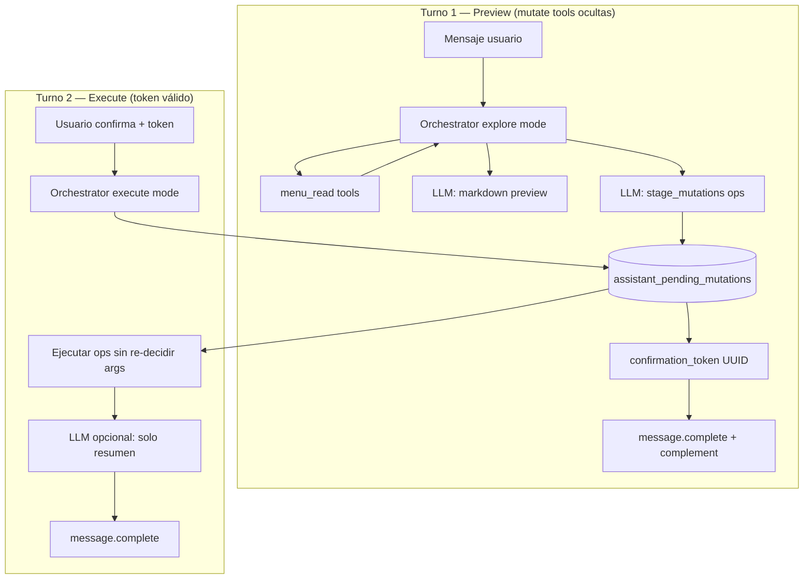

# Confirmación de mutaciones del asistente — Design Spec

**Fecha:** 2026-06-30  
**Estado:** Borrador para revisión — pendiente de aprobación antes de plan de implementación  
**Relacionado con:** [Asistente Agéntico §7](./2026-06-27-agentic-assistant-design.es.md#7-agent-loop--plan-act-confirm-runtime-agéntico), [Conversaciones](./2026-06-27-assistant-conversations-design.md), [Form complement](../../frontend/docs/assistant-chat-form-complement.md)

---

## 1. Objetivo

Implementar un flujo **Preview → Confirm → Execute** **enforceado en backend** para cambios de menú (y futuras skills `mutate`), inspirado en el patrón de aprobación de OpenClaw Lobster pero adaptado a Venddelo:

- El dueño ve un preview claro de **qué se va a aplicar**.
- Al confirmar, el backend ejecuta **exactamente** las operaciones congeladas en Postgres — no re-delega al LLM decidir qué ítems incluir.
- Todo vive en el **mismo proceso FastAPI** desplegado en Cloud Run; el estado pausado es **durable en Postgres** (no en disco del contenedor).
- **Redis no es requerido** para este feature: la lane queue existente sigue usando Redis si está disponible (`NullCacheAdapter` si no), pero la confirmación **no depende** de Redis.

### Problema que resuelve

Hoy la confirmación es solo **prompt + SKILL.md**. El LLM puede:

- Marcar cambios como “opcionales” y omitirlos al ejecutar.
- Aplicar un solo `update_product` cuando el preview listaba varios.
- Contradecirse en el resumen post-ejecución.

### Criterios de éxito

1. Tras “Ejecutar cambios” / botón Confirmar, **todas** las filas del bloque “Se aplicará” se ejecutan o fallan con error explícito por fila.
2. Sin `confirmation_token` válido, **ninguna** tool con `effect: mutate` puede mutar datos.
3. Funciona con **una réplica o N réplicas** de Cloud Run (estado en Postgres).
4. Compatible con conversaciones persistidas y lane queue actuales.

---

## 2. Alcance

### In scope (v1)

- Tabla Postgres `assistant_pending_mutations`.
- Tool meta **`stage_mutations`** (nombre provisional) para congelar ops después del preview.
- Modo **execute** en orchestrator: ejecuta ops almacenadas de forma determinista.
- Campo API existente `confirmation_token` + `form_submission` cableados end-to-end.
- Complement form de confirmación (Sí / No) en `message.complete`.
- Skills afectadas: **`menu_write`** (bulk + `update_product`); gate genérico por `effect: mutate`.
- Expiración de tokens (TTL configurable).
- Tests de integración orchestrator + repositorio.

### Out of scope (v1)

- Motor Lobster / DSL de pipelines.
- Confirmación cross-conversación o cross-restaurante.
- Edición parcial del lote staged (“aplica solo 2 de 4”) — v2 vía nuevo preview.
- Sub-agentes en background.
- Redis como store primario de pending mutations.

---

## 3. Enfoques considerados

| Enfoque | Pros | Contras | Veredicto |
|---------|------|---------|-----------|
| **A — Solo prompt** (hoy) | Cero código | No enforceable; bugs de alcance | ❌ Mantener solo como fallback de copy |
| **B — Gate de tools + ops en Postgres + execute determinista** | Corrige el bug; Lobster-lite; Cloud Run-safe | Requiere tool `stage_mutations` + modo execute | ✅ **Recomendado v1** |
| **C — LLM re-ejecuta mutate con token** | Menos código nuevo | El modelo puede volver a desviarse | ❌ |

---

## 4. Arquitectura

### 4.1 Vista general



### 4.2 Modos del orchestrator

| Modo | Cuándo | Tools expuestas al LLM | Ejecución |
|------|--------|------------------------|-----------|
| **explore** | Mensaje normal sin token; o token inválido | Todas **read** + `load_skill` + **`stage_mutations`** | No mutate |
| **execute** | `confirmation_token` válido + status `pending` | Ninguna mutate vía LLM; ops desde DB | **`registry.execute`** en bucle server-side |

El LLM **no** vuelve a elegir argumentos de mutate en execute mode. Eso es lo que hace el patrón “resume” de Lobster: continuar con el plan congelado.

### 4.3 Lane queue (sin cambios de contrato)

Sigue usando Redis si existe (`ConversationLaneQueue`). La pending mutation vive en Postgres; la lane evita dos turnos concurrentes en la misma conversación.

---

## 5. Modelo de datos (Postgres)

### 5.1 Tabla `assistant_pending_mutations`

Migración: `0035_assistant_pending_mutations.py` (siguiente número disponible).

| Columna | Tipo | Notas |
|---------|------|-------|
| `id` | UUID PK | **`confirmation_token`** expuesto al cliente |
| `restaurant_id` | UUID FK → restaurants | CASCADE |
| `conversation_id` | UUID FK → assistant_conversations | CASCADE |
| `preview_message_id` | UUID NULL FK → assistant_messages | Mensaje assistant con preview |
| `status` | VARCHAR(20) | `pending` \| `executing` \| `executed` \| `cancelled` \| `expired` |
| `intent_summary` | TEXT | Una línea ES: “Correcciones ortográficas en 4 productos” |
| `preview_markdown` | TEXT NULL | Copia del preview mostrado (auditoría) |
| `operations` | JSONB | Lista ordenada de ops (schema §5.2) |
| `operation_count` | INTEGER | Denormalizado para UI/límites |
| `expires_at` | TIMESTAMPTZ | Default now + 24h (configurable) |
| `confirmed_at` | TIMESTAMPTZ NULL | Cuando el usuario confirma |
| `executed_at` | TIMESTAMPTZ NULL | Fin de ejecución |
| `execution_result` | JSONB NULL | Resumen por op (ok/error/summary) |
| `created_at`, `updated_at` | TIMESTAMPTZ | Standard |

**Índices:**

- `(conversation_id, status)` — buscar pending activo por conversación.
- `(restaurant_id, created_at DESC)` — auditoría / admin futuro.
- Unique parcial: **una sola fila `pending` por `conversation_id`** (constraint o upsert en `stage_mutations`).

### 5.2 Schema `operations` (JSONB, versionado)

```json
{
  "version": 1,
  "ops": [
    {
      "skill_id": "menu_write",
      "tool_name": "bulk_update_product_descriptions",
      "args": {
        "items": [
          { "name": "WINGS & FRIES", "description": "Alitas crujientes… papas en gajos…" }
        ]
      },
      "label": "WINGS & FRIES — descripción"
    },
    {
      "skill_id": "menu_write",
      "tool_name": "bulk_update_product_names",
      "args": {
        "items": [
          {
            "name": "BONELESS & FRIES WITC SAUCE",
            "new_name": "BONELESS & FRIES WITH SAUCE"
          }
        ]
      },
      "label": "BONELESS & FRIES — corregir nombre"
    }
  ]
}
```

Reglas de validación al staging:

- Máximo **50 ops** totales (alineado con bulk limits).
- Cada op: `skill_id` + `tool_name` deben existir en registry y estar en `effective_skill_ids`.
- Cada tool referenciada debe tener `effect: mutate`.
- `args` validados contra `input_schema` de la tool (jsonschema / pydantic ligero).
- Preferir **una op bulk** sobre N `update_product` cuando aplique (warning en logs, no hard-fail v1).

### 5.3 Metadata en `assistant_messages`

En el mensaje assistant del preview, guardar en `metadata`:

```json
{
  "pending_mutation_id": "uuid",
  "confirmation_token": "uuid",
  "phase": "confirm"
}
```

---

## 6. Tool meta: `stage_mutations`

Registrada por el orchestrator (no por una skill de dominio), similar a `load_skill`.

| Propiedad | Valor |
|-----------|-------|
| Nombre OpenAI | `stage_mutations` |
| Effect | `read` (no muta menú; muta estado de confirmación) |
| Cuándo | Solo en **explore mode**, después de preview read-only |

**Input schema (resumen):**

```json
{
  "type": "object",
  "properties": {
    "intent_summary": { "type": "string", "maxLength": 200 },
    "preview_markdown": { "type": "string" },
    "operations": {
      "type": "object",
      "properties": {
        "ops": { "type": "array", "items": { "type": "object" } }
      },
      "required": ["ops"]
    }
  },
  "required": ["intent_summary", "operations"]
}
```

**Comportamiento:**

1. Valida ops (§5.2).
2. Cancela/expira cualquier `pending` anterior de la misma conversación.
3. Inserta fila Postgres → devuelve `confirmation_token` (= `id`).
4. Emite SSE `agent.confirmation` (nuevo) o incluye token en tool result al LLM.
5. El turno termina con `message.complete` + **complement** de confirmación.

**Resultado al LLM (role=tool):**

```json
{
  "ok": true,
  "summary": "Cambios preparados: 2 operaciones. Esperando confirmación del dueño.",
  "confirmation_token": "uuid",
  "expires_at": "2026-07-01T12:00:00Z"
}
```

---

## 7. Flujo por turnos

### 7.1 Turno preview (ejemplo ortografía)

**Usuario:** *«Corrige faltas de ortografía a todo mi menú»*

| Paso | Actor | Acción |
|------|-------|--------|
| 1 | Orchestrator | `explore mode` — oculta tools `menu_write__*` mutate |
| 2 | LLM | `menu_read__list_products` + `menu_read__list_promotions` (read) |
| 3 | LLM | Markdown con secciones **Se aplicará** / **Sin cambios** |
| 4 | LLM | `stage_mutations` con **todas** las ops de “Se aplicará” |
| 5 | Backend | Persiste Postgres; emite complement |
| 6 | UI | Muestra preview + botones Confirmar / Cancelar |

Copy obligatorio en preview (prompt + `menu_write/SKILL.md`):

```markdown
### Se aplicará al confirmar
- **WINGS & FRIES** — descripción: «…papas en gajos…»
- **BONELESS & FRIES WITC SAUCE** — nombre → «BONELESS & FRIES WITH SAUCE»

### Sin cambios
- BURGER & BONELESS, HAMBURGUESA
```

No usar “opcional” para typos obvios cuando el usuario pidió “todo el menú”.

### 7.2 Turno execute

**Request:**

```json
{
  "message": "Ejecutar cambios",
  "profile_version": 3,
  "confirmation_token": "550e8400-e29b-41d4-a716-446655440000",
  "form_submission": {
    "complementId": "mutation-confirm",
    "messageId": "…",
    "values": {
      "decision": { "kind": "choice", "optionId": "confirm" }
    }
  }
}
```

| Paso | Actor | Acción |
|------|-------|--------|
| 1 | `ConversationService` | Carga pending por token + valida restaurant/conversation/expiry |
| 2 | Orchestrator | `execute mode` — **no** expone mutate tools al LLM |
| 3 | Orchestrator | `UPDATE status = executing` (optimistic lock) |
| 4 | Orchestrator | Por cada op: `registry.execute(skill_id, tool_name, args, ctx)` |
| 5 | Orchestrator | `UPDATE status = executed`, `execution_result` JSONB |
| 6 | LLM | Un turno **sin tools** (o solo read) para resumen ES al dueño |
| 7 | SSE | `message.complete` con resumen |

Si `form_submission` elige `cancel`: status `cancelled`, respuesta amable, sin mutate.

### 7.3 Consultas read-only (sin cambio)

Preguntas como *«¿Qué productos no tienen promoción?»* no llaman `stage_mutations`. Orchestrator permanece en explore mode con read tools; flujo actual intacto.

---

## 8. API y SSE

### 8.1 Request (ya reservado)

`AssistantConversationChatRequest` en `schemas.py`:

- `confirmation_token: str | None`
- `form_submission: dict | None`

`ConversationService.stream_chat` debe pasar ambos al orchestrator vía `AgentContext` o parámetros dedicados.

### 8.2 Complement de confirmación (v1)

Emitir en `message.complete` del turno preview:

```json
{
  "conversation_id": "…",
  "message_id": "…",
  "content": "…preview markdown…",
  "complement": {
    "type": "form",
    "id": "mutation-confirm",
    "title": "Confirmar cambios",
    "description": "Se aplicarán 2 cambios en tu menú.",
    "submitLabel": "Ejecutar cambios",
    "fields": [
      {
        "type": "choice",
        "id": "decision",
        "label": "¿Procedo?",
        "required": true,
        "options": [
          { "id": "confirm", "label": "Ejecutar cambios" },
          { "id": "cancel", "label": "Cancelar" }
        ]
      }
    ]
  },
  "confirmation_token": "uuid"
}
```

El frontend debe enviar `confirmation_token` + `form_submission` en el siguiente POST chat (hoy **no** lo hace — parte del scope).

### 8.3 Eventos SSE nuevos / extendidos

| Evento | Cuándo | Payload clave |
|--------|--------|---------------|
| `agent.confirmation.staged` | Tras `stage_mutations` OK | `token`, `operation_count`, `expires_at` |
| `message.complete` | Siempre | `complement?`, `confirmation_token?` |
| `agent.phase` | Execute | `execute` |

Registrar nombres en `ChatStreamEventName` (`ports.py`) antes de emitir.

---

## 9. Cambios por capa

### 9.1 Backend — archivos principales

| Archivo | Cambio |
|---------|--------|
| `migrations/versions/0035_assistant_pending_mutations.py` | Nueva tabla |
| `app/db/models/assistant.py` | Model `AssistantPendingMutation` |
| `app/modules/assistant/repository.py` | CRUD pending mutations |
| `app/modules/assistant/agent/context.py` | `confirmation_token`, `execute_pending_mutation` |
| `app/modules/assistant/agent/orchestrator.py` | explore/execute modes; filter mutate schemas |
| `app/modules/assistant/agent/stage_mutations.py` | **Nuevo** — tool handler + validación |
| `app/modules/assistant/agent/response_format.py` | Schema `stage_mutations`; reglas preview |
| `app/modules/assistant/conversation_service.py` | Resolver token antes de stream |
| `app/modules/assistant/skills/menu_write/SKILL.md` | Secciones Se aplicará / Sin cambios |
| `app/core/llm/ports.py` | Eventos SSE |
| `tests/modules/test_pending_mutations*.py` | **Nuevo** |
| `tests/modules/test_agent_orchestrator.py` | Execute determinista |

### 9.2 Frontend

| Archivo | Cambio |
|---------|--------|
| `frontend/src/lib/api/assistant.ts` | Enviar `confirmation_token`, `form_submission` |
| `AssistantChatPanel.tsx` | Guardar token del `message.complete`; pasarlo al confirmar |
| `ChatFormComplement.tsx` | Sin cambios de schema (choice confirm/cancel) |

### 9.3 Config

```python
# app/core/config.py (nuevos defaults)
assistant_mutation_confirm_ttl_hours: int = 24
assistant_mutation_max_ops: int = 50
```

---

## 10. Seguridad y multi-tenant

1. **Token scope:** `confirmation_token` solo válido si `restaurant_id` y `conversation_id` del request coinciden con la fila.
2. **Entitlements:** Re-validar `skill_id` de cada op contra `effective_skill_ids` en execute (no confiar solo en staging).
3. **Idempotencia execute:** Si status ya es `executed`, devolver resumen cacheado (`execution_result`) sin re-ejecutar.
4. **Concurrencia:** Unique partial index `pending` por conversación; segundo `stage_mutations` reemplaza el pending anterior.
5. **TTL:** Job lazy en execute (si `expires_at < now()` → `expired` + error claro) o cron futuro.

---

## 11. Cloud Run

| Requisito | Cómo se cumple |
|-----------|----------------|
| Contenedor stateless | Token + ops en Postgres |
| Múltiples instancias | Lock vía `status = executing` + row update |
| Sin Redis obligatorio | Pending mutations 100% Postgres |
| Mismo container | Toda la lógica en FastAPI existente |

---

## 12. Prompt / SKILL (comportamiento LLM)

Actualizar `build_agent_runtime_section()` y `menu_write/SKILL.md`:

1. Antes de mutate, **siempre** preview con sección **«Se aplicará al confirmar»**.
2. Llamar **`stage_mutations`** con el mismo conjunto que «Se aplicará».
3. No marcar typos obvios en nombres como “opcionales” en auditorías de “todo el menú”.
4. Tras confirmación del dueño, **no** volver a llamar mutate tools — el backend ejecuta.

En **explore mode**, si el LLM intenta llamar una tool mutate (bug/regresión), el orchestrator responde tool error:

```json
{
  "ok": false,
  "summary": "Confirmación requerida. Usa stage_mutations después del preview."
}
```

---

## 13. Casos límite

| Caso | Comportamiento |
|------|----------------|
| Usuario escribe “Ejecutar cambios” sin token | Explore mode; LLM debe pedir re-preview o usar token del complement |
| Token expirado | Error SSE `confirmation_expired`; sugerir nuevo preview |
| Op falla mid-batch | Continuar resto; `execution_result` marca failed rows; resumen honesto |
| Usuario envía mensaje distinto mientras pending | Nuevo turno explore; pending anterior sigue hasta expirar o ser reemplazado |
| `load_skill` durante execute | Permitido si se necesita guía; mutate sigue bloqueado |

---

## 14. Estrategia de pruebas

1. **Repository:** create pending, get by token, expire, unique pending per conversation.
2. **stage_mutations:** validación schema; rechaza ops no mutate; rechaza skill no entitled.
3. **Orchestrator explore:** mutate tool call → error tool.
4. **Orchestrator execute:** 2 ops staged → ambas ejecutadas; LLM no re-invocado para args.
5. **Regresión ortografía:** preview con nombre + descripción → execute aplica **2** cambios.
6. **Idempotencia:** segundo POST con mismo token executed → no double-write.

---

## 15. Fases de rollout

| Fase | Entrega |
|------|---------|
| **F1** | Migración + repository + tests |
| **F2** | `stage_mutations` + explore gate + SSE complement |
| **F3** | Execute determinista + `confirmation_token` API |
| **F4** | Frontend wire-up + SKILL/prompt updates |
| **F5** | Métricas/logs (`execution_result` en metadata assistant message) |

---

## 16. Checklist pre-implementación

- [ ] Aprobar este spec
- [ ] Invocar skill **writing-plans** → `docs/superpowers/plans/2026-06-30-assistant-mutation-confirm.md`
- [ ] Implementar F1→F4 en worktree aislado (skill **using-git-worktrees**)

---

## 17. Referencias

- OpenClaw Lobster (approve + resumeToken): https://docs.openclaw.ai/tools/lobster
- §7 Plan-Act-Confirm: `./2026-06-27-agentic-assistant-design.es.md`
- Form complement: `frontend/docs/assistant-chat-form-complement.md`
- API chat reservado: `backend/app/modules/assistant/api.py` (comentario `confirmation_token`)
