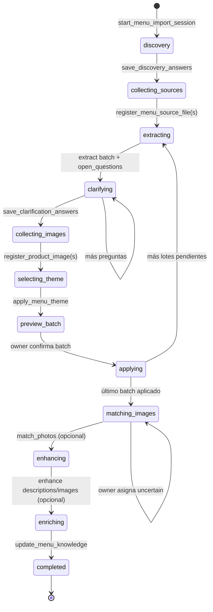

# Skill `menu_import` — Onboarding completo del menú digital

**Fecha:** 2026-07-02  
**Estado:** Aprobado (enfoque completo §10) — listo para plan de implementación  
**Relacionado con:** [Asistente Agéntico §10](./2026-06-27-agentic-assistant-design.es.md#10-menud-temas-en-db-y-onboarding-agéntico-del-menú), [Confirmación de mutaciones](./2026-06-30-assistant-mutation-confirm-design.es.md)

---

## 1. Objetivo

Permitir que el dueño suba su menú impreso o digital (PDF, imagen, DOCX u otro documento), extraiga **todo** el contenido con OCR/visión (`OPENAI_VISION_MODEL=gpt-5.4-nano-2026-03-17`), aclare reglas ambiguas en conversación, recolecte fotos de productos, opcionalmente mejore descripciones e imágenes con IA, y publique el menú completo en Venddelo: categorías, productos, grupos de complementos, complementos y promociones — con mapeo inteligente de imágenes y omisión explícita de asignaciones inciertas.

### Criterios de éxito

1. El owner puede adjuntar PDF/imagen/DOCX en el chat del asistente; los archivos llegan a Storage y el agente los procesa.
2. La extracción devuelve un borrador estructurado con `open_questions[]` cuando hay reglas ambiguas (p. ej. promo solo viernes, complementos elegibles limitados).
3. El agente **no aplica mutaciones** hasta preview explícito + confirmación del owner (integración con Plan-Act-Confirm cuando esté cableado; mientras tanto, confirmación conversacional + tool `apply_menu_batch` con flag `confirmed: true`).
4. Las fotos se mapean a productos por nombre/descripción; las inciertas quedan en `uncertain_images[]` y el agente pregunta al owner dónde van.
5. Promociones extraídas se crean vía `PromotionService` con schedule y `option_item_ids` cuando aplique.
6. Sesión de import durable en Postgres — retomable entre turnos y conversaciones del mismo restaurante.
7. Flujos largos no chocan con el límite de 8 tool calls: límite elevado + tools batch que ejecutan N operaciones en una sola invocación.

---

## 2. Alcance

### In scope

| Área | Entregable |
|------|------------|
| Upload | Endpoint assistant import assets + cableado frontend chat attachments |
| OCR / extracción | Vision + parsers PDF/DOCX; schema JSON estricto |
| Sesión | Tabla `assistant_menu_import_sessions` |
| Skill | `menu_import` con tools listados en §6 |
| Temas | Tabla `digital_menu_themes` + script sync desde frontend catalog |
| Promos | Creación en apply batch vía `PromotionService` |
| Imágenes | Registro, mapeo vision, apply paths; mejora opcional vía `menu_media` |
| Descripciones | Preview + apply mejoras vía `bulk_update_product_descriptions` |
| Conocimiento | Re-habilitar `menu_markdown` al finalizar import |
| Límites | `ASSISTANT_MAX_TOOL_ITERATIONS=32`; batch interno hasta 50 entidades |
| Entitlements | Registrar `menu_import` en catálogo |

### Out of scope (v1 de este spec)

- Traducción automática del menú público
- Eliminación de entidades importadas (solo soft-disable vía `menu_write`)
- Sub-agentes en background / jobs async separados del turno del chat
- Edición parcial de un batch staged (“aplica 2 de 5”) — requiere spec mutation-confirm v2
- WhatsApp / canales externos

---

## 3. Flujo agéntico (estados)



### Fases en lenguaje del owner (español)

1. **Bienvenida al onboarding** — el agente explica pasos y pide contexto (tipo de cocina, moneda, horarios promo).
2. **Sube tu menú** — PDF, fotos del menú impreso, DOCX.
3. **Revisión del borrador** — tabla de categorías/productos/complementos/promos + preguntas sobre reglas.
4. **Fotos de platillos** — subir todas las que tenga; lista de productos sin foto.
5. **Tema visual** — recomendación entre temas del catálogo DB.
6. **Confirmación por lotes** — máx. 15 productos por lote; aplicar al menú digital.
7. **Mapeo de fotos** — automático + preguntas por imágenes dudosas.
8. **Mejora opcional** — descripciones más apetitosas; regenerar/mejorar imágenes (`menu_media`).
9. **Cierre** — actualizar `menu_markdown` con reglas confirmadas; resumen final.

---

## 4. Infraestructura

### 4.1 Upload de archivos

**Nuevo endpoint:** `POST /api/v1/restaurants/{restaurant_id}/assistant/import/assets`

| Parámetro | Valor |
|-----------|-------|
| `kind` query | `menu_source` \| `product_photo` |
| Tipos MIME | `application/pdf`, `application/vnd.openxmlformats-officedocument.wordprocessingml.document`, `image/jpeg`, `image/png`, `image/webp`, `image/heic` |
| Límite tamaño | 15 MB documentos; 5 MB imágenes |
| Storage path | `restaurants/{restaurant_id}/import/{kind}/{uuid}.{ext}` |

**Procesamiento previo a visión:**

| Tipo | Pipeline |
|------|----------|
| PDF | `pymupdf` (fitz): render cada página a PNG @ 150 DPI → lista de `image_bytes` |
| DOCX | `python-docx`: extraer párrafos/tablas a texto; si layout es tabular complejo → también render placeholder o pedir PDF |
| Imagen | Passthrough directo a `VisionPort` |

Dependencias nuevas en `requirements.txt`: `pymupdf`, `python-docx`.

### 4.2 Chat con adjuntos

Extender `AssistantConversationChatRequest`:

```python
class ChatAttachmentRef(BaseModel):
    storage_path: str
    original_name: str
    mime_type: str
    kind: Literal["menu_source", "product_photo"]
    size_bytes: int

class AssistantConversationChatRequest(BaseModel):
    message: str = Field(min_length=0, max_length=8000)  # allow empty if attachments
    attachments: list[ChatAttachmentRef] = Field(default_factory=list, max_length=20)
    ...
```

**Frontend:** antes de `streamAssistantChat`, subir cada adjunto a `POST .../assistant/import/assets`; incluir `storage_path` en el payload del chat. Persistir metadata en `assistant_messages.metadata.attachments`.

Validación server-side: paths deben pertenecer a `restaurants/{restaurant_id}/import/`.

### 4.3 Sesión de import (Postgres)

**Tabla `assistant_menu_import_sessions`:**

| Columna | Tipo | Descripción |
|---------|------|-------------|
| `id` | UUID PK | |
| `restaurant_id` | UUID FK | UNIQUE partial: una sesión `active` por restaurante |
| `conversation_id` | UUID FK | Conversación donde inició |
| `status` | VARCHAR(32) | Ver diagrama §3 |
| `discovery_answers` | JSONB | Respuestas cuestionario inicial |
| `clarification_answers` | JSONB | Respuestas post-OCR |
| `source_files` | JSONB | `[{path, mime_type, name, page_count?}]` |
| `product_images` | JSONB | `[{path, original_name, mapped_product_ref?, confidence?, status}]` |
| `draft_batches` | JSONB | `[{batch_index, categories[], promotions[], global_rules[], open_questions[], applied_at?}]` |
| `selected_theme_id` | VARCHAR(64) NULL | |
| `enhance_descriptions` | BOOLEAN | Owner pidió mejora copy |
| `enhance_images` | BOOLEAN | Owner pidió mejora fotos |
| `unmatched_images` | JSONB | Fotos sin producto asignado |
| `uncertain_images` | JSONB | Fotos con confidence < umbral |
| `created_at`, `updated_at` | TIMESTAMPTZ | |

Índice único: `(restaurant_id) WHERE status NOT IN ('completed', 'cancelled')`.

Repositorio: `app/modules/assistant/skills/menu_import/session_repository.py`.

### 4.4 Catálogo de temas (Postgres)

**Tabla `digital_menu_themes`** (global, no por tenant) — igual §10.2 del diseño agéntico.

**Script:** `backend/scripts/sync_digital_menu_themes.py`

- Input: JSON exportado desde `frontend/src/lib/digital-menu/themes/` (nuevo script Node `scripts/export-digital-menu-themes.mjs` genera `backend/data/digital_menu_themes.json`).
- UPSERT por `id`; campos: `label`, `description`, `best_for`, `recommendation`, `style_keywords`, `is_active`, `sort_order`.

Validación en `apply_menu_theme`: `theme_id` debe existir en DB activo (reemplaza validación regex-only actual en `RestaurantService` para writes del agente).

### 4.5 Visión / OCR

Reutilizar `VisionPort.analyze_json()` con `model=settings.openai_vision_model`.

Módulo `app/modules/assistant/skills/menu_import/extraction.py`:

- `extract_from_images(pages, context)` → schema §5
- `extract_from_text(docx_text, context)` → mismo schema
- Prompt en `extraction_prompt.py` (inglés); respuestas al owner en español

Multi-página PDF: concatenar resultados por página con deduplicación de categorías por nombre normalizado; merge de `global_rules` y `unmapped_text`.

### 4.6 Límites del orchestrator

| Config | Default nuevo | Env |
|--------|---------------|-----|
| `assistant_max_tool_iterations` | **32** | `ASSISTANT_MAX_TOOL_ITERATIONS` |
| `max_total_turns` | `max_tool_iterations + 5` | (hardcoded orchestrator) |
| `menu_import_batch_max_products` | 15 | `MENU_IMPORT_BATCH_MAX_PRODUCTS` |
| `menu_import_photo_match_confidence_threshold` | 0.72 | `MENU_IMPORT_PHOTO_MATCH_THRESHOLD` |

Tools batch (`apply_menu_batch`, `match_photos_to_products`) ejecutan loops internos — cuentan como **1** tool iteration cada uno.

---

## 5. Schema de extracción JSON

```json
{
  "categories": [{
    "ref": "cat_1",
    "name": "string",
    "description": "string | null",
    "sort_order": 0,
    "products": [{
      "ref": "prod_1",
      "name": "string",
      "description": "string | null",
      "price_cents": 0,
      "currency": "MXN",
      "is_available": true,
      "option_groups": [{
        "ref": "og_1",
        "title": "string",
        "selection": "single | multi",
        "required": false,
        "min_selections": 0,
        "max_selections": 1,
        "items": [{
          "ref": "oi_1",
          "label": "string",
          "price_delta_cents": 0
        }]
      }],
      "constraints_notes": "string | null"
    }]
  }],
  "promotions": [{
    "ref": "promo_1",
    "name": "string",
    "type": "two_for_one | percent | amount | combo",
    "scope": "product | category | order",
    "percent": null,
    "amount_cents": null,
    "bundle": {"get_quantity": 2, "pay_quantity": 1, "pairing_mode": "cross_product"},
    "target_product_refs": ["prod_1"],
    "target_category_refs": ["cat_1"],
    "eligible_option_item_refs": ["oi_1"],
    "schedule_notes": "solo viernes",
    "schedule": {
      "weekdays": [4],
      "use_time_window": false
    },
    "constraints_notes": "string | null"
  }],
  "global_rules": ["string"],
  "unmapped_text": ["string"],
  "open_questions": [{
    "id": "q1",
    "question_es": "string",
    "context": "string",
    "related_refs": ["promo_1"]
  }]
}
```

**Reglas del prompt de extracción:**

- Transcribir literalmente; no inventar ítems.
- Precio ambiguo → `unmapped_text` + `open_questions`, no adivinar.
- Reglas de promo/complemento parcialmente legibles → `open_questions` obligatorio.
- `ref` estables para mapeo foto→producto y promo→targets en apply.

---

## 6. Tools del skill `menu_import`

Prefijo OpenAI: `menu_import__{tool_name}`.

| Tool | Effect | Descripción |
|------|--------|-------------|
| `start_menu_import_session` | mutate | Crea sesión; cancela sesión activa previa si owner confirma |
| `get_import_session` | read | Estado, fase, contadores |
| `save_discovery_answers` | mutate | Persiste cuestionario inicial |
| `register_menu_source_file` | mutate | Registra path ya subido; avanza a `extracting` |
| `start_menu_extraction_batch` | mutate (LLM) | OCR/extracción lote N → `draft_batches[]` |
| `get_extraction_status` | read | Batch pendiente/aplicado, preview payload |
| `save_clarification_answers` | mutate | Resuelve `open_questions`; merge al draft |
| `list_menu_themes` | read | Temas activos desde DB |
| `recommend_menu_theme` | read | Top 3 ids vía LLM + discovery |
| `apply_menu_theme` | mutate | PATCH `restaurants.digital_menu_theme_id` |
| `register_product_image` | mutate | Registra foto subida en sesión |
| `match_photos_to_products` | read (LLM) | matched / uncertain / unmatched |
| `resolve_uncertain_image` | mutate | Owner asigna product_ref manual |
| `preview_import_batch` | read | Tabla markdown-friendly del batch |
| `apply_menu_batch` | mutate | Materializa categorías/productos/grupos/promos del batch |
| `apply_photo_mappings` | mutate | Set `image_path` en productos confirmados |
| `preview_description_enhancements` | read | Propuestas copy mejorado |
| `apply_description_enhancements` | mutate | `bulk_update_product_descriptions` interno |
| `request_image_enhancement` | read | Lista productos elegibles para `menu_media` |
| `update_menu_knowledge` | mutate | Append reglas a `menu_markdown`; habilita flag |

**Integración `menu_media`:** tras `request_image_enhancement`, el agente usa tools `menu_media__generate_product_image` / `bulk_generate_product_images` con confirmación del owner (skill separado, no duplicar lógica).

**Integración promos:** `apply_menu_batch` resuelve `target_product_refs` → UUIDs creados en el mismo batch (mapa ref→id en memoria durante apply) y llama `PromotionService.create_promotion`.

---

## 7. Apply batch — orden de materialización

Por cada batch confirmado, en una transacción UoW:

1. Crear categorías (orden `sort_order`)
2. Crear productos con `category_ids`
3. Crear `option_groups` + `option_items` por producto
4. Crear promociones con targets y schedule
5. Invalidar cache menú
6. Marcar `draft_batches[batch_index].applied_at`

Mapeo `ref → uuid` persistido en sesión (`ref_map` JSONB subcampo del batch) para lotes posteriores y fotos.

Errores parciales: rollback transacción; tool devuelve `ok=false` con detalle por entidad.

---

## 8. Mapeo de fotos

`match_photos_to_products`:

1. Cargar bytes desde Storage
2. Vision prompt: lista de `{ref, name, description}` del menú aplicado + N imágenes
3. Output:

```json
{
  "matched": [{"image_path": "...", "product_ref": "prod_1", "confidence": 0.91}],
  "uncertain": [{"image_path": "...", "candidates": [{"product_ref": "prod_2", "confidence": 0.58}], "reason_es": "..."}],
  "unmatched": [{"image_path": "...", "reason_es": "..."}]
}
```

- `confidence >= threshold` → auto-match en sesión (no apply hasta confirmación)
- `uncertain` → agente pregunta; owner usa `resolve_uncertain_image`
- `apply_photo_mappings` solo aplica matched + resolved con `confirmed: true`

---

## 9. Confirmación y seguridad

**v1 (hasta mutation-confirm global):**

- Tools mutate de apply requieren `confirmed: true` en args
- SKILL.md instruye: siempre preview → pregunta explícita → apply
- `apply_menu_batch` rechaza si batch tiene `open_questions` sin respuesta

**v2 (cuando exista `assistant_pending_mutations`):**

- `apply_menu_batch` acepta `confirmation_token` en lugar de `confirmed`
- Ops congeladas en Postgres; execute determinista

Tenant isolation: todo scoped a `ctx.restaurant_id`; paths Storage validados por prefijo.

---

## 10. SKILL.md — guía del agente

Ubicación: `backend/app/modules/assistant/skills/menu_import/SKILL.md`

Contenido clave (español para el agente en respuestas; guía en inglés como otras skills):

- Secuencia obligatoria de fases
- No saltar a apply con preguntas abiertas
- Cómo presentar previews (tablas, promos con reglas)
- Pedir **todas** las fotos antes del mapeo
- Preguntar mejora IA de descripciones/imágenes antes de ejecutar
- Listar imágenes inciertas con opciones numeradas
- Cargar `menu_best_practices` para copy e imágenes
- Delegar generación de fotos faltantes a `menu_media`

---

## 11. Entitlements y registro

Descomentar en `entitlements/catalog.py`:

```python
"menu_import": SkillDefinition(id="menu_import", label="Import menu"),
```

Tests existentes en `test_assistant_profile.py` ya esperan `menu_import`.

---

## 12. Re-habilitar `menu_markdown`

Al completar import, `update_menu_knowledge`:

1. Set `MENU_MARKDOWN_ENABLED = True` en `profile/menu_markdown.py` **o** flag por restaurante post-onboarding
2. Append sección `## Notas de importación` con `global_rules` + respuestas discovery
3. Re-enable injection en `prompt_composer.py` para ese restaurante

Decisión v1: flip global `MENU_MARKDOWN_ENABLED = True` al cerrar cualquier import exitoso (simple); v2: per-tenant flag.

---

## 13. Testing

| Suite | Casos |
|-------|-------|
| `test_menu_import_extraction.py` | Schema parse, merge multi-page, open_questions |
| `test_menu_import_session.py` | CRUD sesión, unique active |
| `test_menu_import_apply.py` | apply batch mock MenuService + PromotionService |
| `test_menu_import_photos.py` | match thresholds, uncertain flow |
| `test_menu_import_tools.py` | Integration skill registry + stub vision |
| `test_assistant_import_assets.py` | Upload validation, path prefix |
| Frontend | Upload before chat, attachment refs in request |

Stub providers: `VisionPort` stub con fixture JSON de menú taquería.

---

## 14. Observabilidad

- LangSmith traces en extraction y photo match (tags `menu_import`, `batch_index`)
- Metering LLM vía pipeline existente `assistant_llm_usage`
- Activity emit: fases `extracting`, `applying`, `matching_images`

---

## 15. Rollout

1. Migraciones DB (themes + sessions)
2. Sync themes script en deploy
3. Backend skill + upload API
4. Frontend attachment upload
5. Subir `ASSISTANT_MAX_TOOL_ITERATIONS` en prod
6. Habilitar entitlement `menu_import` (ya granted por default en dev)

---

## 16. Riesgos y mitigaciones

| Riesgo | Mitigación |
|--------|------------|
| Menú 100+ productos excede contexto | Lotes de 15; multi-turn extract |
| DOCX mal formateado | Fallback texto + pedir PDF/foto |
| Vision alucina precios | `unmapped_text` + no apply sin confirm |
| 32 tool calls insuficientes | Batch tools; continuar en siguiente mensaje owner |
| Promos complejas | `open_questions` + apply conservador (solo campos confirmados) |

---

## 17. Self-review (spec)

- [x] Sin placeholders TBD en requisitos funcionales
- [x] Alineado con §10 diseño agéntico aprobado
- [x] Upload gap resuelto (endpoint + chat refs)
- [x] Promos incluidas en apply
- [x] Imágenes inciertas con flujo explícito
- [x] Límites tool calls documentados
- [x] Dependencias nuevas listadas
