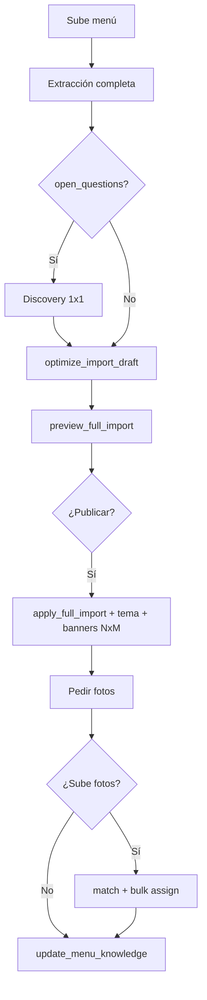

# `menu_import` — Rediseño Concierge (one-shot)

**Fecha:** 2026-07-06  
**Estado:** Aprobado — plan en [`docs/superpowers/plans/2026-07-06-menu-import-concierge-redesign.md`](../plans/2026-07-06-menu-import-concierge-redesign.md)  
**Supersede parcialmente:** [Onboarding completo 2026-07-02](./2026-07-02-menu-import-onboarding-design.es.md) (flujo agéntico §3, SKILL.md §10, fases owner §3)  
**Relacionado con:** [menu_write SKILL](../../backend/app/modules/assistant/skills/menu_write/SKILL.md), [menu_best_practices](../../backend/app/modules/assistant/skills/menu_best_practices/SKILL.md), [promotions SKILL](../../backend/app/modules/assistant/skills/promotions/SKILL.md)

---

## 1. Objetivo

Transformar `menu_import` de un onboarding **por lotes y muchas confirmaciones** a un flujo **concierge**: el dueño sube su menú, el agente investiga todo el documento, hace discovery solo donde hay ambigüedad, optimiza estructura para ticket promedio, publica el menú completo con **una confirmación**, asigna fotos que el dueño sube (sin IA en platillos), y genera banners solo para promos **NxM**.

### Criterios de éxito

1. Dueño con menú claro completa onboarding en **~3 interacciones** (subir → leer preview → confirmar).
2. Todo lo extraído y confirmado queda **activo y publicado** (`is_active=true`, `is_published=true`) al aplicar.
3. El agente decide orden de categorías, `display_layout` por categoría, orden de productos y complementos, y `price_delta` en complementos — siguiendo `menu_best_practices`.
4. **Prohibido** proponer o invocar `generate_product_image` / `menu_media` durante import.
5. Promos tipo `two_for_one` (NxM) reciben banner vía `promotions__generate_promotion_banner` automáticamente post-apply (sin preguntar salvo datos faltantes).
6. Fotos: match masivo con `menu_write__match_product_photos` + `bulk_assign_product_images` tras upload del dueño.
7. Reglas confirmadas persisten en `menu_markdown` al cierre (`update_menu_knowledge`).

---

## 2. Cambio de filosofía

| Antes (spec 2026-07-02) | Concierge (este spec) |
|-------------------------|------------------------|
| 11 fases, lotes ≤15 productos | **Un preview + un apply** del menú completo |
| Fotos antes del apply; `request_image_enhancement` + `menu_media` | Fotos **después** del apply; solo upload + match |
| Tema: owner elige explícitamente | Agente **recomienda y aplica** tema; owner puede objetar en preview |
| Descripciones: fase opcional separada | Mejoras de copy **incluidas en borrador optimizado** antes del preview |
| Promos sin banner automático | Banners NxM **sí**, generados por agente |

**Infra existente que se conserva:** upload API, sesión Postgres, extracción OCR/visión, schema de borrador, `apply_batch.py`, precios MXN→centavos, adjuntos en chat con `storage_path`, tools de fotos en `menu_write`.

---

## 3. Flujo del usuario (dueño)

### Fase 0 — Bienvenida

Un mensaje en español: el dueño sube PDF/fotos/DOCX; el agente hace el resto; solo preguntará si algo no está claro.

**Agente (invisible al dueño):**

```
load_skill(menu_write)
load_skill(menu_best_practices)
start_menu_import_session
```

### Fase 1 — Sube el menú

- Dueño adjunta archivos en chat (o mensaje vacío + adjuntos).
- Opcional: contexto en el mismo mensaje (“taquería, pesos, 2×1 viernes”).
- `register_menu_source_file` por cada `storage_path` del bloque `## Chat attachments`.
- `save_discovery_answers` si el dueño dio contexto (moneda, cocina, horarios).

### Fase 2 — Extracción + discovery

- `start_menu_extraction_batch` — OCR/visión de **todas** las fuentes → `draft_batches[]`.
- Si `open_questions[]` no vacío → **una pregunta por turno** hasta resolver.
- `save_clarification_answers` mergea respuestas al borrador.
- **No avanzar a preview** con preguntas sin respuesta.

### Fase 3 — Optimización + preview único

- `optimize_import_draft` (nuevo) — aplica reglas de `menu_best_practices` al borrador mergeado:
  - Orden de categorías (promos primero si aplica).
  - `display_layout` por categoría (`vertical` | `horizontal` | `grid`).
  - `sort_order` / orden de productos dentro de categoría.
- Orden de grupos e ítems de complementos.
- **Reglas de complementos:** `required` vs opcional, `selection` (single/multi), `min_selections`, `max_selections`, `price_delta_mxn` — inferidas del menú; si ambiguo → `open_questions`.
  - Tema recomendado (`recommend_menu_theme` → id guardado en sesión).
- `preview_full_import` (nuevo) — resumen ejecutivo en español + tabla compacta (precios en **MXN**).

El dueño ve **un solo bloque** de propuesta, no lotes numerados.

### Fase 4 — Confirmación única → publicar todo

Dueño dice sí → en cadena (mismo turno, múltiples tools internos):

1. `apply_full_import` (`confirmed: true`) — materializa **todos** los batches pendientes en orden, transacción por batch o transacción única (ver §6).
2. `apply_menu_theme` — tema ya elegido en optimización.
3. Por cada promo `two_for_one` creada: `promotions__generate_promotion_banner` (`confirmed: true`).
4. Transición sesión → `matching_images`.

Defaults en apply: `is_active=true`, `is_published=true` en categorías y productos.

### Fase 5 — Fotos (opcional)

> “Si tienes fotos de platillos, súbelas ahora.”

- Dueño sube imágenes → `menu_write__match_product_photos`.
- Mostrar matched + uncertain; una confirmación → `bulk_assign_product_images`.
- **Nunca** ofrecer generación IA de fotos de producto.

### Fase 6 — Cierre

- `update_menu_knowledge` — append reglas + discovery; sesión `completed`.
- Resumen: link menú, conteos, promos con banner, productos sin foto.



---

## 4. Skills y responsabilidades

| Skill | Rol en import concierge |
|-------|-------------------------|
| `menu_import` | Sesión, extracción, optimización borrador, preview/apply full, cierre |
| `menu_write` | **Cargada al inicio** — referencia de mapeo (categorías, complementos, layouts, fotos, bulk tools) |
| `menu_best_practices` | **Cargada al inicio** — criterios de orden, layout, copy, ticket promedio |
| `promotions` | Solo `generate_promotion_banner` para NxM post-apply |
| `menu_media` | **Excluida** del flujo de import |
| `menu_read` | No requerida pre-apply; opcional post-apply para verificar |

---

## 5. Estados de sesión

Simplificar transiciones en `SKILL.md` (los enum en DB pueden conservarse; el agente sigue una secuencia lineal):

```
discovery → collecting_sources → extracting → clarifying*
  → optimizing → preview_full → applying → matching_images → completed

* clarifying solo si hay open_questions
```

Nuevo estado lógico **`optimizing`** — entre clarifying y preview; persistir en sesión como subcampo `phase_hint` o reutilizar `preview_batch` con flag `concierge_mode` en `discovery_answers`.

**Deprecar en guía del agente:** `collecting_images` pre-apply, `enhancing`, `enriching`, `request_image_enhancement`.

---

## 6. Tools — nuevos y cambios

### 6.1 Nuevos tools (`menu_import`)

| Tool | Effect | Descripción |
|------|--------|-------------|
| `optimize_import_draft` | mutate (LLM) | Merge `draft_batches[]`, aplica reglas best-practices, escribe `optimized_draft` en sesión |
| `preview_full_import` | read | Markdown ejecutivo del menú completo (MXN); incluye layouts, tema, optimizaciones |
| `apply_full_import` | mutate | Aplica **todos** los batches con `applied_at` null; `confirmed: true`; rechaza si hay `open_questions` pendientes |

### 6.2 Tools existentes — comportamiento

| Tool | Cambio |
|------|--------|
| `start_menu_extraction_batch` | Sin cambio de contrato; puede seguir partiendo en batches internos |
| `apply_menu_batch` | Conservar para compatibilidad; **SKILL.md desaconseja** en concierge — usar `apply_full_import` |
| `preview_import_batch` | Conservar; desaconsejado en concierge |
| `request_image_enhancement` | **Deprecar** — no registrar en flujo; opcional eliminar tool en v2 |
| `preview_description_enhancements` / `apply_description_enhancements` | Opcional post-cierre; **no** fase obligatoria — copy ya en `optimize_import_draft` |

### 6.3 `apply_full_import` — semántica

**Menú completo en un solo batch:** extracción y optimización guardan **todo** el menú como
un único batch (`single_batch_from_draft`, sin `split_draft_into_batches`). No hay tools
por-sección (`apply_menu_batch` / `preview_import_batch` eliminados) para que el agente no
pueda subir el menú en partes.

1. Validar: sesión activa, borrador presente, sin `open_questions` sin respuesta.
2. Aplicar el batch completo con la lógica de `apply_batch.py` (categorías → productos →
   grupos/complementos → promos), acumulando `ref_map`.
3. Marcar `applied_at`; status → `matching_images`.
4. Límite interno: hasta **200 productos** por import (config `MENU_IMPORT_FULL_MAX_PRODUCTS`);
   si excede, error claro pidiendo dividir menú manualmente.

Una invocación = **1** tool iteration (loop interno).

### 6.4 `optimize_import_draft` — semántica

Entrada: `draft_batches[]` + `discovery_answers` + `clarification_answers` + guía `menu_best_practices` (inyectada vía skill cargada).

Salida en sesión (`optimized_draft` JSONB):

- Categorías con `sort_order`, `display_layout` sugerido.
- Productos con `sort_order`, descripciones refinadas.
- Option groups/items con orden y `price_delta_mxn`.
- `recommended_theme_id`.
- `optimization_notes_es[]` — bullets para el preview.

Implementación: prompt dedicado `optimization_prompt.py` + validación schema (`draft_schema.py`).

### 6.5 Post-apply — `menu_write` + `promotions`

| Acción | Tool |
|--------|------|
| Tema | `apply_menu_theme` |
| Fotos | `match_product_photos`, `bulk_assign_product_images` |
| Banners NxM | `generate_promotion_banner` (skill `promotions`, `confirmed: true`) |

Criterio NxM: `promotion.type == "two_for_one"` (incluye 2×1, 3×2, etc.).

---

## 7. Reglas de imágenes (estrictas)

### Permitido

- Dueño sube `product_photo` vía chat → match → bulk assign.
- Agente pide fotos **después** de publicar el menú.
- Resolver `uncertain` con pregunta al dueño antes de bulk assign.

### Prohibido

- `menu_media__generate_product_image` / `bulk_generate_product_images` durante import.
- `request_image_enhancement` como paso del workflow.
- Proponer “¿generamos fotos con IA?” para platillos.

### Banners promocionales

- **Sí** generar para promos NxM con `generate_promotion_banner`.
- No generar banners para `%`, monto fijo, o combo badge salvo que el dueño lo pida después del cierre.

---

## 8. Confirmaciones del dueño

| Decisión | Quién |
|----------|--------|
| Reglas ambiguas (horarios, precios, elegibilidad) | Dueño — discovery |
| Publicar menú completo | Dueño — **una vez** tras `preview_full_import` |
| Tema visual | Agente aplica recomendación; dueño puede pedir cambio **antes** del apply en el mismo preview |
| Orden, layouts, complementos, copy mejorado | Agente — sin confirmación item por item |
| Match de fotos inciertas | Dueño — solo uncertain |
| Banners NxM | Agente — automático post-apply |

---

## 9. Cambios en `SKILL.md` (`menu_import`)

Reemplazar workflow § por:

1. Cargar `menu_write` + `menu_best_practices` al iniciar.
2. Secuencia concierge (§3 de este doc).
3. Bloque **“Never during import”**: `menu_media`, `generate_product_image`, `request_image_enhancement`.
4. Bloque **“Always after apply for NxM”**: `load_skill(promotions)` → `generate_promotion_banner`.
5. Precios: chat/preview en MXN; apply convierte a centavos (sin cambio).
6. Comunicación: resumen ejecutivo, no tablas por lote salvo menú enorme (appendice opcional).

Actualizar `promotions/SKILL.md` — nota: durante `menu_import` concierge, banners NxM se generan sin preguntar.

---

## 10. Alcance técnico de implementación

### In scope

- `optimize_import_draft`, `preview_full_import`, `apply_full_import`
- `optimization_prompt.py` + campo `optimized_draft` en sesión
- Reescritura `menu_import/SKILL.md`
- Ajuste `promotions/SKILL.md` (banner auto en import)
- Tests unitarios nuevos + actualizar tests de tools
- Config `MENU_IMPORT_FULL_MAX_PRODUCTS` (default 200)

### Out of scope

- Eliminar físicamente `request_image_enhancement` (solo deprecar en SKILL)
- Mutation-confirm global (`confirmation_token`) — sigue `confirmed: true`
- Jobs async / sub-agentes background
- Generación IA de fotos de producto en cualquier fase del import

---

## 11. Testing

| Suite | Casos nuevos |
|-------|----------------|
| `test_menu_import_optimize.py` | Layout/orden aplicado; theme id; price_delta preservado |
| `test_menu_import_apply.py` | `apply_full_import` multi-batch; ref_map acumulado; rollback |
| `test_menu_import_tools.py` | Registry incluye 3 tools nuevos; preview full markdown |
| `test_menu_import_skill_md.py` | SKILL no menciona `menu_media` en workflow obligatorio |
| E2E manual | Menú 40+ productos, 1 confirm, fotos bulk, banner 2×1 |

---

## 12. Riesgos

| Riesgo | Mitigación |
|--------|------------|
| Turno largo (apply 100+ entidades) | `apply_full_import` loop interno; `ASSISTANT_MAX_TOOL_ITERATIONS=32` |
| Optimización LLM inconsistente | Schema validado; fallback a borrador sin optimizar si falla validación |
| Timeout Cloud Run | Monitorear; futuro: job async si >200 productos |
| Dueño sorprendido por cambios de copy | `optimization_notes_es` visibles en preview |

---

## 13. Self-review

- [x] Sin placeholders TBD en requisitos funcionales
- [x] Consistente con flujo aprobado por el usuario (concierge one-shot)
- [x] Prohibición explícita de IA en fotos de producto
- [x] Banners NxM explícitos
- [x] `menu_write` + `menu_best_practices` obligatorios al inicio
- [x] Alcance acotado a un plan de implementación único
- [x] Compatibilidad con infra 2026-07-02 documentada

---

## 14. Próximo paso

Tras aprobación de este archivo → invocar skill **writing-plans** para plan de implementación detallado.
